# Worklight Decision Engine — Forensic Audit

**Scope document audited:** `docs/architecture/day-sync-decision-pipeline-audit-scope.md`
**Pipeline audited:** `POST /api/day/sync` → Inngest `syncMyDay` → queue rebuild → `DailyBriefV2` → `TodayPage`
**Method:** direct code reading. Documentation, comments, and prompt text were treated as claims to verify, not as evidence.
**Constraint:** no repository file was modified; no patches produced.

---

## 1. Executive summary

### Overall reliability judgment

Worklight's pipeline is **structurally sound but not evidence-safe**. The ingestion, source-persistence, and change-detection layers are genuinely careful: content hashing, revision snapshots, race-safe upserts, an honest provider-success gate, and a per-quote evidence-relevance predicate shared by write/display/prune are all real and correctly implemented. The deterministic ranking function is legible and reasonably well-motivated.

The failures are concentrated in **four places where a probabilistic or heuristic signal is given authority over persistent state**:

1. **Rank position is converted directly into meaning.** `buildQueueDecisionsFromRanking` assigns `now` to array index 0 and `next` to index 1 with no score threshold. The engine therefore *always* asserts a primary task, even when every candidate scored negative, has no fresh evidence, and has no actionable next step. The product's central claim — "this is what to do first" — is unconditional rather than earned.

2. **A regex-based ownership heuristic silently deletes the user's own work.** `namedForeignActor` matches any capitalized noun followed by `to|will|should|needs to|must`. Verified reproductions: *"Content File Manager needs to be converted to Canvas"* → foreign actor `File Manager`; *"The Part Search Banner must ship this week"* → `Search Banner`; *"Migration to Canvas should land Friday"* → `Migration`. Any such task with `owner === null` (the extractor prompt's mandated default when no person is named) is **dropped at extraction time and never persisted**, and if it was persisted earlier it is **hidden from Today**. These example strings are taken from this codebase's own comments describing real tasks.

3. **LLM-authored prose is fed back into destructive deterministic logic.** The priority planner rewrites each task's `reason` on every sync. That rewritten `reason` then (a) becomes the domain text for `planEvidenceRelevancePrune`, which **hard-deletes** evidence rows, and (b) is scanned by the ownership classifier described above. A single reason rewrite can therefore permanently destroy a task's evidence or remove the task from view.

4. **Task identity is "a Jira key appears somewhere in the title."** `planJiraDoneReconciliation` and `planDuplicateJiraTaskMerge` both resolve identity via `jiraKeyForTask`, which falls back to *any* key found anywhere in the title. A task titled "Write QA plan for UATL-380" is therefore the same work item as "UATL-380 · Design banner": when the ticket closes, the QA task is closed; while both are open, one is merged into the other and its `nextAction`, `doneCriteria`, `reason`, `dueDate`, and `owner` are discarded (only evidence rows are carried over).

### Most serious verified risks

| ID | Risk | Severity |
|---|---|---|
| WLA-01 | A primary task is always manufactured from rank order, regardless of score, evidence, or actionability | Critical |
| WLA-02 | Ownership heuristic false-positives delete the user's own tasks at extraction and hide them at display | Critical |
| WLA-04 | LLM-mutable text drives irreversible evidence deletion on every sync | High |
| WLA-03 | Regex completion detector auto-closes tasks — including manually pinned ones — with no negation handling | High |
| WLA-06 | Jira-key-in-title treated as work-item identity; closes and merges unrelated tasks with field loss | High |
| WLA-05 | Planner LLM scalar overwrites the deterministic decomposed confidence; stored components no longer explain the stored value | High |
| WLA-07 | Two independent, differently-scoped rankings both answer "what first"; they can disagree | High |
| WLA-08 | A `waiting` task can be published as `todayFirst` with `statusHint: "now"` | High |

### Is the engine safe to improve incrementally?

**Yes, with one exception.** The module boundaries are clean, the pure decision functions (`sourceAuthority`, `confidenceModel`, `evidenceRelevance`, `transcriptTaskMerge`, `plannerConfidence`, `ownerFilter`) are dependency-light and unit-testable, and most findings are localized to a single function. Incremental repair is viable.

The exception is **WLA-04**. Evidence deletion is irreversible and runs on every sync. Every day this ships, the audit trail that any future correctness work would be measured against is being eroded, and the erosion is driven by non-deterministic text. This should be converted to a soft delete or gated behind a stable (non-LLM-authored) domain text before further behavioural work.

### Should any issue block further feature work?

**WLA-01, WLA-02, and WLA-04 should block new decision-surface features.** They are not edge cases: WLA-01 fires on every sync, WLA-02 fires on ordinary product-noun phrasing that the extractor prompt actively encourages, and WLA-04 destroys data continuously. Building more UI on top of a queue whose top slot is unconditional and whose task set is silently lossy will make the underlying inaccuracy harder to attribute, not easier.

Findings WLA-03, WLA-05 through WLA-18 do not need to block feature work.

### What cannot be verified from code alone

- **LLM determinism and model identity.** Temperature, model pinning, and retry semantics live in `src/lib/llm/router.ts` and the runtime LLM settings file (`data/llm-settings.json`). Whether identical input produces identical extraction output is a runtime property.
- **Real conflict frequency.** How often two sources actually disagree, how often `namedForeignActor` misfires on this user's real corpus, and how much evidence the prune removes per day are all measurable only against production data. No labeled corpus exists.
- **Deployment target.** `writeSummary` / `writeShadowFile` write to `process.cwd()/data`. That works for the documented local-first mode; on a read-only serverless filesystem it throws inside the `rebuild-queue` step. `vercel.json` and the README's "Inngest local Dev Server + Vercel production" note make this ambiguous. Filed as **Likely**, not Confirmed.
- **Whether the priority planner LLM call succeeds in practice.** Every semantic overlay (reason rewrite, confidence, waiting/tomorrow/unclear deferral) is skipped silently when the call fails. The deterministic path is the fallback, so failures are invisible in the output.

---

## 2. Scope validation

### Supplied files — coverage verdict

The 31 non-test files in the scope document **do reconstruct the complete decision path** from `POST /api/day/sync` to the tasks handed to `HumanReadableTodayView`. Entry point, orchestration, provider ordering, import, extraction, merge, confidence, ranking, grouping, brief composition, and the server-side UI boundary are all present. No listed file was unnecessary.

However, the scope document's own stage list is **incomplete in one materially important way**: it maps `rebuildTodayQueue` as a single node, but three destructive mutations run *inside* it, before ranking, that are not in the scope map and that change which tasks exist at all.

### Required scope additions

These are not optional context. Each one either closes tasks, deletes rows, or defines the identity used to do so, and each is invoked directly by a scoped file.

| File | Why required | Scoped file that depends on it |
|---|---|---|
| `src/services/jiraWorkItemReconciliation.ts` | `rebuildTodayQueue` line 245/248 calls `reconcileJiraWorkItems()` and `reconcileSelfReportedCompletion()` before anything is ranked. These set `status: "done"` on live tasks. Task closure is a decision the audit must cover, and it is not reachable from any other scoped file. | `src/lib/tasks/prioritizer.ts:245,248` |
| `src/lib/imports/jiraDoneReconciliation.ts` | Defines *which* tasks are closed as Done and *which* are merged as duplicates, including the identity rule (`jiraKeyForTask` on the title). Root cause of WLA-06. | `jiraWorkItemReconciliation.ts:35,62` |
| `src/lib/imports/selfReportedCompletionReconciliation.ts` + `src/lib/tasks/completionEvidence.ts` | The only non-Jira task-closing rule in the system: a regex over `evidence.summary`. Root cause of WLA-03. The scope document lists neither. | `jiraWorkItemReconciliation.ts:148` |
| `src/services/evidenceRelevancePrune.ts` | Performs the **hard delete** of evidence rows on every rebuild (line 74). The scope document lists the pure planner (`evidenceRelevance.ts`) but not the caller that persists deletions. Root cause of WLA-04. | `src/lib/tasks/prioritizer.ts:252` |
| `src/lib/tasks/claimAwareRanking.ts` | The scope document explicitly excludes it as a "direct ranking helper", but it contributes the three largest single score deltas in the engine (`+520`, `+380`, `−900`) and can flip `forceInclude` off. Excluding it makes the ranking un-auditable. | `priorityRank.ts:358`, `composer.ts:225` |
| `src/lib/tasks/canonicalKey.ts` | Supplies `isJiraDoneMetadata` / `isJiraDoneStatus` / `resolveCanonicalKeyForTask` — the Done predicate and the identity function used by ranking, the composer, and both reconcilers. | `priorityRank.ts:18`, `composer.ts:11-14` |
| `src/lib/imports/sourceProcessing.ts` | Owns the re-extraction gate (`sourceProcessingIsCurrent`) that decides whether an unchanged source is reprocessed. Change detection cannot be audited without it. | `sourceImportPipeline.ts:105,288` |
| `src/lib/tasks/jiraAnchorEvidence.ts` | Writes new evidence rows during rebuild (`prioritizer.ts:302-319`). Paired with the prune, it is the other half of the evidence-churn loop (WLA-16). | `src/lib/tasks/prioritizer.ts:31,302` |
| `src/lib/dailyBrief/needsInputRelevance.ts` | Gates the `blockedWaiting` rail in both the composer and `TodayPage`. Already imported by two scoped files but unlisted. | `composer.ts:27-30`, `page.tsx:19-22` |
| `src/lib/llm/router.ts` (+ `prompts/shared.ts`) | Every LLM decision in the pipeline flows through `runLlmJob`. Model, temperature, validation, retry, and failure shape cannot be established from the prompt files alone. | `extractor.ts:2`, `prioritizer.ts:5`, `projectMatcher.ts:2`, `knowledge/extractor.ts` |
| `drizzle/postgres/0009_source_items_dedupe_unique.sql` | `src/db/schema.ts` declares **no** unique constraint on `source_items(source_type, source_external_id)`, yet `createSourceItem` documents and depends on `source_items_type_external_id_unique`. The constraint exists only in this migration. The scoped schema file alone would give a false negative on race safety. | `src/services/sourceItems.ts:32-39` |

### Unnecessary supplied files

None. Two are marginal but justified:

- `src/lib/imports/providerSyncStatus.ts` (20 lines) — trivial, but it is the sole cursor-commit gate and has a direct test.
- `src/lib/llm/prompts/knowledgeExtractor.ts` — included as a "required prompt contract", but see the note below.

### Unresolved dependencies / notes

- **The knowledge branch does not feed the daily plan.** `extractKnowledgeFromSourceItem` writes `knowledge_items` and embeddings. `composeDailyBriefV2` sets `knowledgeHighlights: []` unconditionally (`composer.ts:519`). Knowledge extraction affects the plan only indirectly, by contributing `itemsExtractionFailed` to the provider-success gate. It is correctly *in* scope for that reason, but no knowledge content reaches the queue, the ranking, or the brief.
- **Single-tenant by construction.** `work_tasks`, `source_items`, `evidence`, `projects`, and `daily_briefs` have no `user_id` column (`src/db/schema.ts`). Only `sync_runs` does. `daily_briefs` is unique on `today` alone. There is therefore no cross-user exposure risk — but equally no isolation if the app is ever multi-user. Noted, not filed as a finding, because single-user is the documented design.
- **`src/db/dialect.ts` hardcodes `isPostgresDatabase() → true`.** The SQLite branches throughout `workTasks.ts` and `evidence.ts` are dead code. This matters for one finding (WLA-09) because Postgres and SQLite disagree on `NULLS` ordering, and only the Postgres semantics apply.

---

## 3. Decision-engine architecture (verified behaviour only)

```mermaid
flowchart TD
  A["SyncMyDayButton<br/>POST /api/day/sync"] --> B["route.ts: createSyncRun<br/>emit worklight/sync.requested"]
  B --> C["Inngest syncMyDay"]

  C --> D["approveAllPendingExtractions"]
  D --> E["resolve connected providers<br/>(all except 'drive')"]
  E --> F["discoverProjectsFromSignals"]
  F --> G["SYNC_PROVIDER_WAVES<br/>confluence → jira → granola+gmail → rest"]

  G --> H["syncProvider (per provider)"]
  H --> I["connector.listItems"]
  I --> J["importConnectorSources"]

  J --> K{"existing row by<br/>(sourceType, externalId)?"}
  K -->|no| L["createSourceItem"]
  K -->|yes| M{"contentHash changed<br/>OR metadata differs<br/>OR prior extraction failed?"}
  M -->|no| N["skip · itemsUnchanged++"]
  M -->|yes| O["recordSourceRevision → updateSourceItem"]

  L --> P["matchAndAssignSourceItemToProject<br/>LLM · threshold 0.7"]
  O --> P
  P --> Q["indexSourceItem (warn-only)"]
  Q --> R["extractTasksFromSourceItem<br/>LLM task_extraction"]
  R --> S["reflectOnExtractedTasks<br/>LLM · fails open"]
  S --> T["resolveTranscriptMergeTarget<br/>deterministic"]

  T --> U{"merge target?"}
  U -->|yes| V["filterEvidenceForTarget<br/>isIncomingSourceAuthoritative<br/>→ update or evidence-only"]
  U -->|no| W["classifyTaskOwnership gate<br/>'other' ⇒ DISCARD"]
  W --> X["computeTaskConfidence<br/>deterministic 7-component"]
  X --> Y["createWorkTaskWithEvidence<br/>(tx; 0 evidence ⇒ 'unclear')"]

  V --> Z["extractKnowledgeFromSourceItem<br/>→ knowledge_items (plan-inert)"]
  Y --> Z
  Z --> AA["markSourceProcessed"]
  N --> AB
  AA --> AB["isProviderSyncFullyOk?<br/>gate cursor commit"]

  AB --> AC["backfillUnextractedSources"]
  AC --> AD["fetchJiraPendingSnapshot"]
  AD --> AE["importLinkedJiraEvidence"]
  AE --> AF["rebuildTodayQueue"]

  AF --> AG["reconcileJiraWorkItems<br/>Done close + duplicate merge<br/>⚠ identity = key-in-title"]
  AG --> AH["reconcileSelfReportedCompletion<br/>⚠ regex over evidence.summary<br/>⚠ ignores statusManuallySet"]
  AH --> AI["pruneIrrelevantTaskEvidence<br/>⚠ HARD DELETE"]
  AI --> AJ["getTodayQueue"]
  AJ --> AK["exclude statusManuallySet<br/>exclude 'unclear'<br/>exclude inactive projects"]
  AK --> AL["planJiraAnchorEvidenceAdoption<br/>→ createEvidence"]
  AL --> AM["rankWorkTasks<br/>deterministic score"]
  AM --> AN["buildQueueDecisionsFromRanking<br/>⚠ index 0 ⇒ now, index 1 ⇒ next"]
  AN --> AO["LLM priority_planning<br/>(top 40 by score)"]
  AO --> AP["overlay: reason, confidence,<br/>waiting/tomorrow/unclear only"]
  AP --> AQ["applyPlannerDecisions (tx)<br/>+ single-'now' sweep"]

  AQ --> AR["runTodayFigmaTaskAudits"]
  AR --> AS["buildTodayBriefing (legacy)"]
  AS --> AT["buildDailyBriefV2"]
  AT --> AU["composeDailyBriefV2<br/>⚠ SECOND independent ranking<br/>⚠ different task population"]
  AU --> AV["validateDailyBriefCitations<br/>(existence only)"]
  AV --> AW["upsertDailyBrief → daily_briefs<br/>+ data/daily-brief-v2.json"]

  AW --> AX["finalizeSyncRun<br/>deriveSyncRunCompletionStatus"]
  AX --> AY["router.refresh()"]
  AY --> AZ["TodayPage"]

  AZ --> BA["filterQueueByOwners"]
  BA --> BB["primaryTask = queue.now[0] ?? queue.next[0]"]
  AZ --> BC["filterTasksForTodayView<br/>+ taskEligibleForBriefPriority"]
  BB --> BD["orderedTasks<br/>⚠ same-title suppression"]
  BC --> BD
  AZ --> BE["reconcile cached brief<br/>blockedWaiting vs live tasks"]
  BD --> BF["HumanReadableTodayView"]
  BE --> BF
```



### Stage-existence verdict against the expected pipeline

| Expected stage | Verdict | Where |
|---|---|---|
| Provider synchronization | **Explicit** | `syncMyDay.ts:121-252`, `syncProvider.ts:81` |
| Source ingestion | **Explicit** | `connector.listItems` → `sourceImportPipeline.ts:67` |
| Normalization | **Indirect** — done inside each connector, not in scoped code. There is no shared normalizer; `source_items` is the normalized shape by convention only | `sourceImportPipeline.ts:122-147` |
| Source-item persistence | **Explicit** | `sourceItems.ts:40,150` |
| Change detection | **Explicit** | `sourceImportPipeline.ts:77-110` + `sourceProcessing.ts:52` |
| Task extraction | **LLM-only** | `extractor.ts:243`, `taskExtractor.ts` |
| Knowledge extraction | **LLM-only, plan-inert** | `knowledge/extractor.ts` |
| Project resolution | **LLM-only + deterministic 0.7 threshold** | `projectMatcher.ts:100,131` |
| Task matching / dedupe | **Explicit deterministic** (LLM hint must be confirmed) | `transcriptTaskMerge.ts:369` |
| Conflict resolution | **Duplicated across 4 locations, inconsistent** — see §6 | `sourceAuthority.ts:420`, `priorityRank.ts:358`, `composer.ts:130-160`, `jiraDoneReconciliation.ts:41` |
| Source-precedence evaluation | **Explicit** but applied only on the merge path | `sourceAuthority.ts:396-460` |
| Freshness evaluation | **Explicit, three different windows** (5d task, 4d attendance, 2d needs-input) | `sourceAuthority.ts:286-302,109`, `needsInputRelevance.ts:11` |
| Evidence construction | **Explicit** | `extractor.ts:339-344`, `evidence.ts:53` |
| Confidence calculation | **Explicit deterministic at extraction, then overwritten by LLM at rebuild** — see WLA-05 | `taskConfidence.ts:112` vs `workTasks.ts:526` |
| Priority scoring | **Explicit deterministic** | `priorityRank.ts:194-401` |
| Task filtering | **Duplicated across 5 locations** — see §6 | |
| Main-task selection | **Duplicated: two independent implementations** — see WLA-07 | `priorityRank.ts:595`, `composer.ts:250-252` |
| Now/Next/Later/Waiting grouping | **Explicit but index-based** — see WLA-01 | `priorityRank.ts:587-616` |
| **Blocked grouping** | **Missing as a distinct state.** `WORK_TASK_STATUSES` has no `blocked`. Jira "Blocked" contributes only `−100` to score (`jiraText.ts:145`). `blockedWaiting` in the brief is a *presentation* bucket, not a task status | `src/db/schema.ts:77-85` |
| Final daily-plan response | **Explicit deterministic** | `composer.ts:106` |
| UI consumption | **Explicit** | `page.tsx:40-237` |

---

## 4. End-to-end execution walkthrough

### 4.1 Trigger (synchronous, HTTP)

`SyncMyDayButton` issues `POST /api/day/sync`. The route (`route.ts:9-41`) creates a `sync_runs` row (`status: "running"`, `trigger: "manual"`, `mode: "full"`) and emits the Inngest event `worklight/sync.requested` carrying only `syncRunId`. If `inngest.send` throws, the run is finalized as `failed` and a 500 is returned. **No idempotency key and no check for an already-running sync** — the route will happily create a second concurrent run.

### 4.2 Orchestration (asynchronous, Inngest background job)

`syncMyDay` (`syncMyDay.ts:45-440`) is a sequence of `step.run` units. Inngest memoizes completed steps, so a mid-flight failure retries only the failed step. Between every phase it re-reads the cancellation flag (`isSyncRunCancellationRequested`), giving nine cancellation checkpoints.

Order (each item is a distinct step):

1. `check-cancelled`
2. `approve-pending` — flips every `reviewStatus: "pending"` task/knowledge row to `approved`. **This runs before any new data arrives**, so it approves the *previous* run's leftovers.
3. `resolve-connected-providers` — `CONNECTION_PROVIDERS` filtered by `isSyncMyDayProvider` (everything except `drive`) intersected with `status === "connected"`.
4. `discover-projects`
5. **Provider waves** — `SYNC_PROVIDER_WAVES` = `[["confluence"], ["jira"], ["granola","gmail"], ["calendar","github","discord","figma"]]`, then any connected provider not in a wave. Waves are sequential; providers *within* a wave run concurrently via `Promise.all`. Ordering matters: Confluence/Jira land before transcripts so that transcript extraction can find the Jira-anchored tasks it should merge onto (`extractor.ts:227-235`).
6. `backfill-sources`
7. `fetch-jira-pending`
8. `rediscover-projects` — only when `totalImported > 0 && !connectedProviders.includes("jira")`
9. `import-linked-jira`
10. **`rebuild-queue`** → `rebuildTodayQueue`
11. `audit-today-figma-work`
12. `build-briefing` — legacy `todayBriefing`
13. **`build-daily-brief-v2`** → `buildDailyBriefV2`
14. `post-sync-hooks`, `finalize-sync-run`

**Failure containment:** `syncProvider` catches all its own exceptions and returns a discriminated outcome, so a provider failure never aborts the wave loop. `rebuildTodayQueue` and `buildDailyBriefV2` failures are collected into `errorParts` and folded into `deriveSyncRunCompletionStatus`, but **neither is allowed to abort publication** — the brief is written from whatever state the queue is in.

**Transaction boundaries** (the only ones in the pipeline):
- `createWorkTaskWithEvidence` — task row + all evidence rows (`workTasks.ts:266-301`)
- `replaceEvidenceForTaskSource` — delete-then-insert per (task, source) (`evidence.ts:58-81`)
- `applyPlannerDecisions` — all decisions + the single-`now` sweep (`workTasks.ts:503-547`)
- `deleteWorkTask` (`workTasks.ts:616-623`)

Everything else — source upsert, project assignment, `markSourceProcessed`, Done reconciliation, self-reported closure, evidence pruning, anchor adoption — is a **bare sequence of unwrapped statements**. A crash between `updateSourceItem` and `markSourceProcessed` leaves a source with new content and a stale processing fingerprint; the next sync re-extracts it (safe). A crash inside `reconcileJiraWorkItems`'s duplicate merge, after evidence has been copied but before the duplicate is closed, leaves two live tasks sharing evidence (not self-healing until the next merge pass).

### 4.3 Per-source import (`importConnectorSources`)

For each candidate, in order:

1. `getSourceItemByExternalId({sourceType, sourceExternalId})`
2. `computeSourceContentHash({title, body, author, sourceDate, url})`
3. `contentChanged` = new hash ≠ hash recomputed **from the existing row's own fields** (not from the stored `contentHash` column — so pre-backfill rows still work)
4. `unchanged` = `!contentChanged && connectorMetadataMatches(existing.metadata, candidate.metadata)`
5. `priorExtractionFailed` = `!sourceProcessingIsCurrent(existing)`
6. **Skip** iff `unchanged && !priorExtractionFailed`
7. On content change: `recordSourceRevision(existing)` (failure is recorded as an error but does not abort)
8. `updateSourceItem` (metadata merged, not replaced) or `createSourceItem`
9. Project resolution — **only when `created.projectId` is null**
10. `indexSourceItem` — embedding failure downgraded to a warning
11. Task extraction, gated by `shouldExtractTasksFromSourceItem` and the Granola personal-relevance check
12. Knowledge extraction (skipped for `calendar`); prior knowledge for the source is deleted first when updating
13. `markSourceProcessed`

A thrown error anywhere in 1–13 sets `result.ok = false`, increments `itemsFailed`, and moves to the next candidate. `isProviderSyncFullyOk` then blocks the cursor commit for the whole provider, so the failed item stays inside the next run's overlap window. This is a genuinely correct design and the tests for it (`syncProvider.test.mts`) target the right predicate.

### 4.4 Queue rebuild (`rebuildTodayQueue`)

```
reconcileJiraWorkItems()          ← closes tasks, merges duplicates   [MUTATES]
reconcileSelfReportedCompletion() ← closes tasks by regex             [MUTATES]
pruneIrrelevantTaskEvidence()     ← HARD DELETES evidence rows        [MUTATES]
getTodayQueue() + getProjects() + getSourceItems() + memory + profile
  → tasks := open ∧ ¬statusManuallySet ∧ status≠"unclear" ∧ project active
planJiraAnchorEvidenceAdoption()  ← INSERTS evidence rows             [MUTATES]
rankWorkTasks(tasks)              ← deterministic score, sort desc
buildQueueDecisionsFromRanking()  ← index 0 ⇒ now, index 1 ⇒ next
inputHash short-circuit           ← may return before applying anything
runLlmJob("priority_planning")    ← top 40 ranked tasks only
overlay                           ← reason, confidence, waiting/tomorrow/unclear
applyPlannerDecisions()           ← single transaction + single-"now" sweep
writeSummary()                    ← fs.writeFileSync to data/
```

Note the three mutations that run **before** the queue is read: the ranking operates on a task set that this same function already shrank.

### 4.5 Brief composition (`buildDailyBriefV2` → `composeDailyBriefV2`)

`buildDailyBriefV2` re-reads `getTodayQueue()` (post-rebuild) and passes **all** open statuses — including `waiting`, `tomorrow`, and `unclear` — into the composer. The composer then performs its **own, second** ranking over a **different** population: `activeTasks` (minus Jira-Done and self-reported-complete) filtered to `taskEligibleForBriefPriority === "mine"`, and *including* `statusManuallySet` tasks (which `rankWorkTask` awards `+1000`). It re-applies `claimAwareScoreAdjustment` — which `rankWorkTask` already applied internally at line 358 — so those deltas are **counted twice** in the brief's ranking but once in the queue's.

Output is validated by `dailyBriefV2Schema.parse` (throws on violation, caught by `buildDailyBriefV2`'s try/catch → `{ok: false}`) and by `validateDailyBriefCitations`, whose result is stored as `validationOk` but **never gates publication**.

### 4.6 UI return (`TodayPage`)

Eight parallel reads, then:

- `queue = filterQueueByOwners(rawQueue, myOwnerFilter(myName), myName)` — owner-field match only
- `primaryTask = queue.now[0] ?? queue.next[0]` — **ranking answer #1**
- `allOpenTasks = filterTasksForTodayView(...).filter(taskEligibleForBriefPriority)` — a *stricter* filter than the one that produced `primaryTask`
- `reconciledBrief` — re-applies ownership + `needsInputItemIsRelevant` to the cached `blockedWaiting`, and replaces each description with the live task's humanized reason
- `dailyBrief.todayFirst` — **ranking answer #2**, computed at sync time from a different population
- `orderedTasks` — `primaryTask` first, then every task whose normalized title differs from `primaryTask`'s

### 4.7 Concurrency and ordering hazards (verified)

| Hazard | Status |
|---|---|
| Two `syncMyDay` runs overlapping | **No lock at the route.** Inngest `createFunction` options are `{id, name, triggers}` only (`syncMyDay.ts:46-50`) — no `concurrency`, no `idempotency`, no `cancelOn`. Confirmed unguarded at the application layer. |
| Two providers in the same wave extracting concurrently | Real. `granola` and `gmail` run in parallel and both call `extractTasksFromSourceItem`, which reads `getWorkTasks()` then writes. Two transcripts describing the same work can each miss the other's in-flight task and create duplicates. Not protected by any transaction. |
| Source-row race | **Protected** by `source_items_type_external_id_unique` (migration `0009`) plus the `23505` fallback in `createSourceItem`. |
| Wave ordering dependency | Real and load-bearing: Jira must precede transcripts for `resolveTranscriptMergeTarget`'s Jira-key path to find an anchor. Encoded only in `SYNC_PROVIDER_WAVES`; nothing asserts it beyond `sourceAuthority.test.mts:18`. |
| Partial-failure inconsistent state | Real. A wave that fails mid-way still proceeds to rebuild + brief, so the plan is published from a partial corpus with no marker in the brief. |

---

## 5. Data-lineage table

Tracing one representative task: a Granola transcript in which the user commits to converting a file manager to Canvas, which also has a Jira ticket.

**Legend** — `SRC` copied from source · `DET` computed deterministically · `LLM` inferred by a model · `USR` user-supplied · `INH` inherited from an older record · `MRG` merged from multiple records · `UNS` generated without direct supporting evidence

| Field | Origin | Path | Overwrite / loss risk |
|---|---|---|---|
| `source_items.id` | DET | `serial` PK | stable |
| `source_items.source_external_id` | SRC | connector | Unique with `source_type` (migration 0009). The identity anchor for everything downstream. |
| `source_items.body` | SRC | connector → `updateSourceItem` | **Overwritten in place on every content change.** `recordSourceRevision` snapshots the prior version, but the *task fields already derived from it* are not revisited. |
| `source_items.source_date` | SRC | connector | **Event time.** Used for all freshness maths. |
| `source_items.created_at` | DET | DB default | **Ingestion time.** Never used in any ranking or freshness decision — correctly kept separate from `source_date`. |
| `source_items.updated_at` | DET | `updateSourceItem` | Bumped by `markSourceProcessed` too, so it is a "last touched by us" stamp, not a source-change stamp. |
| `source_items.content_hash` | DET | `computeSourceContentHash` | sha256 over title/body/author/sourceDate/url |
| `source_items.project_id` | LLM + DET threshold | `matchAndAssignSourceItemToProject`, accepted only at `confidence ≥ 0.7` and `!isUnclear` | **Assigned once and never revisited.** `sourceImportPipeline.ts:150` short-circuits (`created.projectId ? {match: null} : match…`), so a wrong early assignment is permanent for that row. |
| `source_items.metadata.projectMatch` | LLM | `buildSourceMetadata` — stores confidence, matchedSignals, reason, quotes, timestamp | Best provenance record in the system. |
| `source_items.metadata._worklightProcessing` | DET | `markSourceProcessed` | fingerprint includes `project_id` — see WLA-L2 |
| **`work_tasks.title`** | LLM, then MRG | `extractedTaskSchema.title` (≤44 chars) → `mergeTaskTitle` | `mergeTaskTitle` keeps the existing title whenever it already contains a Jira key, so the newest wording is discarded for anchored tasks. |
| **`work_tasks.reason`** | LLM, then **LLM again** | extractor `reason` (+ `(Unclear: …)` suffix) → planner rewrite on **every** sync (`workTasks.ts:526`) | **Highest-risk field.** It is the displayed "why", *and* the domain text for evidence pruning, *and* an input to ownership classification. Unvalidated against evidence. |
| **`work_tasks.next_action`** | LLM | extractor only; planner does not touch it | Overwritten on a `full`-mode transcript merge. Discarded entirely when a duplicate is merged away. |
| `work_tasks.done_criteria` | LLM, MRG | `uniqueCriteria` across the group | `hasRequiredPillars` enforces ≥1 at creation. Discarded on duplicate merge. |
| **`work_tasks.owner`** | LLM (copy-only) | prompt: *"must be copied exactly as written… never infer"* | Not validated against `people`. `resolveOrCreatePerson` runs but its result only feeds `identityConfidence`. |
| **`work_tasks.project_id`** | INH, then LLM | inherited from `sourceItem.projectId`; if null, `matchAndAssignTaskToProject` | Never re-evaluated after creation. |
| **`work_tasks.status`** | DET (rank index) + LLM (deferral only) + USR | `buildQueueDecisionsFromRanking` index → planner may only downgrade to waiting/tomorrow/unclear → `shouldRouteLowConfidenceToUnclear` → single-`now` sweep | The LLM cannot promote. `statusManuallySet` and `unclear` are protected in `applyPlannerDecisions`… but **not** in `reconcileSelfReportedCompletion`, which can force `done`. |
| `work_tasks.due_date` | LLM, bounded | prompt requires an explicit date in the source | Merge keeps `primary.dueDate ?? existing.dueDate` — a newer source cannot *clear* a stale due date. |
| **blocking state** | **absent** | no `blocked` status exists | Jira "Blocked" contributes `−100` to score and nothing else. |
| `work_tasks.waiting_on` | LLM | required when status is `waiting` (schema-enforced) | Cleared to `null` whenever the resolved status is not `waiting` (`prioritizer.ts:423-428`), so the reason for waiting is destroyed on transition out. |
| `evidence.quote` | SRC (verbatim, model-selected) | schema requires ≥1 quote per task | Model chooses the span; nothing verifies the quote is a substring of `source.body`. |
| **`evidence.summary`** | LLM | set to `primary.reason` for **every** evidence row of the group (`extractor.ts:341`) | Not a per-quote summary. This is what `detectSelfReportedCompletion` scans → WLA-03. |
| `evidence.source_date` | SRC | `sourceItem.sourceDate` | |
| `evidence` set membership | MRG + **destructive** | `replaceEvidenceForTaskSource` per merge; `planJiraAnchorEvidenceAdoption` adds; `pruneIrrelevantTaskEvidence` **hard-deletes** | See WLA-04 / WLA-16. |
| `source link` | SRC | `sourceLinks` in the brief, from `source.url` | Faithful. |
| **`work_tasks.confidence`** | DET at creation, **LLM at every rebuild** | `computeTaskConfidence` (7 weighted components) → `resolvePlannerConfidence` → raw LLM scalar | See WLA-05. |
| `work_tasks.confidence_components` | DET | written only by the extractor | **Becomes stale immediately** — never updated when `confidence` is overwritten. |
| **`work_tasks.priority_score`** | DET | `normalizedScore = score / maxScore` of the current run | **Run-relative**, so not comparable across syncs; `null` for never-planned tasks, which Postgres sorts *first* under `DESC`. |
| `reason it matters` | LLM | = `work_tasks.reason` | unvalidated |
| `next action` | LLM | = `work_tasks.next_action` | unvalidated |
| `done criteria` | LLM | = `work_tasks.done_criteria` | unvalidated |
| **final queue position** | DET | status group order, then `priority_score DESC` within group | Two different rankings decide "first" (WLA-07). |

### Fields whose origin cannot be reliably traced

1. **`work_tasks.reason` after the first rebuild.** Written by the planner from a prompt containing 40 tasks' summarised evidence. No record of which evidence produced which sentence; no `prompt_version` on `llm_telemetry`; the prompt itself is not stored (only a sha256).
2. **`work_tasks.confidence` after the first rebuild.** Its `confidence_components` describe a value that is no longer in the column.
3. **Which quotes a task *used to* have.** Pruned evidence is deleted with no tombstone. Only a `console.info` line survives, and only in the process log.
4. **Why a task was assigned its project.** `source_items.metadata.projectMatch` records it for the *source*; for a task assigned via `matchAndAssignTaskToProject` (`extractor.ts:517`), the match result is **discarded** — only `projectId` is written.

---

## 6. Decision-rule inventory

Legend: **D** deterministic · **L** LLM · **D←L** deterministic rule over an LLM-produced input.

### 6.1 Rules that create, ignore, or merge a task

| # | Rule | File:symbol | Trigger | Type | Consistent? | Conflicting path? | Failure / ambiguity | Consequence |
|---|---|---|---|---|---|---|---|---|
| R1 | Extract tasks only from eligible source types | `dailyFocus.ts:26 shouldExtractTasksFromSourceItem` | per source | D | yes | — | Jira issues matching the skip predicate produce no task | Provider data present but no task |
| R2 | Granola sources must mention the user | `sourceImportPipeline.ts:187-190` | granola only | D | yes | — | `granolaWorkContext == null` ⇒ **all** granola task *and* knowledge extraction is skipped | Silent whole-provider loss when the profile is empty |
| R3 | A task must have ≥1 verbatim quote | `taskExtractor.ts:206 evidence.min(1)` | schema | D←L | yes | — | Model can quote loosely; no substring check | Ungrounded quotes possible |
| R4 | A task must have `nextAction` + ≥1 `doneCriteria` | `workTask.ts:101 hasRequiredPillars` | create | D | yes | — | throws, aborting the whole source | Import item fails ⇒ provider partial |
| R5 | Zero evidence ⇒ force `unclear` | `workTasks.ts:257-264` | create | D | **create only** | Later pruning can strip a task to zero evidence without re-demoting it | — | Tasks with no evidence live outside `unclear` |
| R6 | Reflect stage may discard candidates | `taskReflect.ts` via `extractor.ts:280-295` | every extraction | L | fails open | — | On error keeps everything | Can only narrow |
| R7 | **Discard candidates classified as someone else's** | `extractor.ts:451-472` + `ownerFilter.ts:208` | new task, `currentUserName != null` | D←L | yes | — | **`namedForeignActor` false-positives on product nouns** | **WLA-02 — task never created** |
| R8 | Jira key in source ⇒ merge onto that task | `transcriptTaskMerge.ts:445-457` | transcript | D | yes | `findTaskByJiraKey` also matches a key in `reason`/`nextAction` (rank 2) | Bare "ticket 367" resolved only when unique | Correct merges; occasional over-merge |
| R9 | LLM `existingTaskId` must be confirmed | `transcriptTaskMerge.ts:332-359` | any | D←L | yes | — | Requires shared key **or** ownership `mine` + overlap ≥2 | Good guard; genuinely blocks hint abuse |
| R10 | Topic anchor needs a ≥2-point margin | `transcriptTaskMerge.ts:296-324` | no key | D | yes | — | Returns null on ties | Conservative |
| R11 | Exact-title dedupe (Jira prefix stripped) | `transcriptTaskMerge.ts:180-197` | any | D | yes | Blocked when the target is owned by someone else | — | Correct |
| R12 | **Merge candidates = 30 most-recently-updated open tasks** | `extractor.ts:227-235` + `workTasks.ts:435` | every extraction | D | yes | — | `applyPlannerDecisions` stamps an identical `updated_at` on every planned task ⇒ the 30 are arbitrary | **WLA-10 — missed dedupe** |
| R13 | Merge blocked when no quote survives relevance filtering | `extractor.ts:351-359` | merge | D | yes | — | — | Correct; prevents unsupported updates |
| R14 | Incoming source must be authoritative to change fields | `sourceAuthority.ts:420-460` | `full` merge | D | **merge path only** | Ranking uses a different precedence (`compareSourceAuthority` is not consulted) | — | Stale sources may still attach evidence-only |
| R15 | Transcript merge may not demote now/next | `extractor.ts:412-417` | merge | D | yes | — | — | Correct |
| R16 | Done tasks are never merge candidates | `extractor.ts:229` | every extraction | D | yes | — | **No reopen path exists** | **WLA-11 — revived work becomes a new task** |

### 6.2 Rules that close a task

| # | Rule | File:symbol | Type | Respects manual pin? | Consequence |
|---|---|---|---|---|---|
| R17 | Jira Done ⇒ close the canonical task | `jiraDoneReconciliation.ts:41-100` | D | **No — by design** (documented) | Correct in intent; **identity is key-in-title** ⇒ WLA-06 |
| R18 | Duplicate Jira tasks ⇒ close all but one | `jiraDoneReconciliation.ts:117-158` | D | Manual wins as canonical | Loses the loser's `nextAction`/`doneCriteria`/`reason`/`dueDate`/`owner`; only evidence is carried ⇒ WLA-06 |
| R19 | **Freshest-day evidence text matching a completion regex ⇒ close** | `completionEvidence.ts:17-68` | D over LLM text | **No — and not by design; `statusManuallySet` is in the type but never read** | **WLA-03** |

### 6.3 Rules that set status, confidence, or visibility

| # | Rule | File:symbol | Type | Notes |
|---|---|---|---|---|
| R20 | Extracted status → queue status | `extractor.ts:64-68` | D | `actionable → later`; triage is deferred to the planner |
| R21 | **Rank index 0 ⇒ `now`, index 1 ⇒ `next`** | `priorityRank.ts:587-616` | D | **No score threshold** ⇒ WLA-01 |
| R22 | `waitingOn` or `status === waiting` ⇒ `waiting` | `priorityRank.ts:591-592` | D | Evaluated before the index rule, so a waiting task at index 0 leaves the queue with no `now` |
| R23 | `forceInclude` ⇒ at least `next` | `priorityRank.ts:599-601` | D | attended transcript ≤4 days |
| R24 | LLM may only defer, never promote | `prioritizer.ts:409-419` | D←L | Good containment |
| R25 | Confidence < 0.5 ⇒ `unclear` | `plannerConfidence.ts:77-87` | D | Exempted by `forceInclude` |
| R26 | Planner confidence resolution | `plannerConfidence.ts:53-72` | D←L | LLM scalar wins outright ⇒ WLA-05 |
| R27 | Manual + `unclear` statuses are protected | `workTasks.ts:509,555` | D | **Effectively dead on the sync path** — those tasks are filtered out at `prioritizer.ts:273-279` before decisions are built |
| R28 | At most one non-manual `now` | `workTasks.ts:533-545` | D | `continue` on manual rows ⇒ multiple manual `now` survive ⇒ WLA-15 |
| R29 | Ownership `other` ⇒ hidden | `taskVisibility.ts:58-64` | D←L | WLA-02 at display |
| R30 | Owner null / ownership unclear ⇒ visible as unclear | `taskVisibility.ts:76-82` | D | …but `TodayPage` then applies `taskEligibleForBriefPriority` (requires `mine`), so unclear tasks are dropped anyway |
| R31 | Needs-input freshness gate (2 days) | `needsInputRelevance.ts:63-78` | D | Applied identically in composer and page — good |
| R32 | Inactive-project tasks excluded from planning | `prioritizer.ts:277-278` | D | But the single-`now` sweep still touches them |

### 6.4 Ranking rules (all deterministic, `priorityRank.ts:194-401`)

| Signal | Δ | Line | Note |
|---|---|---|---|
| `statusManuallySet` (unless Jira Done) | **+1000** | 217 | Never applies during queue rebuild — those tasks are pre-filtered out. Applies in the composer. |
| Jira Done overrides transcript | **−900** | `claimAwareRanking.ts:38` | |
| Attended transcript ≤4 days | **+600** + `forceInclude` | `sourceAuthority.ts:308` | |
| New Jira assignment ≤72h | **+520** | `claimAwareRanking.ts:29` | |
| Evidence < 24h old | **+420** | 142 | Largest single freshness term |
| Fresh open Jira update ≤72h | **+380** | `claimAwareRanking.ts:35` | |
| Waiting status | **−300** | 61 | |
| Evidence < 48h | +280 | 143 | |
| `waitingOn` set | **−250** | 387 | Stacks with −300 |
| Unclear status | −200 | 63 | |
| Overdue (unless >14d overdue **and** evidence >14d old) | +180 | 112 | |
| Transcript present | +180 | `sourceAuthority.ts:331` | |
| Stakeholder (Matt/Lucas) instruction | +160 | `sourceAuthority.ts:352` | |
| Jira "In Progress" | +160 | `jiraText.ts:135` | |
| Text matches "blocks the team/others/release" | +160 | 225 | **Regex over LLM-authored text** |
| Due today | +150 | 114 | |
| Fresh transcript ≤48h | +140 | `sourceAuthority.ts:361` | |
| Jira needs-action states | +130 | `jiraText.ts:138` | |
| Text matches "stakeholder/client request/asked me to" | +120 | 229 | **Regex over LLM-authored text** |
| Jira priority highest/critical/P0 | +120 | 85 | |
| Tomorrow status | −120 | 62 | |
| Due tomorrow | +110 | 116 | |
| Jira "Blocked" | **−100** | `jiraText.ts:146` | The only blocked handling in the system |
| Text matches "review comment/PR" | +100 | 233 | **Regex** |
| Jira open/to-do | +90 | `jiraText.ts:143` | |
| Evidence ≤7 days | +90 | 144 | |
| `now` status | +80 | 58 | **Hysteresis** — prior state feeds the score ⇒ WLA-12 |
| Text matches "requirement changed/supersed" | +80 | 237 | **Regex** |
| Due ≤7 days | +70 | 116 | |
| Maintenance-word title without a commitment word | **−45** | 382 | **Regex over the title** |
| `next` status | +40 | 59 | Hysteresis |
| Any Jira source | +40 | `sourceAuthority.ts:371` | |
| ≥2 fresh sources | +25 | 368 | |
| Due >7 days | +20 | 117 | |
| PRD source | +20 | `sourceAuthority.ts:378` | |
| Confluence source | +10 | `sourceAuthority.ts:383` | |

Not inputs to the score: **confidence**, **project importance**, and any user preference. A 0.1-confidence task and a 0.95-confidence task with identical evidence rank identically.

**Tie-breaking:** none. `rankWorkTasks` sorts with `(a,b) => b.score - a.score` (line 413) — `Array.prototype.sort` is stable in V8, so ties resolve to input order, which comes from `getTodayQueue`'s `priority_score DESC` (itself carrying the previous run's normalized scores, with NULLs first).

---

## 7. LLM-call inventory

Six job types touch the pipeline. All flow through `runLlmJob` (`src/lib/llm/router.ts`).

### 7.1 Shared router behaviour

| Property | Value |
|---|---|
| Primary model (all pipeline jobs but reflect) | Groq `openai/gpt-oss-120b` (`router.ts:44-48`) |
| Fallback chain | groq `gpt-oss-20b` → `claude-3-7-sonnet-latest` → `gpt-4.1-mini` (or `gpt-4.1` for heavy jobs) — `router.ts:80-90` |
| **Temperature** | **Never set by any pipeline caller.** Provider defaults apply: **0.2** for Groq (`openaiCompatible.ts:140`) and Anthropic (`anthropic.ts:40`); **unset** for the OpenAI Responses API, which never sends the field (`openaiResponses.ts:47-77`) |
| `top_p` / `seed` | not present |
| Structured output | Zod → `z.toJSONSchema` → provider JSON-schema mode. Groq computes `strict` via `everyObjectFieldIsRequired`; OpenAI hardcodes `strict: true`; **Anthropic has no JSON mode** and relies on a prompt suffix (`anthropic.ts:38`) |
| **Schema constraints stripped before transmission** | `sanitizeJsonSchemaForProviders` (`router.ts:295-321`) removes `minLength`, `maxLength`, `minimum`, `maximum`, `minItems`, `maxItems`, `pattern`, `format`, `default`. So `title.max(44)` and `confidence.min(0).max(1)` are **enforced locally only** — a violation costs a full retry round instead of being prevented |
| Local validation | `schema.safeParse` (`router.ts:474`) |
| Schema-failure retry | 1 retry, with the Zod error echoed into the prompt (`router.ts:476-481`), then the whole fallback chain |
| Timeout | 60 s per request (`openaiCompatible.ts:10`, `anthropic.ts:6`, `openaiResponses.ts:11`); 5 min for local. **No aggregate job deadline** |
| Retry layers | rate-limit (3, ≤30 s wait) × transient (2, 150 ms) × parse (2) × fallback configs (up to 4) ⇒ **up to 48 HTTP requests for one `task_extraction`** |
| Truncation handling | `finish_reason` / `stop_reason` is **never read**. A response truncated at `max_tokens` returns as a normal success, fails `JSON.parse`, and is retried **at the same token limit** |
| Markdown-fence stripping | not present — a ```` ```json ```` reply fails parse |
| Failure shape | `{ok: false, kind, error, provider, model}`. `kind` ∈ 6 values. **Timeout is indistinguishable from a network error**; refusal, empty output, and HTTP 4xx/5xx all collapse into `provider_error` |
| Reported provider on failure | the **primary** config's failure, not the last fallback's (`router.ts:533-535`) — misleading during triage |
| Persistence | `llm_telemetry` (`schema.ts:608`): jobType, provider, model, inputHash (sha256 of the prompt), ok, errorKind, fallback, durationMs, tokens, cost. **No prompt text, no raw output, no task/source id, and `prompt_version` is always NULL** (`router.ts:372-382` never sets it). Written fire-and-forget (`void recordLlmTelemetry`) |
| Cost | always NULL for pipeline jobs — `MODEL_COST_PER_MILLION_TOKENS` has no entry for `gpt-oss-120b`/`20b` |
| Response cache | none in the router. Two **result**-level caches exist, both keyed on a content hash + calendar day and stored in `data/*.json` files |
| Prompt-injection handling | All external content is wrapped by `wrapUntrustedContent`, which also runs `redactSecrets` (9 patterns). The planner prompt explicitly instructs the model to treat task text as data. Good. |
| Input truncation | **No cap on `sourceItem.body`** for extraction, knowledge, project matching, or reflect. An oversized transcript surfaces as an HTTP 400 → `provider_error` rather than a silent tail drop |

### 7.2 Per-call detail

| Job | Purpose | Context supplied | Context omitted | Validation | Overwrites? | Idempotent? |
|---|---|---|---|---|---|---|
| **`task_extraction`** | Extract candidate tasks | Full source body, source metadata, project context, ingestion rules, up to 30 existing open tasks | Other sources for the same task; the task's existing evidence; prior extractions of this source | Zod + `superRefine` (waitingOn/unclearReason required); then **every structural decision is re-derived deterministically** — `existingTaskId` must pass `isExtractRelevantToTask`, ownership re-checked, confidence recomputed | Yes, via merge (`full` mode overwrites title/reason/nextAction/doneCriteria/dueDate/owner) | **No** — no cache; re-running can create duplicates if the merge window misses |
| **`task_reflect`** | Filter obvious noise | Source body, candidate titles, existing open task titles | evidence, ownership | keep-flags array | No | Fails open — keeps everything |
| **`project_matching`** | Assign a project | Title + full body, all candidate projects with ≤3 previous linked sources each | Task-level context when matching a source | Zod + `superRefine` + **deterministic 0.7 threshold and candidate-id membership check** (`projectMatcher.ts:97-101`) | Sets `projectId` once; never revisited | No cache |
| **`knowledge_extraction`** | Durable knowledge | Full body, project context, granola work context | — | Zod | Deletes prior knowledge for the source, then re-inserts | No cache. **Plan-inert** — `knowledgeHighlights` is hardcoded `[]` in the composer |
| **`priority_planning`** | Semantic overlay | today, **top 40 ranked tasks only**, all projects, 8 recent sources @360 chars, previous daily memory, per-task `rankExplanation` | Tasks ranked 41+; full evidence text (only summaries and quotes); the deterministic decisions themselves | Zod; decisions for unknown task ids are silently dropped; **no check that every id was returned** | **Yes — `reason` and `confidence` are written verbatim** to every planned task. `status` accepted only for waiting/tomorrow/unclear. `priorityScore` **ignored entirely** | Cached on `inputHash` + `today` in `data/today-queue-summary.json` |
| **`today_briefing`** (legacy) | Narrative enrichment | tasks, jira, knowledge | — | Zod | Writes `focusItems` used to *enrich* Today copy; the live queue wins for ordering | Cached; **on failure writes a degraded briefing and returns `ok: true`**, poisoning its own cache until inputs change |

### 7.3 Inference-safety assessment

| Field | What evidence exists | What is passed | What the model may infer | How output is validated | If evidence is insufficient | Verdict |
|---|---|---|---|---|---|---|
| Task existence | source text | full body | must cite ≥1 verbatim quote | `evidence.min(1)`; no substring check | prompt says return `[]` | **Bounded inference** |
| `owner` | names in the source | full body + user's name | copy exactly, else null | none beyond type | null | **Bounded** — the prompt forbids inference and downstream code treats null conservatively |
| `project` | project registry + source text | all candidates + body | pick an id or null | **id membership + 0.7 threshold + `isUnclear`** | null | **Bounded — best-guarded LLM decision in the system** |
| `status` (actionable/waiting/unclear) | source text | full body | 3-way classification | enum + conditional required fields | prompt prefers `unclear` | **Bounded** |
| Completion | source text | — | *not* an LLM decision | — | — | **Deterministic regex — and unsafe** (WLA-03) |
| `dueDate` | explicit dates | body + source date | resolve relative dates only if unambiguous | string, **not date-validated** | null | **Bounded**, weak validation |
| Urgency / importance | ranking signals | — | LLM `priorityScore` is **discarded** | — | — | **Not LLM-driven — correct** |
| Blocked state | — | — | — | — | — | **Not modeled at all** |
| `waitingOn` | source text | full body | free text | required when waiting | — | **Bounded** |
| **`nextAction`** | source text | full body | "single concrete step" | `min(1)` only | prompt says use `unclear` | **Weakly supported inference** — nothing checks it is derivable from a quote |
| **`doneCriteria`** | source text | full body | "specific checkable statements" | `min(1)` per string | prompt says use `unclear` | **Weakly supported inference** — a plausible-sounding criterion is indistinguishable from a sourced one |
| **`reason`** (extractor) | source text | full body | 2–4 sentences | `min(1)` | — | **Weakly supported inference** |
| **`reason`** (planner rewrite) | 8 recent-source excerpts + evidence summaries | **not the full evidence text** | rewrite grounded in evidence | **none** | — | **Unsupported invention risk.** The model is asked to name "the artifact, screen, flow, file, decision" while seeing only summaries and quotes. It then becomes the displayed truth, the prune's domain text, and an ownership-classification input |
| Source authority | — | prompt describes the hierarchy | — | — | — | **Deterministic in code** — the prompt text is decorative here |
| **`confidence`** | — | task fields | free scalar 0..1 | `min(0).max(1)` (stripped before transmission, enforced locally) | — | **Unsupported invention.** Overwrites a 7-component deterministic model (WLA-05) |
| `meetingContext` | transcript | full body | overview/decisions/changes/questions | `evidenceQuotes.min(1)` | null for non-transcripts | **Safe summarization**, later filtered per-quote |

---

## 8. Confirmed findings

---

### [WLA-01] Queue status is assigned from rank index, so a "now" and a "next" are manufactured on every sync regardless of merit

**Classification:** Confirmed · **Severity:** Critical · **Confidence:** High
**Affected stage:** Now/Next/Later grouping → main-task selection
**Files:** `src/lib/tasks/priorityRank.ts`, `src/lib/tasks/prioritizer.ts`, `src/app/page.tsx`
**Symbols:** `buildQueueDecisionsFromRanking`, `rebuildTodayQueue`, `TodayPage`

**Trigger** — Any sync where at least two tasks survive the planning filter (`!statusManuallySet ∧ status ≠ "unclear" ∧ project active`). No unusual input is required; this fires on every normal sync.

**Current behaviour** — `priorityRank.ts:587-605`:

```ts
return ranked.map((item, index) => {
  ...
  } else if (index === 0) {  status = "now";
  } else if (index === 1) {  status = "next";
  } else if (item.forceInclude) { status = "next";
  } else { status = "later"; }
```

`ranked` is sorted by score descending, but **the score is never compared against a threshold**. Whatever lands at index 0 becomes `now`. Scores can be deeply negative: `−900` for Jira-Done-overrides-transcript, `−300` waiting, `−250` waitingOn, `−200` unclear, `−100` Jira Blocked, `−45` maintenance. A queue in which the best candidate scores `−45` still produces a confident `now`.

`TodayPage:160` then reads `primaryTask = queue.now[0] ?? queue.next[0]` and renders it as the day's first task.

**Expected behaviour** — A decision engine should distinguish "the highest-ranked candidate" from "a task that earns the primary slot". `now` should require a positive, evidence-backed score floor; below it the correct output is an explicit "nothing clearly demands attention first — here is what is open", which the composer already knows how to express (`composer.ts:258-271` has a `"No open owned work"` branch that the queue path has no equivalent for).

**Evidence**
- `priorityRank.ts:587-616` — index-based assignment, no threshold.
- `priorityRank.ts:403-419` — `rankWorkTasks` sorts descending, no filtering.
- `priorityRank.ts:57-64` — `STATUS_WEIGHT` shows negative scores are routine.
- `priorityRank.ts:396` — the fallback explanation is the string `"Open work in your queue"`, i.e. the code anticipates tasks with no ranking signal at all and still promotes them.
- `prioritizer.ts:324` — decisions are built directly from ranking with no gate.
- `workTasks.ts:519-530` — status is written verbatim.

**Root cause** — Rank *order* is conflated with rank *meaning*. `rankWorkTasks` produces a total order; nothing converts that order into a claim about sufficiency.

**Product impact** — The user is told "do this first" every day, including days where the engine has no defensible basis for it. Because there is no floor, an empty or stale corpus is indistinguishable from a well-evidenced one at the point of display. This is the most direct threat to the product's core promise.

**Reproduction** — Connect one provider. Let one sync run. Manually resolve or close every genuinely urgent item so only two low-signal `later` tasks remain (e.g. "Update Figma", "Cleanup exports" — both hit the `−45` maintenance penalty and have evidence older than a week, so `evidenceRecencyWeight` returns 0). Re-sync. Both score negative; the first becomes `now` and is rendered as the day's primary task.

**Existing protection** — None. `buildDeterministicFocusItems` (the *legacy* briefing path) does apply eligibility filters at `priorityRank.ts:497-499` (`FOCUS_EXCLUDED_STATUSES`, non-empty `nextAction`, non-empty `doneCriteria`) — but `buildQueueDecisionsFromRanking`, which drives the real queue, applies none of them.

**Recommended correction** — *Deterministic code.* Introduce an explicit promotion threshold in `buildQueueDecisionsFromRanking`: assign `now` only when `ranked[0].score` exceeds a floor derived from real signal (e.g. requires at least one of: fresh evidence within the recency window, an open Jira assignment, a due date, or `forceInclude`). Below the floor, assign `later` and let the UI render the empty-primary state the composer already models.

**Implementation risk** — Medium. The threshold value needs calibration against real data, and the UI must handle a genuinely empty `now`. The change itself is ~10 lines and fully local.

**Verification** — Unit test on `buildQueueDecisionsFromRanking`: given a ranked array whose top entry has a negative score and no `forceInclude`, assert no decision carries `status: "now"`. Given a top entry above the floor, assert exactly one `now`. Plus a regression test that the `jul20Scenario` fixture still promotes UATL-376.

---

### [WLA-02] Ownership heuristic misclassifies capitalized product nouns as other people, deleting the user's own tasks at extraction and hiding them at display

**Classification:** Confirmed · **Severity:** Critical · **Confidence:** High
**Affected stage:** Task extraction → task filtering → UI return
**Files:** `src/lib/filters/ownerFilter.ts`, `src/lib/tasks/extractor.ts`, `src/lib/tasks/taskVisibility.ts`, `src/lib/dailyBrief/composer.ts`
**Symbols:** `namedForeignActor`, `classifyTaskOwnership`, `extractTasksFromSourceItem`, `decideTaskVisibility`, `taskEligibleForBriefPriority`

**Trigger** — A task with `owner === null` whose title, reason, or nextAction contains a capitalized word (≥3 lowercase letters after the capital) followed by `to`, `will`, `should`, `needs to`, `need to`, or `must`. `owner === null` is the *prompt-mandated default*: `taskExtractor.ts:67` — *"If no owner is named, use null — never infer or guess a name."*

**Current behaviour** — `ownerFilter.ts:154`:

```ts
/\b([A-Z][a-z]{2,}(?:\s+[A-Z][a-z]+)?)\s+(?:to|will|should|needs?\s+to|must)\b/g
```

The only guard is `NON_PERSON_ACTORS` (`ownerFilter.ts:72-119`), a 43-word denylist checked against the **first** token of the match. Executed against realistic phrasings:

| Input | Extracted "person" | Result |
|---|---|---|
| `"Content File Manager needs to be converted to Canvas"` | `File Manager` | ownership → `other` |
| `"The Part Search Banner must ship this week"` | `Search Banner` | ownership → `other` |
| `"Migration to Canvas should land Friday"` | `Migration` | ownership → `other` |
| `"Sofija to send the updated copy"` | `Sofija` | ownership → `other` (correct) |
| `"I'll finish the remaining screens today"` | `null` | ownership → `mine` (correct) |

*(Verified by executing the exact production regex and denylist against these strings.)* The first three phrasings are taken from this repository's own comments describing real tasks — `transcriptTaskMerge.ts:181-183` names *"Design Part Search Banner"*, `taskExtractor.ts:55` gives *"UATL-367 · Convert file manager to Canvas"* as the model title example, and `composer.ts:113-115` discusses *"Content File Manager"*.

Two independent consequences:

1. **The task is never created.** `extractor.ts:451-461`:
   ```ts
   if (currentUserName !== null) {
     const ownership = classifyTaskOwnership({ owner: primary.owner, title, reason, nextAction }, currentUserName);
     if (ownership === "other") continue;
   ```
   `continue` skips `createWorkTaskWithEvidence` entirely. No row, no evidence, no log line.

2. **An already-persisted task is hidden.** `taskVisibility.ts:58-64` returns `visible: false` for ownership `other`; `TodayPage:144-157` applies `filterTasksForTodayView` and then `taskEligibleForBriefPriority` (which requires `mine`). `composer.ts:176-187` excludes it from `todayFirst`/`afterThat`, and `composer.ts:356` excludes it from `blockedWaiting`. The task is invisible on every Today surface simultaneously.

**Expected behaviour** — A named-actor heuristic should require evidence that the token is a person: a match against `people`/`person_aliases` (which the schema already provides, `schema.ts:571-585`), the project's `people` array, or a transcript speaker label. Absent that, the correct classification is `unclear` — visible and flagged — never `other`, which is a silent, terminal drop.

**Evidence**
- `ownerFilter.ts:147-174` — `namedForeignActor`, the two regexes, and the denylist-first-token guard.
- `ownerFilter.ts:229-231` — `classifyTaskOwnership` reaches `namedForeignActor` only when `owner` and `jiraAssignee` are both empty, then returns `"other"` on any hit.
- `taskExtractor.ts:67` — the prompt mandates `owner: null` when no person is named.
- `taskExtractor.ts:55` — the prompt requires titles that "name the concrete action and its object", which produces exactly the capitalized-object phrasing that triggers the regex.
- `extractor.ts:451-472` — silent `continue`.
- `taskVisibility.ts:58-64`, `page.tsx:144-157`, `composer.ts:176-187,356`.
- `services/people.ts` is called at `extractor.ts:93-101` (`resolvePersonIdForOwner`) but its result feeds only `identityConfidence`; the classifier never consults it.

**Root cause** — `classifyTaskOwnership` treats a syntactic pattern (`Capitalized + modal`) as proof of third-party ownership, and the extractor treats that verdict as terminal rather than as a signal to route to `unclear`.

**Product impact** — The user's own work silently disappears. There is no "not mine" badge, no unclear rail, no log entry — the task simply is not there. Because the drop happens at extraction, re-syncing the same source reproduces the drop deterministically; the work can never surface. This is the single most damaging finding in the audit, because the failure is invisible from the product surface.

**Reproduction** — Set a profile name. Import a transcript containing: *"We agreed the Content File Manager needs to be converted to Canvas before the release."* The extractor produces a task with `owner: null` and a reason echoing that sentence. `classifyTaskOwnership` returns `other`. No `work_tasks` row is written. `result.tasksExtracted` counts it as 0 and the provider still reports success.

**Existing protection** — Partial and inadequate. `NON_PERSON_ACTORS` catches 43 specific words (including `figma`, `canvas`, `design`, `review`), which is why `"Design System needs to…"` happens to survive. It is a denylist against an open vocabulary of product nouns. `ownerFilter.test.mts` has 10 tests, all with either an explicit owner or an unambiguous person name (`Sofija`, `Milos`) — no test exercises a capitalized non-person noun.

**Recommended correction** — *Deterministic code + validation step.* Require `namedForeignActor` candidates to resolve against a known-person set (`people`/`person_aliases`, project `people`, transcript participants) before returning `other`. When the candidate does not resolve, return `unclear`. Separately, change `extractor.ts:461` from `continue` to creating the task with `status: "unclear"`, so an ownership judgement can never silently destroy a candidate.

**Implementation risk** — Medium. Widening `unclear` will increase the volume in that rail until identity resolution is populated; the `people` table exists but its coverage in production is unknown.

**Verification** — Unit tests on `namedForeignActor` with the three verified false-positive strings above, asserting `null`, plus a positive control (`"Sofija to send the updated copy"` → `"Sofija"`). Integration test on `extractTasksFromSourceItem` asserting that an unresolvable-actor candidate produces an `unclear` task rather than no task.

---

### [WLA-03] A regex over LLM-authored text auto-closes tasks, ignoring manual pins and negation

**Classification:** Confirmed · **Severity:** High · **Confidence:** High
**Affected stage:** Queue rebuild (pre-ranking task closure)
**Files:** `src/lib/tasks/completionEvidence.ts`, `src/lib/imports/selfReportedCompletionReconciliation.ts`, `src/services/jiraWorkItemReconciliation.ts`, `src/lib/tasks/extractor.ts`
**Symbols:** `detectSelfReportedCompletion`, `planSelfReportedCompletionReconciliation`, `reconcileSelfReportedCompletion`

**Trigger** — Any task one of whose freshest-day evidence rows has a `summary` or `quote` matching one of five patterns, chiefly `/\bis (?:now )?(?:complete|completed|done|resolved|shipped|closed)\b/i` and `/\balready (?:done|completed|shipped|resolved|closed)\b/i`.

**Current behaviour** — Three compounding facts:

1. **The text being matched is not a quote from the source.** `extractor.ts:339-344` sets every evidence row's `summary` to `primary.reason` — the LLM-authored task rationale, identical across all rows in the group. `completionEvidence.ts:62` checks `summary` **first**:
   ```ts
   const matched = matchCompletionPhrase(item.summary) ?? matchCompletionPhrase(item.quote);
   ```
   So the phrase that closes the task is usually the model's own prose about the task, not a source statement about completion.

2. **No negation or interrogative handling.** The patterns are unanchored substring matches. `"Confirm whether the migration is already done"`, `"Check that the export is not complete yet"`, and `"The old flow is done but the new one is not"` all match.

3. **Manual pins are ignored.** `SelfReportedCompletionTask` declares `statusManuallySet: boolean` (`selfReportedCompletionReconciliation.ts:6`) and `reconcileSelfReportedCompletion` populates it (`jiraWorkItemReconciliation.ts:153`) — but `planSelfReportedCompletionReconciliation` (lines 26-38) **never reads it**. The only guard is `if (task.status === "done") continue`. A task the user explicitly pinned to `now` is closed.

The write at `jiraWorkItemReconciliation.ts:165-176` sets `status: "done"` unconditionally. This runs at `prioritizer.ts:248`, before the queue is even read.

Contrast with the Jira Done path, where ignoring the manual pin is a *deliberate, documented* decision (`jiraDoneReconciliation.ts:36-38`: *"that manual pin was about ordering, not about disputing Jira's status"*) grounded in an external system of record. Here the "system of record" is a sentence a model wrote.

**Expected behaviour** — Self-reported completion is a weak signal and should behave like one: surface it as a conflict or a confirmation prompt, not as a unilateral close. At minimum it must (a) match only verbatim source quotes, never generated summaries, (b) respect `statusManuallySet`, and (c) reject negated and interrogative contexts.

**Evidence**
- `completionEvidence.ts:17-23` — the five patterns.
- `completionEvidence.ts:58-68` — `summary` checked before `quote`.
- `extractor.ts:341` — `summary: primary.reason` for every row.
- `selfReportedCompletionReconciliation.ts:26-38` — `statusManuallySet` declared, never read.
- `jiraWorkItemReconciliation.ts:145-179` — unconditional `status: "done"`.
- `prioritizer.ts:248` — invoked on every rebuild.
- `composer.ts:149-160` — the same predicate independently excludes the task from the brief.

**Root cause** — Evidence `summary` was repurposed as the task's reason (`extractor.ts:341`) while a separate subsystem began treating `summary` as source-attributable text.

**Product impact** — Real, open work vanishes from Today with the reason *"Today's notes report this is already done"*. `done` tasks are excluded from `getTodayQueue`, from merge candidates (`extractor.ts:229`), and from the brief, so the task cannot return through any automatic path — a later source describing the same work creates a *new* task instead (see WLA-11). The user's manual pin provides no protection.

**Reproduction** — A meeting note produces a task whose LLM `reason` reads *"The Canvas migration is complete for the list view, but the detail view still needs converting."* `evidence.summary` receives that string. On the next rebuild, `/\bis (?:now )?(?:complete|…)\b/` matches `"is complete"`. The task is set to `done`. The detail-view work is lost.

**Existing protection** — Only the freshest-day scoping in `freshestDayEvidence` (`completionEvidence.ts:46-56`), which limits *when* the rule can fire, not *whether* the match is sound. `completionEvidence.test.mts` exists but is outside the audited test set and does not cover negation or manual pins.

**Recommended correction** — *Deterministic code (three narrow changes).* (1) Match `quote` only, never `summary`. (2) Add `statusManuallySet` to the skip condition in `planSelfReportedCompletionReconciliation`. (3) Reject matches preceded by a negation or question marker within the same clause. A stronger variant — routing to `sourceConflicts` instead of closing — is preferable but larger.

**Implementation risk** — Low. All three changes are inside two pure functions with an existing test file.

**Verification** — Unit tests on `detectSelfReportedCompletion`: a summary containing a completion phrase must not match when the quote does not; a negated quote must not match; `planSelfReportedCompletionReconciliation` must emit no action for `statusManuallySet: true`.

---

### [WLA-04] Evidence is hard-deleted every sync using LLM-rewritten text as the relevance key

**Classification:** Confirmed · **Severity:** High · **Confidence:** High
**Affected stage:** Queue rebuild (evidence prune) → priority scoring → citation
**Files:** `src/services/evidenceRelevancePrune.ts`, `src/lib/tasks/evidenceRelevance.ts`, `src/services/workTasks.ts`, `src/lib/tasks/prioritizer.ts`
**Symbols:** `pruneIrrelevantTaskEvidence`, `planEvidenceRelevancePrune`, `taskDomainText`, `applyPlannerDecisions`

**Trigger** — Every `rebuildTodayQueue`, i.e. every sync. Damage occurs whenever the planner's rewritten `reason` shifts the task's domain vocabulary such that a previously-passing quote now shares fewer than two 4+-character non-stopword tokens with it.

**Current behaviour** — The chain closes into a loop:

1. `applyPlannerDecisions` writes `reason: semantic?.reason?.trim() || decision.reason` (`workTasks.ts:526`) — the priority planner's rewritten prose, unvalidated.
2. On the next rebuild, `planEvidenceRelevancePrune` computes `domain = taskDomainText(task)` = `title + reason + nextAction` (`evidenceRelevance.ts:45-53, 246`).
3. Each evidence row is scored with `topicOverlapScore(quoteText, domain)`, which requires **≥2 shared tokens** after removing a 33-word stopword list that includes `review`, `design`, `update`, `create`, `finish`, `screens`, `ticket`, `task`, `work`, `meeting`, `notes`, `sync`, every month name, and the names `milos`, `dostanic`, `lucas`, `matt` (`transcriptTaskMerge.ts:8-64, 199-217`).
4. Rows below the bar are **permanently deleted**: `evidenceRelevancePrune.ts:73-75` → `deleteEvidenceByIds` → `db.delete(evidenceTable).where(inArray(...))` (`evidence.ts:47-51`). No soft delete, no tombstone, no revision table. The only record is a `console.info` line (`evidenceRelevancePrune.ts:85-93`).
5. This runs at `prioritizer.ts:252`, **before** `getTodayQueue()` at line 255 — so the same rebuild ranks on the reduced set. Fewer sources means a weaker `evidenceRecencyWeight` (up to `−420`), a weaker `sourceAuthorityScoreBoost` (up to `−600` if the attended transcript is removed), and loss of the `+25` corroboration bonus.

Non-Jira tasks have no anchor protection: `isQuoteRelevantToTask` only short-circuits when `taskKey` is non-null and the source is the matching Jira ticket, or the quote itself names the key (`evidenceRelevance.ts:89-102`). A meeting-created task's short quote — *"Let's ship it Friday"* — scores 0 overlap and is deleted.

**Expected behaviour** — Deletion of provenance should never be driven by regenerated text, and should never be irreversible. The read-time filter in `attachContext` (`workTasks.ts:122-157`) already hides irrelevant quotes using the identical predicate, so hiding is fully achieved without deleting. Persistence should be a soft delete keyed on a stable domain text (the extractor's original reason, or title + nextAction only).

**Evidence**
- `evidenceRelevancePrune.ts:19-97` — the prune, including the hard delete at 74.
- `evidence.ts:47-51` — `deleteEvidenceByIds`, a raw `DELETE`.
- `evidenceRelevance.ts:236-282` — `planEvidenceRelevancePrune`; `:246` uses `taskDomainText(task)`.
- `evidenceRelevance.ts:43` — `MIN_QUOTE_OVERLAP = 2`.
- `transcriptTaskMerge.ts:199-217` — tokens must be ≥4 chars, non-stopword, non-numeric.
- `workTasks.ts:526` — the planner's reason overwrite.
- `prioritizer.ts:252` vs `:255` — prune precedes the queue read.
- `workTasks.ts:122-157` — the read-time filter that makes deletion redundant for display.
- No `deletedAt`, `isDeleted`, `tombstone`, or `archivedAt` column exists anywhere in `src/db/schema.ts`, `src/services`, or `src/lib` (verified by grep).

**Root cause** — A read-time safety filter was promoted to a write-time garbage collector without making its key stable or its effect reversible.

**Product impact** — Tasks progressively lose their citations. A task stripped to zero evidence still renders (the zero-evidence guard at `workTasks.ts:257-264` applies only at creation), so the user sees a task asserting a next action with nothing behind it — the exact "plausible but untraceable" failure the product exists to prevent. It also silently reshapes the ranking: a task that loses its fresh transcript drops by up to 600 points and falls out of the plan. Because the deletion is irreversible, no post-hoc investigation can reconstruct why.

**Reproduction** — A task exists with evidence quote *"Milos to finish the remaining Canvas screens"* and reason *"Convert the file manager list view to Canvas."* Overlap = {canvas, screens?} — `screens` is a stopword, so the surviving shared tokens are `canvas` only ⇒ score 0 (below 2). On the next rebuild the quote is deleted. The task now has no evidence for its own next action.

**Existing protection** — Jira-anchored tasks keep their ticket row (`evidenceRelevance.ts:92-97`). The prune is unit-tested (`evidenceRelevance.test.mts:112-190`, the strongest assertions in the suite) — but every fixture uses a hand-written, stable `reason`; no test exercises a *changed* reason, and no test asserts that deletion is recoverable.

**Recommended correction** — *Deterministic code + schema improvement.* (1) Replace the hard delete with a soft delete (`evidence.pruned_at` + `pruned_reason`), and have `attachContext` filter on it. (2) Compute `taskDomainText` from fields the planner does not rewrite (`title` + `nextAction`), or persist the extractor's original reason as a stable `domainReason` column.

**Implementation risk** — Low for the soft delete (additive column, one filter). Medium for the domain-text change, because it shifts which quotes are considered relevant everywhere the predicate is used.

**Verification** — Regression test: run `planEvidenceRelevancePrune` on a task, rewrite only its `reason` to different vocabulary, re-run, and assert that no row previously judged relevant is now planned for deletion. Plus a test that pruned rows remain retrievable.

---

### [WLA-05] The priority planner's raw confidence scalar overwrites the deterministic decomposed confidence, leaving `confidence_components` describing a value that no longer exists

**Classification:** Confirmed · **Severity:** High · **Confidence:** High
**Affected stage:** Confidence calculation → unclear routing → visibility
**Files:** `src/services/workTasks.ts`, `src/lib/tasks/prioritizer.ts`, `src/lib/tasks/plannerConfidence.ts`, `src/lib/tasks/taskConfidence.ts`
**Symbols:** `applyPlannerDecisions`, `resolvePlannerConfidence`, `computeTaskConfidence`

**Trigger** — Every rebuild in which the `priority_planning` LLM call succeeds and returns a `confidence` for a task. The schema makes `confidence` required (`priorityPlanner.ts:151`), so this is every successful call, for every one of the top 40 ranked tasks.

**Current behaviour** — `computeTaskConfidence` (`taskConfidence.ts:112-162`) builds a seven-component weighted score — assignment 0.20, extraction 0.20, source authority 0.15, freshness 0.15, identity 0.10, project match 0.10, corroboration 0.10 — with a multiplicative conflict haircut, and stores the breakdown in `confidence_components` (`extractor.ts:500-501`). The module's own header (`confidenceModel.ts:1-23`) states the purpose: *"Confidence must be explainable … not a single model-invented scalar."*

`resolvePlannerConfidence` (`plannerConfidence.ts:53-72`) then returns the LLM value first:
```ts
if (isFiniteNumber(input.semanticConfidence)) {
  return clamp01(input.semanticConfidence);
}
```
and `applyPlannerDecisions` writes it (`workTasks.ts:526`) — while **never touching `confidence_components`** (compare the `set({...})` at `workTasks.ts:521-527`).

Consequences:
- After one sync, `confidence` is a single model-invented scalar and `confidence_components` is a stale artefact of a different number. Any UI or query that shows the breakdown alongside the score is presenting an inconsistent pair.
- `shouldRouteLowConfidenceToUnclear` (`plannerConfidence.ts:77-87`) sends tasks below 0.5 to `unclear`, and `decideTaskVisibility` (`taskVisibility.ts:89-95`) marks them unclear in the UI — both now driven by an unvalidated scalar rather than the deterministic model.
- The contamination guard has a live false positive: `isConfidenceContaminatedByPriority` compares `confidence` to `priorityScore` within `1e-9`. The top-ranked task always has `normalizedScore === 1` exactly (`priorityRank.ts:418`), so a genuinely perfect deterministic confidence of `1.0` is discarded as "contaminated" and replaced with `UNSCORED_CONFIDENCE_DEFAULT = 0.5`.

**Expected behaviour** — Either the deterministic model owns `confidence` and the LLM's scalar is discarded (consistent with how the LLM's `priorityScore` is already discarded, `prioritizer.ts:433`), or the planner's value is folded in as one more weighted component with a recorded breakdown. The current design does neither.

**Evidence** — `taskConfidence.ts:112-162`; `confidenceModel.ts:153-165` (weights); `extractor.ts:476-501` (components written); `plannerConfidence.ts:58-60`; `workTasks.ts:519-530` (`confidence` set, components not); `prioritizer.ts:399-403`; `priorityPlanner.ts:151` (`confidence` required); `prioritizer.ts:433` (`priorityScore: decision.priorityScore` — the *deterministic* one, proving the codebase already knows to distrust the model's numbers).

**Root cause** — Two confidence systems (WL-05 deterministic, planner semantic) were built independently and the later write wins with no reconciliation.

**Product impact** — Confidence is what routes tasks to `unclear` and what the UI uses to mark a task as uncertain. Making it a raw model scalar means uncertainty signalling drifts with model behaviour rather than with evidence. And because `confidence_components` is stale, the one artefact that would let an engineer explain a low score is actively misleading.

**Reproduction** — Extract a task; observe `confidence = 0.78` with a matching seven-field `confidence_components`. Re-sync. `confidence` becomes whatever the planner returned (e.g. `0.4`); `confidence_components` still sums to `0.78`. The task now routes to `unclear`.

**Existing protection** — `plannerConfidence.test.mts` (5 tests) verifies that confidence is never copied from `priorityScore` and that unscored tasks default to 0.5. **No test asserts that the deterministic model's output survives a rebuild**, and none covers the epsilon boundary.

**Recommended correction** — *Deterministic code.* Drop `semanticConfidence` from `resolvePlannerConfidence`'s precedence (keep the existing-confidence and 0.5-default branches), mirroring how the planner's `priorityScore` is already ignored. If the semantic judgement is wanted, feed it in as `extractionConfidence` and re-run `aggregateConfidence` so `confidence_components` stays truthful.

**Implementation risk** — Low. One branch removed; `plannerConfidence.test.mts:18` already asserts adjacent behaviour.

**Verification** — Regression test: extract a task, capture `confidence` and `confidence_components`, run `applyPlannerDecisions` with a semantic confidence, assert the stored value still equals `aggregateConfidence(components).finalConfidence`.

---

### [WLA-06] A Jira key appearing anywhere in a title is treated as work-item identity, closing and merging unrelated tasks with field loss

**Classification:** Confirmed · **Severity:** High · **Confidence:** High
**Affected stage:** Queue rebuild (Done reconciliation, duplicate merge)
**Files:** `src/lib/imports/jiraDoneReconciliation.ts`, `src/lib/tasks/transcriptTaskMerge.ts`, `src/services/jiraWorkItemReconciliation.ts`
**Symbols:** `planJiraDoneReconciliation`, `planDuplicateJiraTaskMerge`, `jiraKeyForTask`, `resolveCanonicalKeyForTask`

**Trigger** — Two or more open tasks whose titles each mention the same Jira key, where at most one *is* that ticket. E.g. `"UATL-380 · Design part search banner"` and `"Write QA plan for UATL-380"`.

**Current behaviour** — `jiraKeyForTask` (`transcriptTaskMerge.ts:128-132`) tries a leading-key parse, then falls back to `extractJiraKeysFromText(task.title)[0]` — *any* key anywhere in the title. `resolveCanonicalKeyForTask` (`canonicalKey.ts:26-42`) has the same fallback chain, extended to evidence text.

Two rules consume this as identity:

1. **Done closure** — `jiraDoneReconciliation.ts:80-82`:
   ```ts
   const citesDone = task.evidence.some((item) => item.sourceItemId === doneSource.id);
   const titleOwnsKey = jiraKeyForTask({ title: task.title })?.toUpperCase() === jiraKey.toUpperCase();
   if (!citesDone && !titleOwnsKey) continue;
   ```
   `titleOwnsKey` is true for the QA-plan task, so when UATL-380 closes, the QA task is set to `done` (`jiraWorkItemReconciliation.ts:47-59`).

2. **Duplicate merge** — `planDuplicateJiraTaskMerge` (`jiraDoneReconciliation.ts:117-158`) groups every open task by extracted key and merges all but one. The write (`jiraWorkItemReconciliation.ts:90-121`) copies **evidence rows only**, then sets each loser to `done`. Its `nextAction`, `doneCriteria`, `reason`, `dueDate`, `owner`, `waitingOn`, and `meetingContext` are discarded.

**Expected behaviour** — "This task *is* ticket X" and "this task *references* ticket X" are different relations. Only a leading-key title, an explicit `canonical_key`, or a Jira source cited as the task's own anchor should establish identity.

**Evidence** — `transcriptTaskMerge.ts:128-132`; `canonicalKey.ts:26-42`; `jiraDoneReconciliation.ts:70-82` and `:117-158`; `jiraWorkItemReconciliation.ts:47-59, 90-131`; `workTasks.ts` has no field-merge logic on the duplicate path. Note that `findTaskByExactTitleMatch` (`transcriptTaskMerge.ts:180-197`) — the *extraction*-time dedupe — is correctly cautious by comparison, checking ownership before merging.

**Root cause** — `jiraKeyForTask`'s permissive fallback, written for the merge-target search (where a subsequent relevance check compensates), reused unguarded in the two reconciliation paths, which have no compensating check.

**Product impact** — Work is closed or absorbed without user action and cannot be recovered from the UI (`done` tasks are excluded from `getTodayQueue` and from merge candidates). Follow-up tasks that reference a ticket — QA plans, handoffs, design reviews — are exactly the population most likely to be hit.

**Reproduction** — Create `"UATL-380 · Design part search banner"` (from the Jira sync) and `"Write QA plan for UATL-380"` (from a transcript). Both are open. Run a sync: `planDuplicateJiraTaskMerge` groups them under `UATL-380`, keeps the prefix-titled one, copies the QA task's evidence onto it, and closes the QA task with reason *"Merged into canonical UATL-380 task #N."* The QA next action no longer exists anywhere.

**Existing protection** — `canonicalLifecycle.test.mts:48,74,102` covers Done closure and duplicate merge — but every fixture uses titles where the key genuinely identifies the ticket. No test uses a task that merely *references* a key.

**Recommended correction** — *Deterministic code.* Add a strict identity predicate — leading-key title, or a persisted `canonical_key`, or the task cites the Jira source as its anchor — and use it in `planJiraDoneReconciliation` and `planDuplicateJiraTaskMerge`. Independently, carry the loser's `nextAction`/`doneCriteria` into the canonical task (or refuse the merge when they differ materially) so merging is never lossy.

**Implementation risk** — Medium. Tightening identity will leave some genuine duplicates unmerged until `canonical_key` is backfilled.

**Verification** — Unit tests on both planners with a reference-only task: assert it is neither closed when the ticket is Done nor selected as a duplicate. Plus a test that a merge preserves the loser's `nextAction`.

---

### [WLA-07] Two independent rankings over two different task populations both answer "what should I do first"

**Classification:** Confirmed · **Severity:** High · **Confidence:** High
**Affected stage:** Main-task selection
**Files:** `src/lib/tasks/prioritizer.ts`, `src/lib/dailyBrief/composer.ts`, `src/app/page.tsx`
**Symbols:** `rebuildTodayQueue`, `composeDailyBriefV2`, `TodayPage`

**Trigger** — Any sync where a task is excluded from one population but not the other. Three exclusion sets differ, so this is the normal case, not an edge case.

**Current behaviour** — Both paths call `rankWorkTasks`, over different inputs:

| | Queue (`prioritizer.ts:273-323`) | Brief (`composer.ts:173-247`) |
|---|---|---|
| `statusManuallySet` tasks | **excluded** (`:275`) | **included** — and `rankWorkTask` grants them **+1000** (`priorityRank.ts:217`) |
| `unclear` tasks | **excluded** (`:276`) | included |
| Inactive-project tasks | **excluded** (`:277-278`) | included |
| Jira-Done / self-complete | included | **excluded** (`:173-175`) |
| Ownership filter | none at ranking time | **`taskEligibleForBriefPriority === "mine"`** (`:176-187`) |
| `claimAwareScoreAdjustment` | applied once, inside `rankWorkTask` (`priorityRank.ts:358`) | applied **again** on top (`:225-233`) — **double-counted** |
| Result | `queue.now[0]` | `brief.todayFirst` |

`TodayPage` consumes both: `primaryTask = queue.now[0] ?? queue.next[0]` (`page.tsx:160`) drives task ordering, and `reconciledBrief.todayFirst` (`page.tsx:233`) is passed to the view as the brief's primary. Nothing reconciles them.

The double-counted claim adjustment is not cosmetic: `NEW_ASSIGNMENT_BOOST = 520`, `FRESH_OPEN_UPDATE_BOOST = 380`, `DONE_OVERRIDES_TRANSCRIPT_PENALTY = 900` (`claimAwareRanking.ts:26-38`). Applying `+520` twice against a `+420` freshness term is enough to invert an order.

**Expected behaviour** — One ranking function, one candidate population, one primary task, consumed by both surfaces.

**Evidence** — `prioritizer.ts:273-279, 322-324`; `composer.ts:173-247` (note `:189` ranks `ownedForPriority`, then `:198-241` re-adjusts); `priorityRank.ts:358` (adjustment already applied); `priorityRank.ts:217` (+1000 for manual); `page.tsx:160, 233`.

**Root cause** — `DailyBriefV2` was added as a parallel composer over the persisted queue rather than as a renderer of the queue's existing decision.

**Product impact** — Today can present two different "first" tasks simultaneously. A manually pinned task always wins the brief (via +1000) but is invisible to the queue ranking, so the brief and the task list systematically disagree whenever the user has pinned anything.

**Reproduction** — Pin task A to `now` ("This is mine"). Let task B rank highest among non-manual tasks. After a sync: `queue.now[0]` is A (protected, preserved) while the brief ranks A at +1000 and also picks A — but pin a task in an *inactive* project instead, and the queue never sees it while the brief promotes it to `todayFirst`.

**Existing protection** — None. `jul20Scenario.test.mts:109` asserts `brief.todayFirst.jiraKey === "UATL-376"` but never compares it to the queue's `now`.

**Recommended correction** — *Deterministic code.* Have `composeDailyBriefV2` consume the persisted queue decision (`status === "now"`) as `todayFirst` rather than re-ranking, keeping its own logic only for the `blockedWaiting`/`coverage` sections. As a minimum interim fix, remove the duplicate `claimAwareScoreAdjustment` at `composer.ts:225-233`.

**Implementation risk** — Medium. `jul20Scenario` asserts composer-specific behaviour and would need revisiting.

**Verification** — Integration test over one fixture asserting `brief.todayFirst.taskId === queue.now[0].id`.

---

### [WLA-08] A `waiting` task can be published as `todayFirst` with `statusHint: "now"`

**Classification:** Confirmed · **Severity:** High · **Confidence:** High
**Affected stage:** Final daily-plan composition
**Files:** `src/lib/dailyBrief/buildDailyBrief.ts`, `src/lib/dailyBrief/composer.ts`
**Symbols:** `buildDailyBriefV2`, `composeDailyBriefV2`

**Trigger** — The highest-ranked owned, non-Done task has `status === "waiting"` or a non-null `waitingOn`, and its `reason`/`nextAction` do not happen to contain `unclear|generic|not specified|scope not`. Guaranteed when every owned task is blocked.

**Current behaviour** — `buildDailyBriefV2:129` passes **all** `OPEN_QUEUE_STATUSES` — including `waiting`, `tomorrow`, `unclear` — to the composer. `composer.ts:173-175` filters only Jira-Done and self-reported-complete. Ranking penalises waiting heavily (`−300` status, `−250` waitingOn) but the top of the list is whatever remains.

The `todayFirst` unclear test (`composer.ts:307-313`) is:
```ts
if (/unclear|generic|not specified|scope not/i.test(`${primaryTask.reason} ${primaryTask.nextAction}`))
```
The `afterThat` test one block later (`composer.ts:323-325`) is:
```ts
const unclear = /unclear|generic|not specified|scope not|waiting/i.test(
  `${task.reason} ${task.nextAction} ${task.status}`
);
```
`afterThat` adds `|waiting` **and** includes `task.status` in the tested string. `todayFirst` does neither. So positions 2–3 correctly downgrade a waiting task to `statusHint: "unclear"` while position 1 publishes it as `"now"` (`composer.ts:282`).

**Expected behaviour** — The primary slot must apply at least the same status test as the secondary slots. A blocked task presented as the day's first action is a direct factual error.

**Evidence** — `buildDailyBrief.ts:129-151`; `composer.ts:173-187`, `:281-282`, `:307-316`, `:318-334`; `priorityRank.ts:61, 387`; `domain/dailyBrief.ts:27` (`statusHint` enum includes `waiting`, so the correct value is expressible and simply not used).

**Root cause** — The `todayFirst` and `afterThat` classification branches were written separately and diverged.

**Product impact** — The user is told to start work that is explicitly blocked on someone else. The brief also drops the `waitingOn` text, so the reason for the block is not shown.

**Reproduction** — Leave exactly one owned open task, with `status: "waiting"` and `waitingOn: "Lucas"`. Sync. `ownedForPriority` has one member; it becomes `primaryRanked`; no unclear keyword matches; `todayFirst.statusHint === "now"`.

**Existing protection** — None for the primary slot. `blockedWaiting` would also list the task (`composer.ts:339-343`), but `:385` only excludes `todayFirst.taskId` — so it appears as both the day's first action and a blocked item.

**Recommended correction** — *Deterministic code.* Apply the `afterThat` predicate (including `task.status` and `waiting`) to `todayFirst`, and set `statusHint: "waiting"` with the `waitingOn` text carried through.

**Implementation risk** — Low. One condition aligned with its sibling six lines below.

**Verification** — Unit test on `composeDailyBriefV2` with a single owned `waiting` task: assert `todayFirst.statusHint !== "now"`.

---

### [WLA-09] `priority_score DESC` puts NULLs first in Postgres, so never-planned tasks sort to the top of their status group

**Classification:** Confirmed · **Severity:** Medium · **Confidence:** High
**Affected stage:** Final queue ordering → main-task selection
**Files:** `src/services/workTasks.ts`, `src/lib/tasks/prioritizer.ts`, `src/db/dialect.ts`
**Symbols:** `getTodayQueue`, `applyPlannerDecisions`, `rebuildTodayQueue`

**Trigger** — Any task with `priority_score IS NULL` sharing a status group with scored tasks. Produced by `createWorkTaskWithEvidence` (never sets `priorityScore`, `workTasks.ts:272`) and by `ensureWorkTaskForJiraIssue`, which creates tasks with `status: "now"` and `statusManuallySet: true` (`workTasks.ts:413-423`).

**Current behaviour** — `getTodayQueue` orders with `desc(workTasksTable.priorityScore)` (`workTasks.ts:333`). PostgreSQL's default for `DESC` is **NULLS FIRST**, and `isPostgresDatabase()` returns a hardcoded `true` (`dialect.ts:8`), so this is the only applicable semantics. A brand-new unscored task therefore precedes every scored task in its group.

Compounding: `rebuildTodayQueue` filters out `statusManuallySet` and `unclear` tasks *before* building decisions (`prioritizer.ts:273-279`), so those tasks never reach `applyPlannerDecisions` at all. The `statusIsProtected` branch (`workTasks.ts:509-517`), which exists precisely to refresh their `priorityScore`, is unreachable on the sync path. Manual and unclear tasks keep whatever score they last received — or `null` forever.

Because `priority_score` is `normalizedScore = score / maxScore` of a single run (`priorityRank.ts:418`), even non-null values are run-relative and not comparable across syncs.

**Expected behaviour** — Ordering should be total and stable: `NULLS LAST` on the query, and manual/unclear tasks should have their score refreshed even when their status is preserved.

**Evidence** — `workTasks.ts:333`; `dialect.ts:1-10`; `workTasks.ts:272, 413-423`; `prioritizer.ts:273-279`; `workTasks.ts:494-517`; `priorityRank.ts:415-419`.

**Product impact** — `page.tsx:160` reads `queue.now[0]`. With a `null`-scored manual `now` task present, that task is the primary regardless of merit. With several, the winner is decided by physical row order.

**Reproduction** — Call `ensureWorkTaskForJiraIssue` (a Jira-only focus card). It creates a `now`, manual, `priorityScore: null` task. Sync. `getTodayQueue().now` returns it first. It becomes `primaryTask`.

**Existing protection** — `applyPlannerDecisions`'s single-`now` sweep orders by `desc(statusManuallySet), desc(priorityScore)` and demotes extras — but skips manual rows entirely (`workTasks.ts:539-545`), so manual `now` tasks are never demoted or reordered.

**Recommended correction** — *Deterministic code + database.* Add explicit `NULLS LAST` to the `getTodayQueue` ordering and a stable secondary key (`id`). Separately, include manual and unclear tasks in `deterministicDecisions` so the protected branch actually runs and refreshes their score.

**Implementation risk** — Low.

**Verification** — Integration test against Postgres asserting that a `null`-score task sorts after scored tasks in the same status group.

---

### [WLA-10] The merge-candidate window is 30 tasks ordered by a timestamp the planner writes identically for all of them

**Classification:** Confirmed · **Severity:** Medium · **Confidence:** High
**Affected stage:** Task matching / deduplication
**Files:** `src/lib/tasks/extractor.ts`, `src/services/workTasks.ts`
**Symbols:** `extractTasksFromSourceItem`, `getWorkTasks`, `applyPlannerDecisions`

**Trigger** — More than 30 open tasks (after the project filter) at extraction time.

**Current behaviour** — `extractor.ts:227-235` builds merge candidates from `getWorkTasks()` — which orders by `desc(workTasksTable.updatedAt)` (`workTasks.ts:435`) — filters to non-done and project-compatible, then `.slice(0, 30)`. The same 30 are sent to the LLM as `existingTasks` and used by `resolveTranscriptMergeTarget`.

`applyPlannerDecisions` computes `const now = new Date().toISOString()` **once** (`workTasks.ts:498`) and stamps that identical string onto every updated task. After a rebuild, all planned tasks share a byte-identical `updated_at`, so `ORDER BY updated_at DESC` cannot distinguish them and the database returns them in an unspecified order. The 30-task window is therefore an arbitrary subset.

A task outside the window cannot be found by `findTaskByJiraKey`, `findTaskByExactTitleMatch`, or `findOnlyActiveTopicAnchor`, so `resolveTranscriptMergeTarget` returns `{taskId: null}` and a duplicate is created.

**Expected behaviour** — Candidate selection should be driven by relevance, not recency: query by extracted Jira keys and by normalized title, unbounded, and use the window only for the LLM prompt.

**Evidence** — `extractor.ts:227-235`; `workTasks.ts:433-438`; `workTasks.ts:498, 526, 573`; `transcriptTaskMerge.ts:369-506` (all resolution strategies operate only on the passed array).

**Product impact** — Duplicate tasks for the same work. `planDuplicateJiraTaskMerge` cleans up the Jira-keyed subset on the next rebuild — lossily (WLA-06) — but meeting-only duplicates persist indefinitely and compete for the `now` slot.

**Reproduction** — With 35 open tasks, sync a transcript naming UATL-380 whose task happens to fall outside the arbitrary 30. A second UATL-380 task is created.

**Existing protection** — Partial and lossy: `planDuplicateJiraTaskMerge` for Jira-keyed tasks only.

**Recommended correction** — *Deterministic code.* Add a targeted lookup: extract Jira keys and the normalized title from the source, query `work_tasks` directly for those, and union the result with the recency window before running `resolveTranscriptMergeTarget`.

**Implementation risk** — Low. The resolution functions are unchanged; only the candidate set widens.

**Verification** — Integration test with 40 open tasks where the true merge target is the least recently updated: assert no duplicate is created.

---

### [WLA-11] There is no reopen path — closed work that resurfaces becomes a new task with no history

**Classification:** Confirmed · **Severity:** Medium · **Confidence:** High
**Affected stage:** Task matching / deduplication
**Files:** `src/lib/tasks/extractor.ts`, `src/services/workTasks.ts`
**Symbols:** `extractTasksFromSourceItem`, `getTodayQueue`

**Trigger** — A task is closed (by Jira Done, by WLA-03's regex, or by duplicate merge) and a later source describes the same work as still open.

**Current behaviour** — `extractor.ts:229` filters merge candidates with `.filter((task) => task.status !== "done")`. No code path anywhere sets a task's status from `done` back to an open status: `applyPlannerDecisions` only receives tasks from `getTodayQueue`, which excludes `done` (`workTasks.ts:332`); both reconcilers only move *toward* `done`; `updateWorkTask` is generic but no caller uses it to reopen.

The later source therefore produces a new task with a new id, no evidence history, no `meetingContext`, and `priority_score = null` (which then sorts first — WLA-09).

**Expected behaviour** — Closure should be reversible when contradicted by fresher, higher-authority evidence, since the engine already computes exactly that comparison in `isIncomingSourceAuthoritative` (`sourceAuthority.ts:420-460`).

**Evidence** — `extractor.ts:229`; `workTasks.ts:332`; `jiraDoneReconciliation.ts:58` and `selfReportedCompletionReconciliation.ts:28` (both `continue` on `done`); no reopen call site exists.

**Product impact** — Continuity is lost. The task's accumulated evidence, meeting context, and manual triage are stranded on the closed row. The user sees a "new" task for work they have been tracking for weeks.

**Reproduction** — Jira marks UATL-380 Done; the task closes. The next day's meeting reopens the scope. Extraction finds no candidate (the closed task is filtered out) and creates a fresh task with one quote.

**Existing protection** — None. No test in the audited set reopens a task.

**Recommended correction** — *Deterministic code.* Include recently-closed tasks (bounded by the 5-day freshness window) as merge candidates, and reopen on a Jira-key or exact-title match when `isIncomingSourceAuthoritative` holds — recording the reopen in `reason`.

**Implementation risk** — Medium. Reopening interacts with the Done reconcilers; without care the two could oscillate.

**Verification** — Integration test: close a task, ingest a newer authoritative source for the same key, assert the original task id is reopened rather than a new id created.

---

### [WLA-12] Prior queue status feeds the score, so the same source data yields different plans depending on the previous plan

**Classification:** Confirmed · **Severity:** Medium · **Confidence:** High
**Affected stage:** Priority scoring
**Files:** `src/lib/tasks/priorityRank.ts`
**Symbols:** `rankWorkTask`, `STATUS_WEIGHT`

**Trigger** — Any second and subsequent sync.

**Current behaviour** — `priorityRank.ts:205-206` adds `STATUS_WEIGHT[task.status]` to the score: `now: +80`, `next: +40`, `later: 0`, `tomorrow: −120`, `unclear: −200`, `waiting: −300`. The status being read was itself assigned by the *previous* run of `buildQueueDecisionsFromRanking`. Yesterday's index-0 task starts today `+80` ahead of an otherwise identical rival, and having won again it retains the advantage tomorrow.

Combined with WLA-01 (the top slot is filled unconditionally) this is a self-reinforcing loop with no external correction: `answer(day N) = f(sources, answer(day N−1))`.

**Expected behaviour** — Ranking should be a pure function of evidence plus explicit user intent. Continuity is a legitimate goal, but it should come from `statusManuallySet` (already `+1000`) or an explicit "in progress" signal, not from the engine's own prior output.

**Evidence** — `priorityRank.ts:57-64, 205-209`; `prioritizer.ts:322-324` (ranking reads live task rows, whose status came from the last `applyPlannerDecisions`); `workTasks.ts:519-530`.

**Product impact** — Answers the audit's question 10 directly: **identical sync input can produce different daily plans**, determined by which task happened to win previously. It also makes A/B evaluation of ranking changes unreliable, since each run's output contaminates the next run's input.

**Reproduction** — Two tasks with identical evidence and scores. Task A wins index 0 by stable-sort order and becomes `now`. Next sync, A carries `+80` and wins on merit. The tie is permanently resolved by an accident of insertion order.

**Existing protection** — None. `confidenceModel.test.mts:141` and `taskConfidence.test.mts:174` are labelled determinism tests but exercise clock-free pure numeric functions and cannot fail; no test covers ranking stability.

**Recommended correction** — *Deterministic code.* Remove `now`/`next` from `STATUS_WEIGHT` (keep the negative deferral weights, which encode user/planner intent rather than engine output). If continuity is wanted, derive it from an explicit signal. Add a deterministic tie-break (`task.id`) to `rankWorkTasks`.

**Implementation risk** — Medium. Removing hysteresis will make day-to-day ordering more volatile until a deliberate continuity signal replaces it.

**Verification** — Test that ranking the same task set twice, with statuses reassigned from the first pass, produces the same order.

---

### [WLA-13] Provider-side deletions are never reconciled; no source or task is ever invalidated

**Classification:** Confirmed · **Severity:** Medium · **Confidence:** High
**Affected stage:** Change detection / state integrity
**Files:** `src/lib/imports/sourceImportPipeline.ts`, `src/db/schema.ts`, `src/services/sourceItems.ts`
**Symbols:** `importConnectorSources`, `sourceItems`

**Trigger** — A source disappears from the provider (Jira issue deleted, Granola note removed, email deleted), or is edited such that the work it described no longer exists.

**Current behaviour** — `importConnectorSources` iterates only over the candidates the connector returned; there is no reconciliation of previously-imported rows that are now absent. No `deletedAt`, `isDeleted`, `tombstone`, or `archivedAt` column exists in `src/db/schema.ts`, and no such marker appears anywhere under `src/services` or `src/lib` (verified by grep). `deleteSourceItem` exists (`sourceItems.ts:164`) but is not called from any sync path.

For **edited** sources the behaviour is partial: the content hash changes, so the source row is updated and re-extracted. But the *previous* extraction's output is not revisited. `replaceEvidenceForTaskSource` refreshes evidence only for tasks the new extraction resolves onto; a task created from removed content keeps its title, reason, and next action, and simply stops receiving updates. Knowledge items *are* cleared and rebuilt (`sourceImportPipeline.ts:230-232`) — tasks are not.

**Expected behaviour** — At minimum, a source that vanishes should be tombstoned and tasks whose sole evidence points at it should be flagged for confirmation.

**Evidence** — `sourceImportPipeline.ts:67-305` (no reconciliation loop); `schema.ts:60-75` (no deletion column); `sourceImportPipeline.ts:230-232` (knowledge cleared, tasks not); `evidence.ts:53-81`.

**Product impact** — A task derived from a deleted ticket or retracted meeting note stays in the queue indefinitely, still carrying an evidence row that links to content that no longer exists. Its `evidenceRecencyWeight` remains frozen at the old `source_date`, so it neither ages out nor updates.

**Reproduction** — Import a Jira issue, let a task be created, delete the issue in Jira. Every subsequent sync omits it from `listItems`. The `source_items` row and the task both persist unchanged.

**Existing protection** — None. Confirmed not covered by any test.

**Recommended correction** — *Schema improvement + deterministic code.* Add `source_items.last_seen_at`, set it for every candidate returned by a **fully successful** provider sync (`isProviderSyncFullyOk` already provides the safe gate), and treat sources unseen across N successful syncs as tombstoned. Flag dependent tasks rather than closing them.

**Implementation risk** — Medium. Must be gated on full provider success, or a partial sync would tombstone live sources.

**Verification** — Integration test: import two sources, re-sync with one absent under a fully-successful provider result, assert the missing one is marked and its dependent task flagged.

---

### [WLA-14] Same-title suppression can drop a task when the primary task was itself filtered out

**Classification:** Confirmed · **Severity:** Medium · **Confidence:** High
**Affected stage:** UI return
**Files:** `src/app/page.tsx`
**Symbols:** `TodayPage`

**Trigger** — `primaryTask` (from `queue.now[0] ?? queue.next[0]`) is excluded from `allOpenTasks` by the stricter display filters, while another task shares its normalized title.

**Current behaviour** — `page.tsx:62` computes `queue` with `filterQueueByOwners`, which for a null/empty owner returns `true` (`ownerFilter.ts:67`). `primaryTask` comes from that lenient queue. `allOpenTasks` (`page.tsx:144-157`) applies the much stricter `filterTasksForTodayView` **and** `taskEligibleForBriefPriority` (requires ownership `mine`). A `primaryTask` with `owner: null` and no first-person signal classifies as `unclear` and is dropped from `allOpenTasks`.

Then `page.tsx:210-220`:
```ts
const orderedTasks = primaryTask
  ? [ ...tasks.filter((task) => task.id === primaryTask.id),
      ...tasks.filter((task) =>
        task.id !== primaryTask.id &&
        normalizedTitle(task.title) !== normalizedTitle(primaryTask.title)) ]
  : tasks;
```
The first array is empty. The second still removes every task whose title matches the absent primary. Those tasks are rendered nowhere.

**Expected behaviour** — De-duplication against the primary should apply only when the primary is actually being displayed.

**Evidence** — `page.tsx:62, 144-160, 209-220`; `ownerFilter.ts:59-69` vs `:242-247`; `taskVisibility.ts:76-82`.

**Product impact** — A legitimate, correctly-owned task disappears from Today because an *invisible* task shares its title. The same-title case is exactly the duplicate-task scenario WLA-10 produces, so the two compound.

**Reproduction** — Two tasks titled "Convert file manager to Canvas": #1 with `owner: null` (ranks `now`, passes the owner filter, fails brief-eligibility) and #2 with `owner: "Milos Dostanic"`. `primaryTask` = #1. #1 is not in `tasks`. #2 is removed by the title check. Today shows neither.

**Existing protection** — None. No page-level tests exist in the repository.

**Recommended correction** — *Deterministic code.* Derive `primaryTask` from `allOpenTasks` (the same list that is rendered), or guard the suppression on the primary actually being present.

**Implementation risk** — Low. Confined to one function.

**Verification** — Component/page test with the two-task fixture above asserting the owned task renders.

---

### [WLA-15] The single-`now` sweep skips manual rows, so multiple manual `now` tasks persist

**Classification:** Confirmed · **Severity:** Medium · **Confidence:** High
**Affected stage:** Now/Next grouping → main-task selection
**Files:** `src/services/workTasks.ts`
**Symbols:** `applyPlannerDecisions`

**Trigger** — Two or more tasks with `status: "now"` and `statusManuallySet: true`.

**Current behaviour** — `workTasks.ts:533-545`:
```ts
const nowRows = await tx.select()...where(status = "now" AND reviewStatus = "approved")
  .orderBy(desc(statusManuallySet), desc(priorityScore));
for (const row of nowRows.slice(1)) {
  if (row.statusManuallySet) continue;
  ... set status "next"
}
```
Manual rows sort first and are then skipped, so with three manual `now` tasks all three remain. `page.tsx:160` picks `queue.now[0]`, ordered by `priority_score DESC` — which for manual tasks is stale or `null` (WLA-09). The primary task is effectively arbitrary.

`ensureWorkTaskForJiraIssue` (`workTasks.ts:413-423`) creates exactly this shape — `status: "now"`, `statusManuallySet: true`, no score — so accumulating several is a normal consequence of opening Jira focus cards.

The sweep is also unscoped: it queries **all** approved `now` rows, including tasks excluded from planning (inactive projects), and can demote them.

**Expected behaviour** — Exactly one `now`. When multiple manual pins exist, keep the most recently pinned and demote the rest to `next`, preserving `statusManuallySet`.

**Evidence** — `workTasks.ts:533-545` (both dialect branches identical); `workTasks.ts:413-423`; `page.tsx:160`; the function's own doc comment at `:476-481` claims a single-`now` invariant that the code does not enforce.

**Product impact** — The day's primary task is chosen by row order rather than by user intent or rank.

**Reproduction** — Open two Jira focus cards via `ensureWorkTaskForJiraIssue`. Both are `now`, manual, unscored. Sync. Both remain `now`.

**Existing protection** — None; `applyPlannerDecisions` is untested (it is DB-facing, and all 11 audited tests are pure-function tests).

**Recommended correction** — *Deterministic code.* Demote all but the first row unconditionally, ordering by `statusManuallySet DESC, updated_at DESC`, and keep the demoted rows' manual flag.

**Implementation risk** — Low.

**Verification** — Integration test with three manual `now` tasks asserting exactly one remains after `applyPlannerDecisions`.

---

### [WLA-16] Evidence adoption and evidence pruning use different inputs, producing an insert/delete churn across syncs

**Classification:** Confirmed · **Severity:** Medium · **Confidence:** Medium
**Affected stage:** Queue rebuild (evidence adoption ↔ prune)
**Files:** `src/lib/tasks/jiraAnchorEvidence.ts`, `src/lib/tasks/evidenceRelevance.ts`, `src/lib/tasks/prioritizer.ts`
**Symbols:** `planJiraAnchorEvidenceAdoption`, `planEvidenceRelevancePrune`

**Trigger** — A transcript whose *title plus first 280 body characters* share ≥2 domain tokens with a Jira anchor, but whose individual quote on a fragment task does not.

**Current behaviour** — The two passes score different text against the same threshold:

| | Adoption (`jiraAnchorEvidence.ts:111-124`) | Prune (`evidenceRelevance.ts:259-260`) |
|---|---|---|
| Scored text | `source.title` + `body.slice(0,280)` | the individual `quote` (or `summary` when empty) |
| Compared against | `anchorTopicText(anchor)` | `taskDomainText(task)` |
| Threshold | `>= 2` | `>= 2` |
| Effect | `createEvidence` (`prioritizer.ts:310-318`) | `deleteEvidenceByIds` |

A source can pass the adoption test on its title while its quote fails the prune test. Ordering within one rebuild is prune (`:252`) then adopt (`:302`), so the row is inserted at the end of run N and deleted at the start of run N+1 — then re-adopted, because the adoption inputs have not changed.

**Expected behaviour** — Both passes should judge the same unit of text against the same predicate; a row that adoption is about to add should not be one the prune would immediately remove.

**Evidence** — `jiraAnchorEvidence.ts:111-124, 157-165`; `evidenceRelevance.ts:236-282`; `prioritizer.ts:252, 302-319`; `evidenceRelevance.ts:43` (`MIN_QUOTE_OVERLAP = 2`).

**Product impact** — The anchor task's score oscillates between syncs by the value of the freshness and authority boosts the adopted evidence carries — up to several hundred points — which can move it in and out of the `now` slot on alternating syncs with no change in source data. Confidence is `Medium` because whether a given source passes one test and fails the other depends on its actual token distribution; the *mechanism* is confirmed, the *frequency* is not.

**Reproduction** — A Granola note titled "Content File Manager — Review" whose quote on a fragment task reads "Let's ship it Friday". Title overlap with anchor "UATL-367 · Convert file manager to Canvas" ≥ 2 (`content`, `manager`, `file`); quote overlap = 0. Adopted at the end of one rebuild, deleted at the start of the next.

**Existing protection** — None. Adoption is untested; the prune's tests do not include an adopted row.

**Recommended correction** — *Deterministic code.* Score adoption on the same per-quote basis the prune uses, so a row is adopted only if it would survive the prune.

**Implementation risk** — Low. Adoption becomes strictly more conservative.

**Verification** — Property test: for every row `planJiraAnchorEvidenceAdoption` returns, `planEvidenceRelevancePrune` on the resulting task must not plan its deletion.

---

### [WLA-17] A partial or fully-failed provider sync still publishes a complete-looking daily plan

**Classification:** Confirmed · **Severity:** Medium · **Confidence:** High
**Affected stage:** Orchestration → final daily-plan response
**Files:** `src/inngest/functions/syncMyDay.ts`, `src/lib/imports/syncRunCompletion.ts`, `src/lib/dailyBrief/composer.ts`, `src/app/page.tsx`, `src/lib/imports/backfillExtractions.ts`
**Symbols:** `syncMyDay`, `deriveSyncRunCompletionStatus`, `composeDailyBriefV2`

**Trigger** — One or more providers fail or return partial results.

**Current behaviour** — Provider failures never gate publication. `syncMyDay.ts:338-359` runs `rebuild-queue`, `build-briefing`, and `build-daily-brief-v2` unconditionally after the wave loop; only cancellation short-circuits. `deriveSyncRunCompletionStatus` (`syncRunCompletion.ts:17-32`) returns `failed` **only** when `!rebuildOk && failedProviderCount === providerCount`. So:

- All providers fail, rebuild succeeds ⇒ `partially_completed`, and a full brief is written from stale data.
- Zero providers connected and rebuild fails ⇒ `failed` (because `0 === 0` satisfies the first rule).
- Briefing failure alone can never produce `failed`.

The published `DailyBriefV2` carries **no** partial-sync marker. `coverageWarnings` (`composer.ts:452-463`) is built from source content, not sync health. `TodayPage` does surface `failedProviderLabels` from `latestSync.providerRuns` (`page.tsx:130-139`), but that is chrome adjacent to the plan, not a qualification of it — and it is derived from the latest *finished* run, which may not be the run that produced the currently-displayed brief.

Backfill errors are discarded entirely: `backfillUnextractedSources` collects `result.errors` and `result.sourcesRemaining`, and `syncMyDay` reads only `backfill.cancelled` and `backfill.sourcesProcessed` (`syncMyDay.ts:277, 434`). A sync in which all 8 backfilled sources fail extraction reports `completed`.

**Expected behaviour** — The plan should record the corpus it was computed from. A brief built while Jira was down is a different artefact from one built with full coverage and should say so.

**Evidence** — `syncMyDay.ts:338-359, 384-403, 277, 434`; `syncRunCompletion.ts:17-32`; `composer.ts:452-463, 504-539`; `page.tsx:130-139`; `buildDailyBrief.ts:185-190` (`validationOk` stored but never gating); `backfillExtractions.ts` (`errors`/`sourcesRemaining` have no reader).

**Product impact** — The user cannot distinguish "nothing urgent today" from "Jira did not sync". Given WLA-01 guarantees a confident `now` regardless, a degraded sync produces a confidently wrong plan.

**Reproduction** — Revoke the Jira token. Sync. Jira's provider run fails; the rest succeed; the rebuild succeeds. Status is `partially_completed`, and a complete `DailyBriefV2` is written with `todayFirst` chosen from non-Jira sources only.

**Existing protection** — Partial: `syncRunCompletion.test.mts` covers the status roll-up, and the sync modal lists failed providers before the page refreshes (`SyncMyDayButton` renders `buildCompletionIssues` results, then calls `router.refresh()`). Neither marks the *brief*.

**Recommended correction** — *Schema improvement + telemetry.* Add the producing `syncRunId` and a provider-coverage summary to `DailyBriefV2`/`daily_briefs`, and emit a `coverageWarnings` entry when any provider failed. Separately, fold `backfill.errors.length` into `errorParts` and into the status derivation.

**Implementation risk** — Low. Additive fields; `dailyBriefV2Schema` already tolerates optional/defaulted fields for backward compatibility.

**Verification** — Integration test: fail one provider, assert the persisted brief carries a coverage warning naming it.

---

### [WLA-18] Nothing prevents two `syncMyDay` runs from overlapping

**Classification:** Confirmed (absence of any guard) · **Severity:** Medium · **Confidence:** High
**Affected stage:** Orchestration
**Files:** `src/app/api/day/sync/route.ts`, `src/services/syncRuns.ts`, `src/inngest/client.ts`, `src/inngest/functions/syncMyDay.ts`, `src/components/SyncMyDayButton.tsx`
**Symbols:** `POST`, `createSyncRun`, `syncMyDay`

**Trigger** — Two tabs, a resumed run racing a fresh click, or any repeated POST.

**Current behaviour** — Verified absent at every layer:
- `route.ts:9-15` calls `createSyncRun` unconditionally; `syncRuns.ts:56-75` is a bare `INSERT` with `status: "running"` and never queries for an existing running run. No unique constraint on `sync_runs`.
- `inngest/client.ts` is `new Inngest({ id: "worklight" })` — no concurrency middleware.
- `syncMyDay.ts:45-50` passes `{id, name, triggers}` only — **no `concurrency`, `idempotency`, `singleton`, `debounce`, `throttle`, or `cancelOn`**.
- The client guard is `isDisabled={status === "syncing"}` plus a `sessionStorage` key (per-tab). `runSync` has no in-flight ref guard, and the resume effect calls `runSync` on mount without consulting `status`.

Two overlapping runs would both drive `backfillUnextractedSources` (whose 8-item batch comes from a non-transactional read-then-write) and `rebuildTodayQueue`. Within `rebuildTodayQueue`, prune-then-adopt and `applyPlannerDecisions` are not serialized against each other; `applyPlannerDecisions` is transactional but reads `currentById` **outside** the transaction (`workTasks.ts:494-497`), so a concurrent status change is silently overwritten.

Source rows are protected — `source_items_type_external_id_unique` (migration `0009_source_items_dedupe_unique.sql`) plus the `23505` fallback in `createSourceItem`. Task rows are not: `createWorkTaskWithEvidence` is a plain insert with no conflict target and no `canonical_key` populated.

**Expected behaviour** — One sync at a time per user, enforced server-side.

**Evidence** — as cited above; each was read directly.

**Product impact** — Duplicate tasks and a queue whose statuses come from two interleaved plans. Classified Medium rather than High because the trigger requires deliberate or accidental double-invocation, and the most likely outcome (duplicate tasks) is partially cleaned up by `planDuplicateJiraTaskMerge` — lossily.

**Reproduction** — Open Today in two tabs, click Sync in both within a second.

**Existing protection** — Only the disabled-button state, which is per-tab and does not survive a reload.

**Recommended correction** — *Transaction / idempotency protection.* Add Inngest `concurrency: { limit: 1 }` (and ideally `singleton`) to `syncMyDay`, and have `POST /api/day/sync` return the existing run when one is already `running`.

**Implementation risk** — Low. Configuration plus one query.

**Verification** — Integration test issuing two concurrent POSTs and asserting a single `sync_runs` row in `running` state.

---

## 9. Likely findings

These have strong code evidence but need a runtime or deployment fact to confirm.

### [WLA-L1] Filesystem writes inside the sync path fail on a read-only deployment

**Classification:** Likely · **Severity:** High (if deployed serverless) / None (local) · **Confidence:** Medium
**Files:** `src/lib/tasks/prioritizer.ts:55, 88-92, 444`; `src/lib/dailyBrief/buildDailyBrief.ts:26-32, 68`

`writeSummary` and `writeShadowFile` do `fs.mkdirSync` + `fs.writeFileSync` under `process.cwd()/data`. `writeSummary` is called **unguarded** at the end of `rebuildTodayQueue`, so an `EROFS`/`EACCES` throws out of the `rebuild-queue` Inngest step — after all three destructive mutations have already run. Inngest would retry the step, re-running Done reconciliation, self-reported closure, and the evidence prune each time.

`writeShadowFile` is inside `upsertDailyBrief`, which is *not* wrapped in try/catch at the point of the file write (`buildDailyBrief.ts:68`) — only the DB upsert below it is (`:107-109`).

**What would confirm it:** the deployment target. `README.md:3` says "local-first", but `vercel.json` defines a cron and `README.md:122` mentions "Inngest (local Dev Server + Vercel production)". Locally, `data/` exists and is writable, so this is inert.

Secondary effect regardless of target: `getTodayQueueSummary` reads that same file for the `inputHash` short-circuit (`prioritizer.ts:359-366`). On ephemeral filesystems the cache never hits and the planner LLM runs on every sync.

**Correction:** *deterministic code* — move both artefacts into Postgres (`daily_briefs` already exists for the brief) and wrap any remaining file write in try/catch.

---

### [WLA-L2] Reassigning a source's project forces full re-extraction of unchanged content

**Classification:** Likely · **Severity:** Low · **Confidence:** Medium
**Files:** `src/lib/imports/sourceProcessing.ts:19-32, 52-61`; `src/lib/imports/sourceImportPipeline.ts:105`

`sourceProcessingFingerprint` hashes `{sourceType, title, body, author, sourceDate, projectId}`. Any change to `projectId` invalidates the fingerprint, so `sourceProcessingIsCurrent` returns `false`, `priorExtractionFailed` becomes `true`, and the byte-identical source is re-extracted — a fresh LLM call and a fresh set of merge attempts.

**What would confirm it:** whether `discoverProjectsFromSignals` (outside scope) ever reassigns `source_items.projectId` post-import. The import path itself assigns a project only when `projectId` is null (`sourceImportPipeline.ts:150`), so it cannot trigger this on its own.

**Correction:** *deterministic code* — drop `projectId` from the fingerprint; it is metadata, not content.

---

### [WLA-L3] The planner cache can short-circuit before any decision is applied

**Classification:** Likely · **Severity:** Low · **Confidence:** Medium
**Files:** `src/lib/tasks/prioritizer.ts:346-366`

When `previousSummary.today === today && previousSummary.inputHash === inputHash`, `rebuildTodayQueue` returns immediately — **before** `applyPlannerDecisions`. The hash covers `deterministicDecisions`, so the decisions being skipped are byte-identical to ones already applied, which is normally safe.

It is not safe if the earlier run wrote the summary but failed partway through `applyPlannerDecisions`, or if a task's status was changed by another path afterwards (a manual triage, or `reconcileSelfReportedCompletion` in this very run). The engine then believes the queue matches the plan when it does not.

Note the hash is computed *before* the three destructive mutations' effects could change it — no, in fact the mutations run first (`:245-252`), so their output is reflected. The residual risk is narrow.

**What would confirm it:** a production trace of a rebuild that returned early with a stale queue.

**Correction:** *deterministic code* — apply `deterministicDecisions` first, and use the hash only to skip the LLM call.

---

### [WLA-L4] Backfill re-extraction duplicates knowledge items

**Classification:** Likely · **Severity:** Low (plan-inert) · **Confidence:** High
**Files:** `src/lib/imports/backfillExtractions.ts`; `src/lib/imports/sourceImportPipeline.ts:230-232`; `src/services/knowledgeItems.ts:90-107`

The import pipeline clears prior knowledge before re-extracting (`deleteKnowledgeItemsForSource`, its only call site in the repo). `backfillExtractions.ts` re-runs `extractKnowledgeFromSourceItem` on a fingerprint change but never calls it, and `createKnowledgeItem` is a bare insert. Each backfill re-extraction therefore appends a full duplicate set.

Severity is Low **only because knowledge is plan-inert**: `composeDailyBriefV2` hardcodes `knowledgeHighlights: []` (`composer.ts:519`), and nothing in extraction, ranking, or confidence reads `knowledge_items`. The duplicates surface on `/knowledge`, in task chat, and in `sourceIdsWithKnowledge` (which is only used as a legacy processed-marker).

**What would confirm it:** a row count on `knowledge_items` grouped by `(source_item_id, title)`.

**Correction:** *deterministic code* — call `deleteKnowledgeItemsForSource` in the backfill path before re-extracting.

---

### [WLA-L5] A lost connection during a successful sync leaves Today stale

**Classification:** Likely · **Severity:** Low · **Confidence:** High
**Files:** `src/components/SyncMyDayButton.tsx:827-857, 984-998`

`pollSyncRun` is a `while (true)` loop with no attempt cap and no wall-clock deadline; its only non-terminal exit is 8 **consecutive** network errors, and the counter resets on any success. That throw lands in `runSync`'s catch, which clears state and shows toasts but **does not call `router.refresh()`** (the only call site is line 987, inside the success path). A client that drops connectivity while the server-side sync completes leaves the page showing the previous plan with no indication that a newer one exists.

`cancelled` also deliberately skips the refresh (`:984`), which is correct, and `failed`/`partially_completed` do refresh, which is also correct.

**What would confirm it:** observing a real disconnect during a sync.

**Correction:** *deterministic code* — refresh on any terminal exit including the polling bail-out, or reconcile against `getLatestFinishedSyncRun` on mount.

---

## 10. Hypotheses

Concerns the code raises but that cannot be established without runtime data. **None of these is a bug claim.**

### [WLA-H1] Extraction may be non-deterministic enough to destabilise the plan

No pipeline caller sets `temperature`, so Groq and Anthropic apply their `0.2` default (`openaiCompatible.ts:140`, `anthropic.ts:40`) and the OpenAI Responses path sends no temperature at all (`openaiResponses.ts:47-77`). There is no `seed`, no `top_p`, and no response cache for `task_extraction`. Because the extracted `title` and `reason` feed title-based dedupe (`findTaskByExactTitleMatch`), topic overlap, and the evidence prune's domain text, run-to-run variation could produce duplicates and evidence churn from identical input.

**Evidence required:** run `extractTasksFromSourceItem` on the same source 20 times and measure title/`existingTaskId` stability. **Suggested resolution:** set `temperature: 0` for the pipeline jobs and re-measure.

### [WLA-H2] The 40-task planner window may systematically starve part of the queue

`LLM_PLANNER_TASK_LIMIT = 40` (`prioritizer.ts:53`) selects the top 40 by deterministic score. Tasks ranked 41+ receive no semantic overlay: their `reason` is never rewritten and their `confidence` keeps whatever it had. Whether this matters depends on typical queue size, which is unknown from code. The truncation is silent — nothing logs how many tasks were dropped.

**Evidence required:** distribution of open-task counts in production.

### [WLA-H3] Regex signals over LLM prose may be a significant score channel

Four ranking rules match regexes against `title + reason + nextAction` (`priorityRank.ts:225-240`), worth `+160`, `+120`, `+100`, `+80`, plus a `−45` maintenance penalty at `:382`. That text is LLM-authored and rewritten by the planner every sync. A model that adopts the phrase "this blocks the team" as a stylistic habit would grant `+160` broadly.

**Evidence required:** frequency of each explanation string across the live queue.

### [WLA-H4] Attendance detection may over-trigger on first names

`nameMatches` (`sourceAuthority.ts:122-134`) falls back to first-name-only matching at ≥3 characters. A participant list containing any "Milos" would satisfy `userAttendedTranscript`, granting `+600` and `forceInclude` (`sourceAuthority.ts:308, 339`) — the second-largest boost in the engine. Whether the user's name collides in practice is unknowable from code.

**Evidence required:** distinct participant names across imported Granola transcripts.

### [WLA-H5] `attachContext` loads the entire `evidence` table on every queue read

`workTasks.ts:108` is `db.select().from(evidenceTable)` with no filter, executed by `getTodayQueue`, `getWorkTasks`, `getWorkTaskById`, and the prune — several times per sync and once per page render. This is a scaling property, not a correctness one, and only becomes a decision-accuracy issue if it causes timeouts inside an Inngest step.

**Evidence required:** row count in `evidence` and step timings.

---

## 11. Adversarial scenario results

| | Scenario | Code path | Expected | Actual (from code) | Reliable? | Severity | Missing regression test |
|---|---|---|---|---|---|---|---|
| **A** | Today's direct instruction vs. an older Jira description | `isIncomingSourceAuthoritative` (`sourceAuthority.ts:420-460`) → `compareSourceAuthority` → `extractor.ts:385-438` | Transcript wins; Jira wording superseded | **Correct on the merge path.** Stakeholder transcript beats non-stakeholder outright; otherwise newest date wins; >5 days older is rejected entirely. Fields are updated only when `incomingIsLatest`; otherwise only meeting context is attached. | **Yes** | — | Precedence is tested (`sourceAuthority.test.mts:87-208`) but only sign-wise; no test drives the full `extractor` merge |
| **B** | Jira says In Progress, latest meeting says done | `detectSelfReportedCompletion` (`completionEvidence.ts:58`) → `reconcileSelfReportedCompletion` | Surface the contradiction; prefer the fresher claim but keep it reversible | **Task is silently closed.** The regex runs over `evidence.summary`, which is the LLM-authored reason, ignores negation, and ignores `statusManuallySet`. No conflict is recorded; `sourceConflicts` only covers Jira-Done-vs-open (`conflictDetection.ts`), not this direction. | **No** | **High** (WLA-03) | Negated-phrase test; manual-pin test; a test asserting the conflict is surfaced rather than auto-resolved |
| **C** | Same task in Granola and Gemini with different wording | `resolveTranscriptMergeTarget` (`transcriptTaskMerge.ts:369`) | Second source merges onto the first | **Depends on a Jira key.** With a key in either source: reliable merge (`:445-457`). Without: needs `findOnlyActiveTopicAnchor` (≥2-point margin) **and** `isExtractRelevantToTask` (ownership must be `mine` **and** overlap ≥2). Both sources are in the *same wave* (`["granola","gmail"]`), so they extract concurrently and each may miss the other's in-flight task. Compounded by the arbitrary 30-task window. | **Partially** | Medium (WLA-10, WLA-18) | Concurrent-extraction test; keyless-merge test across two providers |
| **D** | A source document is edited after first extraction | `computeSourceContentHash` → `recordSourceRevision` → re-extract (`sourceImportPipeline.ts:77-147`) | Re-extract and reconcile the previous output | **Detection is correct** (hash over title/body/author/date/url, recomputed from the row's own fields). **Reconciliation is not.** The prior task's title/reason/nextAction persist; `replaceEvidenceForTaskSource` refreshes evidence only for tasks the new extraction resolves onto. Knowledge *is* cleared and rebuilt; tasks are not. Removed content leaves a live task. | **Partially** | Medium (WLA-13) | Edit-then-resync test asserting the task reflects the new content, or is flagged |
| **E** | A completed task reappears in an old meeting summary | `filterFreshTaskSources` (`sourceAuthority.ts:294`), `isIncomingSourceAuthoritative`, `extractor.ts:229` | Old summary must not revive it | **Correct for the "don't revive" half:** the 5-day window rejects the stale source, and `done` tasks are excluded from merge candidates. **Incorrect for the legitimate half:** because there is no reopen path at all, a *fresh* source that genuinely reopens the work also fails to reopen it and creates a duplicate instead. | **Yes for the stale case; No for the fresh case** | Medium (WLA-11) | Reopen test with a fresh authoritative source |
| **F** | A task has a deadline but no evidence it is the user's | `classifyTaskOwnership` → `extractor.ts:451-472` → `taskVisibility.ts` | Route to unclear, visible and flagged | **Two divergent outcomes.** If `namedForeignActor` fires (including on product nouns), the task is **discarded at extraction** — not routed to unclear. If it does not fire and `owner` is null, ownership is `unclear` → `decideTaskVisibility` returns `visible: true, treatAsUnclear: true`, **but** `TodayPage:147` then applies `taskEligibleForBriefPriority` (requires `mine`) and drops it anyway. Meanwhile the due date still contributes up to `+180`. | **No** | **Critical** (WLA-02) | False-positive actor test; a test that `unclear`-ownership tasks reach the UI |
| **G** | A task is important but blocked by another person | `priorityRank.ts:387`, `buildQueueDecisionsFromRanking:591`, `composer.ts:281-334` | Present as blocked, not as the first action | **Queue handles it correctly:** `waitingOn` forces `status: "waiting"` before the index rule, and costs `−550` combined. **The brief does not:** `todayFirst`'s unclear test omits `task.status` and the word `waiting`, unlike `afterThat`'s test six lines below, so a waiting task at rank 1 is published with `statusHint: "now"`. There is also no `blocked` status in the schema at all — Jira "Blocked" is worth only `−100`. | **No** | **High** (WLA-08) | Single-waiting-task composer test |
| **H** | A meeting discusses work but assigns no action | `taskExtractor.ts` prompt → `reflectOnExtractedTasks` → `hasRequiredPillars` | Extract nothing, or an explicit unclear | **Three real guards, all soft.** The prompt says return `[]` (`:86`) and prefer `unclear` over invented specificity (`:54`); the reflect stage can discard candidates but **fails open**; `hasRequiredPillars` throws only when `nextAction` or `doneCriteria` are *empty*, never when they are plausible-but-unsourced. Nothing verifies that `nextAction` is derivable from a quote. But `taskExtractor.ts:77` simultaneously instructs: *"you MUST extract it as a task even when no Jira ticket exists"* — pressure in the opposite direction. | **Partially** | Medium | A "discussion-only transcript" eval case asserting zero actionable tasks |
| **I** | Two projects with similar names and terminology | `projectMatcher.ts:86-115` + `projectMatcher.ts` prompt `:43-44` | Refuse to guess | **Best-guarded LLM decision in the engine.** The prompt requires `isUnclear` when several are plausible; the code independently enforces candidate-id membership, `confidence ≥ 0.7`, and `!isUnclear`. Residual risk: the match is **assigned once and never revisited** (`sourceImportPipeline.ts:150` short-circuits when `projectId` is set), and for tasks the match result is discarded — only `projectId` is written (`extractor.ts:517-522`). | **Yes, for the decision. No, for revision and provenance** | Low | Ambiguous-projects eval case; a test asserting the task-level match reason is persisted |
| **J** | One provider fails, all others succeed | `syncProvider.ts:226-235` → `isProviderSyncFullyOk` → `deriveSyncRunCompletionStatus` | Withhold the cursor, mark partial, qualify the plan | **First two are correct and well-built.** The cursor commit is gated so failed items stay in the next overlap window; the provider run is recorded `failed`/`partial`, never `completed`; the sync modal lists the failed provider before refresh. **The third is missing:** rebuild and brief run unconditionally and the published `DailyBriefV2` carries no coverage marker. Backfill errors are discarded entirely and can never downgrade the status. | **Partially** | Medium (WLA-17) | Test asserting the brief records a coverage warning naming the failed provider |
| **K** | LLM returns valid JSON with unsupported assumptions | Zod → `superRefine` → deterministic re-derivation | Structural claims re-verified; narrative claims validated | **Structural claims: genuinely well defended.** `existingTaskId` must pass `isExtractRelevantToTask` (`transcriptTaskMerge.ts:332-359`); ownership is re-classified; confidence is recomputed; the planner's `status` may only defer and its `priorityScore` is discarded outright. **Narrative claims: undefended.** `reason`, `nextAction`, and `doneCriteria` are `z.string().min(1)` and nothing else. The planner's rewritten `reason` is written verbatim and then feeds the destructive prune and the ownership classifier. Note the provider never even sees the length/range constraints — `sanitizeJsonSchemaForProviders` strips them (`router.ts:295-321`). | **For structure yes; for prose no** | **High** (WLA-04, WLA-05) | Golden-output test feeding a fabricated `reason` and asserting no evidence is deleted |
| **L** | Two syncs run close together | `route.ts:9-15`, `inngest/client.ts`, `syncMyDay.ts:45-50` | Second is rejected or queued | **No guard exists at any layer** — verified directly. No DB check, no unique constraint, no Inngest `concurrency`/`singleton`/`idempotency`, and the client guard is a per-tab disabled button with no in-flight ref. Source rows are protected by a unique index; **task rows are not**. `applyPlannerDecisions` reads `currentById` outside its own transaction, so a concurrent status change is silently overwritten. | **No** | Medium (WLA-18) | Concurrent-POST test asserting a single running `sync_runs` row |

---

## 12. Test-coverage matrix

32 test files exist repo-wide, all under `src/lib` — **there are no component, page, route, or service tests**. The 11 files named in the scope document contain 113 `it()` blocks, all pure-function tests. Every one calls a real production symbol; none is a re-implementation of live logic.

| Behaviour | Verdict | Covering test | Note |
|---|---|---|---|
| Sync orchestration | **Not covered** | — | `syncProvider.test.mts` exercises only the 3-line `isProviderSyncFullyOk`, despite its filename. `syncProvider.ts`, `sourceImportPipeline.ts`, and `syncMyDay.ts` have no tests at all |
| Partial provider failure | **Partial** | `syncProvider.test.mts:37,43,51` | The predicate is tested; nothing asserts the cursor is actually withheld or that siblings continue |
| Incremental updates | **Not covered** (in scope) | `connectionCursorUtils.test.mts` (outside scope) | |
| Edited sources | **Not covered** (in scope) | `sourceContentHash.test.mts` (outside scope) | No test covers post-edit task reconciliation — WLA-13 |
| Deleted sources | **Not covered** | — | No production handling either |
| Extraction retries | **Not covered** | — | `backfillExtractions.ts` and the router's four retry layers are untested |
| Malformed LLM output | **Not covered** | — | `openaiCompatible.test.mts` tests request shape, not response parsing. Truncation, fences, and refusals are all untested |
| Unsupported LLM assumptions | **Covered** | `transcriptTaskMerge.test.mts:250,274,299,323`; `evidenceRelevance.test.mts:120,145,172` | Best-covered behaviour in the suite — but only for *structural* claims. No test covers a fabricated `reason` |
| Task deduplication | **Partial** | `transcriptTaskMerge.test.mts:371,396,421`; `canonicalLifecycle.test.mts:102` | Planner-level only. No test that the merge is persisted, none for the 30-task window, none for the reference-only-key case |
| Task reopening | **Not covered** | — | Only closing is tested |
| Conflict resolution | **Partial** | `confidenceModel.test.mts:115,187`; `taskConfidence.test.mts:143` | Conflict is only *scored*, never resolved. `jul20Scenario` never asserts `brief.sourceConflicts` even though its own target object declares one |
| Source precedence | **Covered** | `sourceAuthority.test.mts:87,109,150,180` | Comparisons are sign-only; `:284`'s `score >= 300` would pass with the stakeholder branch deleted (transcript 180 + fresh-48h 140 = 320) |
| Project assignment | **Not covered** | — | `projectMatcher.ts` has no test. Only `computeProjectMatchConfidence`, which scores a *supplied* value |
| Confidence calculation | **Covered** | `confidenceModel.test.mts` (14), `taskConfidence.test.mts` (7) | Golden vectors assert only `> 0.85` / `< 0.5`; weights can be re-tuned invisibly. **No test asserts the value survives a rebuild** — the gap behind WLA-05 |
| Priority scoring | **Partial** | `canonicalLifecycle.test.mts:203,249`; `sourceAuthority.test.mts:275` | Two scenarios against ~35 weighting branches, with magic thresholds (`< 100`, `>= 300`) |
| Blocked / waiting | **Partial** | `transcriptTaskMerge.test.mts:122,187` | Brief placement asserted only disjunctively (`jul20Scenario.test.mts:123-125`), so the bucket is unpinned. No test for `todayFirst` + waiting — WLA-08 |
| Main-task selection | **Partial** | `jul20Scenario.test.mts:109`, `:132-159` | One scenario, one expected key. Nothing compares brief `todayFirst` against queue `now` — WLA-07 |
| Deterministic / stable ranking | **Not covered** | — | The two "determinism" tests exercise clock-free pure numeric functions and cannot fail. `rankWorkTasks` has **no tie-break** (`priorityRank.ts:413`), and `jul20Scenario.test.mts:84` explicitly accepts either order (`430 \|\| 432`). Two ranking tests depend on the wall clock |
| Final API response shape | **Partial** | implicit via `dailyBriefV2Schema.parse` (`composer.ts:541`) | No test asserts the route payload; `buildDailyBrief.ts` is untested |
| Final UI consumption | **Not covered** | — | Zero page/component tests exist |

### Tests that pass without verifying their stated behaviour

| Location | Problem |
|---|---|
| `taskVisibility.test.mts:70-74` | Re-implements the removed legacy `< 0.8` gate inline and asserts against it. Those two assertions only prove the fixture contains two low-confidence tasks — no production code is called |
| `jul20Scenario.test.mts:32-51`, `:169-178` | Assert properties of the fixture, not of the composer. No production symbol is invoked |
| `jul20Scenario.test.mts:161-167` | Asserts `JUL20_DAILY_BRIEF_V2_TARGET` (a constant living in **production** at `dailyBrief/types.ts:43`) against fixture literals. Constant vs. literal — cannot fail |
| `jul20Scenario.test.mts:98-130` | The "golden target" declares expected `sourceConflicts`, `meetingPrep.questions`, `keySources`, and a `figma_not_verified` warning. **None is ever compared to `composeDailyBriefV2`'s actual output** — the target is only checked against itself |
| `jul20Scenario.test.mts:101, :147` | `as unknown as SourceItem[]` — a double cast. The fixture does not satisfy the domain type, so drift is invisible |
| `confidenceModel.test.mts:141`, `taskConfidence.test.mts:174` | "Determinism" over pure numeric functions with no clock and no randomness (and `now` injected in the latter). Cannot fail |
| `syncProvider.test.mts:56, :61` | Vary only fields the predicate never reads (`imported`, `warnings`) |
| `sourceAuthority.test.mts:284` | `score >= 300` is satisfied without the stakeholder branch |
| `taskConfidence.test.mts:45, :63` | `assert.ok(x < 1)` — `0.999` and `0.0` both pass |
| `plannerConfidence.test.mts:41` | Asserts a constant equals its literal |
| `transcriptTaskMerge.test.mts` × 8 negatives | Assert `taskId === null` only, never the reason — a rejection for the wrong reason passes |
| `canonicalLifecycle.test.mts:350-356` | Three-way disjunction; does not pin which rule fired |

---

## 13. Observability gaps

Can an engineer explain a wrong plan after the fact?

| Question | Answerable? | Evidence |
|---|---|---|
| Which source created this task? | **Yes** | `evidence.source_item_id` — provided the row has not been pruned |
| Which source *version* was used? | **Partially** | `source_revisions` exist via `recordSourceRevision`, but no task or evidence row references a revision id |
| Which prompt and model produced the extraction? | **No** | `llm_telemetry` stores `model` and a sha256 `input_hash`, but **never the prompt text, never the output, and `prompt_version` is always NULL** (`router.ts:372-382` never sets it). There is no `task_id` or `source_item_id` column, so a task cannot be joined to the call that created it |
| Which records were considered duplicates? | **No** | `resolveTranscriptMergeTarget` returns a `reason` string that is discarded by the caller (`extractor.ts:306`). Rejected candidates leave no trace |
| Why was this task merged? | **No** | Same. `planDuplicateJiraTaskMerge` writes a reason onto the **loser** (`"Merged into canonical …"`), not the survivor, and the loser is set to `done` and hidden |
| Why was it assigned to this project? | **For sources yes, for tasks no** | `source_items.metadata.projectMatch` stores confidence, matched signals, reason, quotes, and timestamp — genuinely good. `matchAndAssignTaskToProject` (`extractor.ts:517`) discards the match and writes only `projectId` |
| Which score components determined its rank? | **No** | `rankWorkTask` builds an `explanation: string[]` and `buildQueueDecisionsFromRanking` **throws it away** (`priorityRank.ts:611-613` deliberately stores `task.reason` instead). Only `normalizedScore` is persisted — a single relative number with no breakdown. The legacy briefing path keeps it as `priorityExplanation`; the queue path does not |
| Why was it selected as the main task? | **No** | It was index 0 of a discarded array |
| Why was another task omitted? | **No** | Extraction-time ownership drops are a bare `continue` (`extractor.ts:461`). Merge-window misses are silent. The 40-task planner truncation is silent |
| Was a provider missing or failed? | **Yes** | `sync_provider_runs` records status, error code/message, and six item counters per provider. The strongest observability in the system |
| Was the plan generated from a partial sync? | **No** | `daily_briefs` has no link to `sync_runs` and no coverage field |
| Which engine or prompt version produced the result? | **Partially** | `daily_briefs.prompt_version` is set (`"v1-deterministic"`). `llm_telemetry.prompt_version` is always NULL. `PRIORITY_PLANNER_PROMPT_VERSION` and `BRIEFING_PROMPT_VERSION` exist but feed only cache keys |

**Additional gaps found:**

- **Evidence deletion leaves no record.** `pruneIrrelevantTaskEvidence` emits one `console.info` (`:85-93`) and deletes the rows. Nothing durable survives (WLA-04).
- **Backfill errors are unread.** `result.errors` and `result.sourcesRemaining` have no consumer anywhere in `src/`.
- **Failure attribution is misleading.** `runLlmJob` returns the **primary** config's failure, not the last fallback's (`router.ts:533-535`). A triage engineer sees `provider: "groq", kind: "invalid_json"` when the actual final failure was an OpenAI network error.
- **Timeouts are indistinguishable from network failures.** Both surface as `network_error` with the same message.
- **Cost is always NULL** for pipeline jobs — `MODEL_COST_PER_MILLION_TOKENS` has no entry for `gpt-oss-120b`/`20b`.
- **`durationMs` is cumulative**, not per-config: `startedAt` is captured once (`router.ts:501`) and reused for every fallback row.
- **Telemetry writes are fire-and-forget** (`void recordLlmTelemetry`) with failures swallowed.

---

## 14. Prioritized correction plan

### P0 — immediate correctness risks

| # | Item | Findings | Type | Expected accuracy gain | Risk | Depends on | Required regression tests |
|---|---|---|---|---|---|---|---|
| P0-1 | Require a known-person resolution before `namedForeignActor` returns `other`; route unresolvable actors to `unclear`. Change `extractor.ts:461` from `continue` to creating an `unclear` task | WLA-02 | deterministic code + validation | **Highest.** Eliminates silent, permanent loss of the user's own tasks | Medium — `unclear` volume rises until `people` is populated | `people`/`person_aliases` coverage | `namedForeignActor` false-positive suite (the three verified strings); extractor test asserting an unresolvable-actor candidate is persisted as `unclear` |
| P0-2 | Replace the evidence hard delete with a soft delete; compute `taskDomainText` from fields the planner does not rewrite | WLA-04 | schema + deterministic code | High. Stops irreversible provenance loss and evidence-driven score drift | Low for soft delete, Medium for the domain change | none | Rewrite-reason-then-prune stability test; pruned rows remain retrievable |
| P0-3 | Add a promotion floor to `buildQueueDecisionsFromRanking`; allow an empty `now` | WLA-01 | deterministic code | High. Stops confident assertions with no basis | Medium — needs threshold calibration and a UI empty state | UI empty-primary state | Negative-score top entry ⇒ no `now`; above-floor ⇒ exactly one `now`; `jul20Scenario` still promotes UATL-376 |
| P0-4 | Self-reported completion: match `quote` only, respect `statusManuallySet`, reject negated/interrogative contexts | WLA-03 | deterministic code | High. Stops silent closure of live work | Low | none | Summary-only phrase ⇒ no close; negated quote ⇒ no close; manual pin ⇒ no close |
| P0-5 | Strict Jira identity (leading-key title, persisted `canonical_key`, or cited anchor) for both reconcilers; carry `nextAction`/`doneCriteria` through a merge | WLA-06 | deterministic code | High. Stops closing and absorbing unrelated tasks | Medium — some genuine duplicates go unmerged until `canonical_key` is backfilled | `canonical_key` backfill | Reference-only-key task is neither closed nor merged; merge preserves the loser's `nextAction` |

### P1 — major reliability improvements

| # | Item | Findings | Type | Expected gain | Risk | Depends on | Required regression tests |
|---|---|---|---|---|---|---|---|
| P1-1 | Drop `semanticConfidence` from `resolvePlannerConfidence`; keep confidence deterministic | WLA-05 | deterministic code | Confidence becomes explainable again and `confidence_components` stays truthful | Low | none | Confidence survives a rebuild unchanged |
| P1-2 | Composer consumes the persisted queue decision for `todayFirst`; remove the duplicated `claimAwareScoreAdjustment` | WLA-07 | deterministic code | One answer to "what first" | Medium — `jul20Scenario` needs revisiting | P0-3 | `brief.todayFirst.taskId === queue.now[0].id` |
| P1-3 | Apply the `afterThat` status/waiting predicate to `todayFirst` | WLA-08 | deterministic code | Blocked work never presented as the first action | Low | none | Single owned `waiting` task ⇒ `statusHint !== "now"` |
| P1-4 | `NULLS LAST` + stable secondary sort; include manual/unclear tasks in `deterministicDecisions` so their score refreshes | WLA-09 | deterministic code | Ordering becomes total and comparable | Low | none | Postgres ordering test |
| P1-5 | Targeted merge-candidate lookup by Jira key and normalized title, unioned with the recency window | WLA-10 | deterministic code | Fewer duplicates at the source | Low | none | 40-task fixture where the true target is least-recently-updated |
| P1-6 | Server-side sync lock + Inngest `concurrency: {limit: 1}` | WLA-18 | idempotency protection | Removes an entire class of interleaving | Low | none | Concurrent-POST test |
| P1-7 | Reopen path: include recently-closed tasks as merge candidates, reopen on authoritative fresh evidence | WLA-11 | deterministic code | Continuity across close/reopen | Medium — must not oscillate with the reconcilers | P0-4, P0-5 | Close-then-reopen test asserting the same task id |
| P1-8 | Remove `now`/`next` from `STATUS_WEIGHT`; add an `id` tie-break | WLA-12 | deterministic code | Ranking becomes a function of evidence alone | Medium — day-to-day order gets more volatile | P0-3 | Rank-twice stability test |
| P1-9 | Fix the same-title suppression to key off the rendered list | WLA-14 | deterministic code | Stops silent UI loss | Low | none | Two-task page test |
| P1-10 | Demote all but one `now` unconditionally | WLA-15 | deterministic code | Deterministic primary | Low | P1-4 | Three-manual-`now` test |
| P1-11 | Score adoption per-quote so adopted rows survive the prune | WLA-16 | deterministic code | Stops evidence churn and score oscillation | Low | P0-2 | Property test: adoption output ∩ prune plan = ∅ |
| P1-12 | Move `today-queue-summary.json` and `daily-brief-v2.json` into Postgres; wrap remaining file writes | WLA-L1 | deterministic code | Removes a crash path from the middle of the destructive section | Low | none | Rebuild succeeds with a read-only cwd |

### P2 — quality and consistency

| # | Item | Findings | Type | Notes |
|---|---|---|---|---|
| P2-1 | Record `syncRunId` + provider coverage on `daily_briefs`; emit a coverage warning when a provider failed; fold backfill errors into `errorParts` | WLA-17 | schema + telemetry | Makes a degraded plan self-describing |
| P2-2 | Tombstone unseen sources via `last_seen_at`, gated on `isProviderSyncFullyOk`; flag dependent tasks | WLA-13 | schema + deterministic code | Must be gated on full success or a partial sync tombstones live data |
| P2-3 | Set `temperature: 0` for `task_extraction`, `project_matching`, `knowledge_extraction`, `priority_planning` | WLA-H1 | deterministic code | One-line change per call site; makes every other measurement meaningful. **Do this before building the eval set** |
| P2-4 | Drop `projectId` from `sourceProcessingFingerprint` | WLA-L2 | deterministic code | Avoids needless re-extraction |
| P2-5 | Apply `deterministicDecisions` before the planner cache short-circuit | WLA-L3 | deterministic code | Cache skips the LLM, not the persistence |
| P2-6 | Call `deleteKnowledgeItemsForSource` in the backfill path | WLA-L4 | deterministic code | Removes knowledge duplication |
| P2-7 | Refresh on any terminal polling exit | WLA-L5 | deterministic code | Stops stale-page-after-disconnect |
| P2-8 | Log the 40-task planner truncation and the reflect-stage discard count durably | WLA-H2 | telemetry | Silent caps must be visible |

### P3 — maintainability / observability

| # | Item | Findings | Type | Notes |
|---|---|---|---|---|
| P3-1 | Persist the ranking `explanation[]` and normalized score components on the task | observability | telemetry | The single highest-value observability change: it makes "why was this first?" answerable |
| P3-2 | Add `task_id` / `source_item_id` and a real `prompt_version` to `llm_telemetry`; store the prompt (or a durable reference) | observability | telemetry | Currently a task cannot be joined to the call that produced it |
| P3-3 | Persist `resolveTranscriptMergeTarget`'s `reason` and the rejected candidates | observability | telemetry | Makes dedupe auditable |
| P3-4 | Persist the task-level project match, as sources already do | observability | schema | `matchAndAssignTaskToProject` currently discards it |
| P3-5 | Return the last fallback's failure, not the primary's; separate `timeout` from `network_error`; add cost entries for `gpt-oss-*` | observability | telemetry | Misleading triage data today |
| P3-6 | Read `finish_reason` / `stop_reason` and escalate `maxTokens` on truncation | reliability | deterministic code | Currently a truncated response burns the whole fallback chain at the same cap |
| P3-7 | Remove the dead SQLite branches in `workTasks.ts` / `evidence.ts` | maintainability | — | `isPostgresDatabase()` is hardcoded `true`; the dual paths obscure the real ordering semantics |

---

## 15. Recommended evaluation dataset

No labeled corpus exists — `confidenceModel.ts:16-22` says so explicitly. Accuracy is currently unmeasurable, so every "improvement" claim above is unfalsifiable until this exists.

**Prerequisite:** land P2-3 (`temperature: 0`) first, or run-to-run variance will swamp the signal.

**Shape.** Each case is a set of `ConnectorSourceCandidate` fixtures plus an asserted outcome, run through the real pipeline with the LLM either stubbed (for deterministic cases) or live (for extraction-quality cases). The existing `test/fixtures/jul20DailyBriefScenario.mts` is the right *shape* but too small, hand-typed, and — critically — is only ever asserted against loose disjunctions.

### Tier 1 — deterministic regression (no LLM; must be exact)

| # | Case | Assertion |
|---|---|---|
| 1 | Empty-signal day: 3 stale, low-score tasks | No task receives `now`; brief renders the empty-primary branch |
| 2 | One clear winner: fresh attended transcript + open Jira assignment | Exactly one `now`; `brief.todayFirst.taskId === queue.now[0].id` |
| 3 | All owned tasks `waiting` | `todayFirst.statusHint !== "now"`; `waitingOn` is carried through |
| 4 | Manual pin + higher-ranked auto task | Exactly one `now`; the pin wins; the auto task is `next` |
| 5 | Three manual `now` tasks | Exactly one survives as `now` |
| 6 | Tie: two tasks with byte-identical evidence | Stable, `id`-ordered result across 10 runs |
| 7 | Re-rank after status assignment | Same order as the first pass (proves hysteresis removed) |
| 8 | Reference-only Jira key: `"UATL-380 · Design banner"` + `"Write QA plan for UATL-380"`, ticket Done | The QA task stays open |
| 9 | Duplicate merge | The loser's `nextAction` survives on the canonical task |
| 10 | Rewrite `reason` then prune | No previously-relevant evidence row is planned for deletion |
| 11 | Adoption ∩ prune | Every adopted row survives the immediately-following prune |
| 12 | Confidence persistence | `confidence` after a rebuild equals `aggregateConfidence(components).finalConfidence` |
| 13 | `NULLS LAST` | A `null`-score task sorts after scored tasks in its group |
| 14 | Provider failure | The persisted brief names the failed provider in `coverageWarnings` |
| 15 | Concurrent POST | One `running` `sync_runs` row |

### Tier 2 — ownership classification (the WLA-02 corpus)

At least 60 labeled `(title, reason, nextAction, owner)` → `mine | other | unclear` cases drawn from the user's real queue, deliberately including:

- capitalized product nouns before modals: `"Content File Manager needs to be converted"`, `"The Part Search Banner must ship"`, `"Migration to Canvas should land Friday"` → **`mine`** or **`unclear`**, never `other`
- genuine third-party assignment: `"Sofija to send the updated copy"` → `other`
- first-person commitment: `"I'll finish the remaining screens"` → `mine`
- bare mention without actorship: `"according to Milos the design is final"` → `unclear`
- Jira assignee present and matching / not matching
- the explicit `"Not mine:"` marker → `other`

Metric: precision on `other` (a false `other` deletes real work) should be the gate; recall is secondary.

### Tier 3 — extraction quality (live LLM, 20 real sources)

| Property | Target |
|---|---|
| No task is emitted without a quote that is a **substring of the source body** | 100% |
| Discussion-only transcript ⇒ zero `actionable` tasks | 100% |
| `nextAction` is traceable to a specific quote (human-labeled) | ≥90% |
| `doneCriteria` traceable to the source | ≥85% |
| Title stability across 5 runs of the same source | ≥90% identical after normalization |
| `existingTaskId` precision when the source names a key | 100% |

### Tier 4 — conflict and lifecycle (10 curated pairs)

Direct instruction vs. older Jira · Jira `In Progress` vs. meeting "done" (assert a **conflict is surfaced**, not an auto-close) · Granola vs. Gemini duplicate wording · edited source · reopened work · similar project names · deadline without ownership · blocked-by-another-person · discussion-only meeting · one provider down.

**Baseline first.** Run Tiers 1–4 against `main` before any fix and record the numbers. Without that, the correction plan's "expected accuracy improvement" column stays an assertion.

---

## 16. Final scorecard

| Dimension | Score | Justification |
|---|---|---|
| **Input integrity** | **8 / 10** | Genuinely strong. Content hashing over the right five fields, recomputed from the row's own values so pre-backfill rows work; revision snapshots on change; a unique index plus a `23505` fallback for the create race; secret redaction on every untrusted block. Loses points only for the absence of deletion reconciliation (WLA-13) |
| **Task extraction accuracy** | **4 / 10** | The prompt is careful and the schema enforces the structural pillars. But the ownership gate silently discards real tasks at extraction (WLA-02), no quote is verified against the source body, `nextAction`/`doneCriteria` are `min(1)` and nothing else, and the prompt simultaneously demands "you MUST extract it" and "prefer unclear" |
| **Project resolution** | **7 / 10** | The best-guarded LLM decision in the engine: candidate-id membership, a 0.7 threshold, and `isUnclear` all enforced in code rather than trusted from the prompt. Docked for never revisiting a match and for discarding the task-level match provenance |
| **Deduplication** | **5 / 10** | `resolveTranscriptMergeTarget` is thoughtful — the LLM's `existingTaskId` must clear an independent relevance predicate, and the topic anchor needs a 2-point margin. Undermined by an arbitrary 30-task candidate window (WLA-10), no reopen path (WLA-11), and a lossy Jira merge keyed on key-in-title (WLA-06) |
| **Conflict resolution** | **5 / 10** | `isIncomingSourceAuthoritative` is a real, tested precedence model (freshness window → stakeholder → date → tier) and it works on the merge path. But it is one of **four** competing conflict mechanisms, it is not consulted during ranking, Jira-status-vs-meeting is auto-resolved by regex rather than surfaced (WLA-03), and `sourceConflicts` covers only one direction |
| **Freshness handling** | **6 / 10** | Three coherent windows (5-day task, 4-day attendance, 2-day needs-input), correctly separated event time from ingestion time, and a sensible stale-overdue suppression. Docked for the adoption/prune churn (WLA-16) and for `Date.now()` being read directly inside the scorer rather than injected |
| **Evidence quality** | **3 / 10** | The per-quote relevance predicate applied identically at write, display, and prune time is a genuinely good design. It is undone by the prune hard-deleting rows keyed on LLM-rewritten text (WLA-04), by `evidence.summary` being the task reason rather than a per-quote summary, and by citation validation checking only that a source id exists — never that it supports the claim |
| **Confidence reliability** | **3 / 10** | `confidenceModel.ts` is the best-engineered module in the codebase: seven explicit components, fixed weights, deterministic aggregation, golden-vector tested. Then the planner overwrites the result with a raw model scalar on every sync and leaves `confidence_components` describing a number that no longer exists (WLA-05). Confidence is also **not** an input to ranking at all |
| **Priority accuracy** | **4 / 10** | The score is legible, well-commented, and mostly grounded in real signals. But it is path-dependent (WLA-12), five of its components are regexes over LLM prose (WLA-H3), it has no tie-break, `confidence` is excluded, and `normalizedScore` is run-relative so it is not comparable across syncs |
| **Main-task selection** | **2 / 10** | The weakest dimension. Two independent implementations over two different populations (WLA-07); the queue's version promotes index 0 unconditionally regardless of score (WLA-01); the brief's version can publish a blocked task as `now` (WLA-08); and `null` priority scores sort first (WLA-09) |
| **Failure recovery** | **6 / 10** | `isProviderSyncFullyOk` gating the cursor commit so failed items stay in the overlap window is exactly right, and the nine cancellation checkpoints are thorough. Docked for publishing a full-looking plan from a partial corpus (WLA-17), no concurrency guard (WLA-18), discarded backfill errors, and destructive mutations sitting outside any transaction |
| **Observability** | **3 / 10** | `sync_provider_runs` and `source_items.metadata.projectMatch` are genuinely good. Everything about the *decision* is missing: the ranking explanation is computed and thrown away, `llm_telemetry` has no task or source link and a permanently-NULL `prompt_version`, merge reasons are discarded, evidence deletion leaves only a console line, and dropped tasks leave no trace at all |
| **Test coverage** | **4 / 10** | 113 tests, all pure-function, all calling real symbols — the discipline is real, and the LLM-assumption tests are the best in the suite. But nothing DB-facing, route-facing, or UI-facing is tested at all; the flagship `jul20Scenario` golden target is never compared to actual composer output; and roughly a dozen assertions cannot fail |
| **Overall engine reliability** | **4 / 10** | The ingestion half is production-grade. The decision half has correct *components* wired into an unsafe *topology*: LLM prose feeds destructive deterministic logic, rank position is read as meaning, and two heuristics (ownership regex, completion regex) can silently destroy the user's work with no trace. None of this is architectural — every finding is localized and fixable — but the current output cannot be trusted without the P0 set |

---

*Audit performed by direct code reading against commit `8e94069` (branch `new_arch`). No repository file was modified. Every claim above cites a file and line range so it can be independently checked; the three `namedForeignActor` false positives in WLA-02 were verified by executing the production regex and denylist against the quoted strings.*
