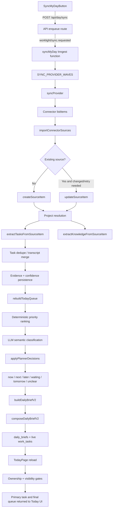

# POST `/api/day/sync` Decision-Pipeline Audit Scope

## Purpose

This is a proposed file map only. It identifies the implementation files and directly relevant tests to audit later for the decision pipeline that begins when the UI triggers `POST /api/day/sync` and ends when the refreshed Today page receives and selects the final daily task queue.

It does **not** evaluate correctness, identify defects, recommend changes, or modify implementation behavior.

## Scope boundary

- Core implementation/repository files: **25**
- Required prompt, domain, and database-schema contract files: **6**
- Total selected non-test files: **31**
- Directly relevant test files: **11**
- Included: the sync trigger, background orchestration, provider ordering, source import, source persistence, project resolution, task and knowledge extraction, task merging, source precedence, evidence and confidence decisions, ranking, queue grouping, final daily-brief composition, ownership/visibility gates, and the server-rendered UI handoff.
- Excluded: styling, generic UI primitives, authentication UI, billing, marketing, connector settings UI, Hydra-only flows, cancellation/status presentation, and infrastructure that does not make or persist a queue decision.

## End-to-end map

## Concept-to-file index

| Requested concept | Primary files |
|---|---|
| `syncMyDay` | `src/inngest/functions/syncMyDay.ts` |
| `SYNC_PROVIDER_WAVES` | `src/lib/tasks/sourceAuthority.ts`, `src/inngest/functions/syncMyDay.ts` |
| `syncProvider` | `src/lib/imports/syncProvider.ts`, `src/lib/imports/providerSyncStatus.ts` through the re-exported success predicate |
| `importConnectorSources` | `src/lib/imports/sourceImportPipeline.ts` |
| `createSourceItem`, `updateSourceItem` | `src/services/sourceItems.ts` |
| `extractTasksFromSourceItem` | `src/lib/tasks/extractor.ts`, `src/lib/llm/prompts/taskExtractor.ts` |
| `extractKnowledge` | `src/lib/knowledge/extractor.ts`, `src/lib/llm/prompts/knowledgeExtractor.ts` |
| Project resolution | `src/lib/tasks/projectMatcher.ts`, `src/lib/llm/prompts/projectMatcher.ts` |
| Task deduplication and merging | `src/lib/tasks/transcriptTaskMerge.ts`, `src/lib/tasks/extractor.ts`, `src/services/workTasks.ts` |
| Source precedence and conflict resolution | `src/lib/tasks/sourceAuthority.ts`, `src/lib/tasks/extractor.ts`, `src/lib/tasks/priorityRank.ts`, `src/lib/dailyBrief/composer.ts` |
| Confidence and evidence calculation | `src/lib/tasks/confidenceModel.ts`, `src/lib/tasks/taskConfidence.ts`, `src/lib/tasks/evidenceRelevance.ts`, `src/lib/tasks/plannerConfidence.ts`, `src/services/evidence.ts` |
| Priority scoring and ranking | `src/lib/tasks/priorityRank.ts`, `src/lib/tasks/prioritizer.ts`, `src/lib/llm/prompts/priorityPlanner.ts` |
| Main-task selection | `src/lib/tasks/priorityRank.ts`, `src/lib/dailyBrief/composer.ts`, `src/app/page.tsx` |
| `now` / `next` / `later` / `waiting` grouping | `src/lib/tasks/priorityRank.ts`, `src/lib/tasks/prioritizer.ts`, `src/services/workTasks.ts` |
| Final daily-plan generation | `src/lib/dailyBrief/buildDailyBrief.ts`, `src/lib/dailyBrief/composer.ts`, `src/domain/dailyBrief.ts` |

## Core implementation file map

### A. Trigger, orchestration, and UI return boundary

| File path | Relevant exports/functions | Role in the decision pipeline | Upstream callers | Downstream effects | Required for audit? | Reason for inclusion |
|---|---|---|---|---|---|---|
| `src/components/SyncMyDayButton.tsx` | `SyncMyDayButton`, `pollSyncRun`, sync-start handler around `fetch("/api/day/sync")` | Client entry point. Starts the sync, waits for a terminal run status, and calls `router.refresh()` so the server-rendered Today queue is fetched again. | `HumanReadableTodayView` | `POST /api/day/sync`; status polling; refreshed `TodayPage` | Yes | Defines the actual user trigger and the handoff that causes the final queue to return to the UI. Audit only behavior in this file, not overlay styling or animation. |
| `src/app/api/day/sync/route.ts` | `POST` | Creates the sync-run record and emits `worklight/sync.requested`. | `SyncMyDayButton` | Inngest `syncMyDay`; sync-run failure finalization if enqueue fails | Yes | This is the requested server-side start boundary for the pipeline. |
| `src/inngest/functions/syncMyDay.ts` | `syncMyDay`, local `finalizeIfCancelled` | Top-level workflow: approves pending items, discovers projects, resolves connected providers, executes ordered waves, runs extraction backfill and Jira reconciliation inputs, rebuilds the queue, builds briefs, and finalizes the run. | Inngest event from `POST /api/day/sync`; registered by `src/inngest/functions.ts` | `syncProvider`, `rebuildTodayQueue`, `buildDailyBriefV2`, sync-run persistence | Yes | It establishes order, concurrency, failure/cancellation boundaries, and the exact sequence between import and final planning. |
| `src/app/page.tsx` | default `TodayPage` | Reads the persisted queue and brief after `router.refresh()`, applies live ownership/visibility filters, selects the live primary task, reconciles cached brief data, and passes the ordered result to the Today UI. | Next.js server rendering; refresh initiated by `SyncMyDayButton` | Final task order and daily-brief data supplied to `HumanReadableTodayView` | Yes | This is the requested end boundary: the last non-presentation decision layer before the queue is returned to the UI. |

### B. Provider ordering, source import, and source persistence

| File path | Relevant exports/functions | Role in the decision pipeline | Upstream callers | Downstream effects | Required for audit? | Reason for inclusion |
|---|---|---|---|---|---|---|
| `src/lib/tasks/sourceAuthority.ts` | `SYNC_PROVIDER_WAVES`, `isSyncMyDayProvider`, `sourceAuthorityTier`, `filterFreshTaskSources`, `sourceAuthorityScoreBoost`, `compareSourceAuthority`, `isIncomingSourceAuthoritative`, transcript/stakeholder/attendance helpers | Defines provider wave order and the deterministic source-authority/freshness policy used when merging and ranking evidence. | `syncMyDay`, `extractor`, `priorityRank`, confidence calculation, tests | Provider execution order; whether incoming fields overwrite task fields; which evidence receives ranking weight | Yes | Central definition for `SYNC_PROVIDER_WAVES`, source precedence, stale-signal handling, and conflict winner selection. |
| `src/lib/imports/syncProvider.ts` | `syncProvider`, `ProviderSyncOutcome`, re-exported `isProviderSyncFullyOk`, `syncProviderCancellationRequested` | Resolves connector configuration, fetches provider candidates, invokes the source-import pipeline, reports partial/full outcomes, and gates cursor commits on complete processing. | `syncMyDay`; individual provider sync route; Hydra orchestrator outside this audit | `importConnectorSources`; connection metadata; provider cursors; provider-run outcome consumed by `syncMyDay` | Yes | Requested function and the provider-level boundary between external signals and Worklight decision inputs. |
| `src/lib/imports/sourceImportPipeline.ts` | `importConnectorSources`, local `connectorMetadataMatches` | For each candidate: identifies existing source rows, decides unchanged/update/create, assigns a project, indexes the source, runs task extraction and knowledge extraction, and records processing status. | `syncProvider`; resource-scope and incremental provider helpers | `source_items`, project match metadata, `work_tasks`, evidence, knowledge items, import metrics | Yes | This is the central fan-out point for create/update, project resolution, extraction, and the metrics that determine provider success. |
| `src/services/sourceItems.ts` | `createSourceItem`, `updateSourceItem`, `getSourceItemByExternalId`, `getSourceItems`, `getSourceItemsByIds` | Database repository for raw evidence sources. Implements the external-id lookup and race-safe create/update behavior used by import and later decision stages. | `sourceImportPipeline`, `projectMatcher`, `extractor`, `prioritizer`, `buildDailyBrief`, `TodayPage` | Durable source content/metadata used by extraction, precedence, confidence, ranking, and UI evidence | Yes | Contains the explicitly requested create/update definitions and the source lookup that controls source-level deduplication. |
| `src/lib/imports/providerSyncStatus.ts` | `isProviderSyncFullyOk` | Pure predicate for deciding whether all persistence and extraction work completed successfully. Re-exported and used by `syncProvider`. | `syncProvider`; direct unit test | Provider outcome classification and cursor-commit permission | Yes | Although small, it is the single decision gate behind `syncProvider` success and has a directly relevant test. |

### C. Project resolution, task extraction, knowledge extraction, merging, confidence, and evidence

| File path | Relevant exports/functions | Role in the decision pipeline | Upstream callers | Downstream effects | Required for audit? | Reason for inclusion |
|---|---|---|---|---|---|---|
| `src/lib/tasks/projectMatcher.ts` | `matchProjectForSourceItem`, `matchAndAssignSourceItemToProject`, `matchProjectForTask`, `matchAndAssignTaskToProject`, local `matchProjectForText`, `normalizeMatch` | Builds candidate project context, calls the project-matching LLM job, applies the confidence threshold, records source match metadata, and assigns source/task project IDs. | `sourceImportPipeline`; `extractTasksFromSourceItem` for unassigned new tasks | `source_items.projectId`, source `projectMatch` metadata, `work_tasks.projectId`, downstream project context for extraction/ranking | Yes | Owns project resolution and the deterministic acceptance threshold around the model result. |
| `src/lib/llm/prompts/projectMatcher.ts` | `PROJECT_MATCHER_SYSTEM_PROMPT`, `buildProjectMatcherUserPrompt`, `projectMatchOutputSchema`, `ProjectMatcherCandidate` | Prompt and Zod contract for project selection, uncertainty, confidence, and evidence quotes. | `projectMatcher`; LLM router imports the static system prompt | Parsed project match result consumed by `normalizeMatch` | Yes | Requested prompt/schema directly controls what project-resolution evidence and confidence can enter the pipeline. |
| `src/lib/tasks/extractor.ts` | `extractTasksFromSourceItem`, `ExtractTasksOptions`, `TaskExtractionRunResult`, evidence filtering and merge helpers | Runs task extraction, filters candidate noise, resolves merge targets, applies source precedence, computes confidence, creates or updates tasks, and writes per-source evidence. | `sourceImportPipeline`; extraction backfill; manual source-item route | New/updated `work_tasks`, evidence rows, meeting context, project matching for unassigned tasks | Yes | Requested extraction function and the main decision point for task creation, merging, ownership, confidence, and evidence attachment. |
| `src/lib/llm/prompts/taskExtractor.ts` | `TASK_EXTRACTOR_SYSTEM_PROMPT`, `buildTaskExtractorSystemPrompt`, `buildTaskExtractorUserPrompt`, `extractedTaskSchema`, `taskExtractionOutputSchema` | Defines extraction rules and the schema for task identity hints, ownership, status, reason, next action, done criteria, evidence, confidence, and meeting context. | `extractTasksFromSourceItem`; LLM router imports the fallback system prompt | Structured candidates passed into deterministic merge/persistence logic | Yes | Requested prompt/schema defines the model-generated inputs that can become queue tasks. |
| `src/lib/tasks/transcriptTaskMerge.ts` | `resolveTranscriptMergeTarget`, `findTaskByExactTitleMatch`, `isExtractRelevantToTask`, `findOnlyActiveTopicAnchor`, `pickPrimaryExtractedTask`, `mergeTaskTitle`, Jira-key helpers | Deterministic task identity, deduplication, and merge-target resolution for transcript/Jira updates. | `extractTasksFromSourceItem`; work-task and daily-brief helpers use its Jira-key utilities | Existing task update versus new task creation; full update versus evidence-only merge | Yes | Primary implementation for the requested task deduplication and merging behavior. |
| `src/lib/tasks/evidenceRelevance.ts` | `isQuoteRelevantToTask`, `filterMeetingContextForTask`, `planEvidenceRelevancePrune`, `taskDomainText` | Determines whether a quote or meeting context actually supports a task, using Jira identity, topic overlap, and freshness. | `extractor`; work-task hydration; evidence-prune service; task detail paths | Evidence retained, discarded, or prevented from attaching to a merge target | Yes | Evidence relevance directly affects confidence inputs, source precedence, ranking, and what evidence the UI receives. |
| `src/lib/tasks/confidenceModel.ts` | component calculators, `CONFIDENCE_WEIGHTS`, `aggregateConfidence`, `ConfidenceComponents`, `ConfidenceResult` | Pure deterministic confidence model combining assignment, identity, project match, extraction confidence, authority, freshness, corroboration, and conflict penalty. | `taskConfidence`; domain/work-task typing; direct tests | Final task confidence and stored component breakdown | Yes | Requested confidence calculation is defined here. |
| `src/lib/tasks/taskConfidence.ts` | `computeTaskConfidence`, `TaskConfidenceInput` | Maps real source, ownership, identity, project, freshness, corroboration, and conflict signals into the pure confidence model. | `extractTasksFromSourceItem` | `work_tasks.confidence` and `confidenceComponents`, later unclear/visibility behavior | Yes | This is the pipeline wiring layer between extracted evidence and stored confidence. |
| `src/lib/knowledge/extractor.ts` | `extractKnowledgeFromSourceItem`, `KnowledgeExtractionRunResult`, local `saveCandidate` | Runs knowledge extraction, applies Granola-personal filtering, saves approved knowledge items, and attempts indexing. | `sourceImportPipeline`; backfill; manual source route | Knowledge items and embeddings; import-result extraction status/metrics | Yes | Requested `extractKnowledge` stage and a branch whose failure affects provider outcome. |
| `src/lib/llm/prompts/knowledgeExtractor.ts` | `KNOWLEDGE_EXTRACTOR_SYSTEM_PROMPT`, `buildKnowledgeExtractorUserPrompt`, `knowledgeItemCandidateSchema`, `knowledgeExtractionOutputSchema` | Prompt and Zod contract separating durable knowledge from tasks and requiring source-grounded evidence/confidence. | `extractKnowledgeFromSourceItem`; LLM router imports the static system prompt | Structured knowledge candidates and confidence values persisted by the extractor | Yes | Requested prompt/schema for the knowledge-extraction branch. |
| `src/services/workTasks.ts` | `createWorkTaskWithEvidence`, `getWorkTasks`, `getTodayQueue`, `applyPlannerDecisions`, `updateWorkTask`, `WorkTaskWithEvidence` | Main task repository. Persists extracted/merged tasks, hydrates evidence, returns status-grouped queues ordered by score, applies planner decisions atomically, preserves manual status, and enforces a single non-manual `now` item. | `extractor`, `prioritizer`, `buildDailyBrief`, `TodayPage`, task APIs | Durable task fields, queue status, score, confidence, evidence context, and the final grouped queue | Yes | Central database repository for task merging, status grouping, main-task uniqueness, and the final queue read. |
| `src/services/evidence.ts` | `createEvidence`, `getEvidenceForTask`, `replaceEvidenceForTaskSource`, deletion helpers | Evidence repository for creating and replacing the task/source evidence set. | `extractor`, prioritizer adoption, evidence-prune paths | Durable evidence quotes and summaries consumed by confidence, precedence, ranking, briefs, and UI | Yes | Explicitly required to trace evidence persistence and replacement during merges. |

### D. Priority scoring, ranking, status grouping, and final plan

| File path | Relevant exports/functions | Role in the decision pipeline | Upstream callers | Downstream effects | Required for audit? | Reason for inclusion |
|---|---|---|---|---|---|---|
| `src/lib/tasks/priorityRank.ts` | `rankWorkTask`, `rankWorkTasks`, `buildQueueDecisionsFromRanking`, `buildPlannerSummaryFromRanking`, `buildDeterministicFocusItems` | Computes deterministic task scores from status, urgency, Jira state, due dates, evidence recency, source authority, attendance, and other source-grounded signals; converts rank order into queue statuses. | `rebuildTodayQueue`; daily-brief composer; legacy briefing builder | Ordered task list, normalized scores, force-inclusion flags, baseline `now`/`next`/`later`/`waiting` decisions | Yes | Primary implementation for priority scoring, ranking, initial main-task selection, and deterministic grouping. |
| `src/lib/tasks/prioritizer.ts` | `rebuildTodayQueue`, `getTodayQueueSummary`, `PriorityPlanSummary`, `RebuildTodayQueueResult` | Reconciles completed/duplicate work, prunes irrelevant evidence, gathers project/source/Jira/memory context, runs deterministic ranking, optionally overlays semantic LLM classifications, resolves confidence, and persists planner decisions. | `syncMyDay` | Updated task status, score, reason, waiting state, confidence, and queue summary | Yes | Requested queue rebuild and the point where ranking plus model output become the stored daily queue. |
| `src/lib/llm/prompts/priorityPlanner.ts` | `PRIORITY_PLANNER_SYSTEM_PROMPT`, `buildPriorityPlannerUserPrompt`, `taskPriorityDecisionSchema`, `priorityPlanningOutputSchema` | Prompt and Zod contract for semantic status classification, priority score, reason, waiting/unclear fields, and confidence. | `rebuildTodayQueue`; LLM router imports the static system prompt | Per-task semantic overlay applied to deterministic queue decisions | Yes | Requested prompt/schema for priority scoring and `now`/`next`/`later`/`waiting` grouping. |
| `src/lib/tasks/plannerConfidence.ts` | `resolvePlannerConfidence`, `effectiveExtractionConfidence`, `isConfidenceContaminatedByPriority`, `shouldRouteLowConfidenceToUnclear` | Separates confidence from urgency score, resolves missing/contaminated values, and decides whether a planned task should route to `unclear`. | `prioritizer`; `taskVisibility` | Stored planner confidence, `unclear` routing, final UI visibility treatment | Yes | Connects confidence semantics to queue grouping and the final UI. |
| `src/lib/dailyBrief/buildDailyBrief.ts` | `buildDailyBriefV2`, `getTodayDailyBrief`, `upsertDailyBrief` | Loads the freshly grouped queue and its sources, invokes the deterministic composer, validates citations, and persists the daily-plan document. | `syncMyDay`; `TodayPage` reads the stored result | `daily_briefs` row and shadow JSON consumed by the Today page | Yes | Requested final daily-plan generation and its persistence/read boundary. |
| `src/lib/dailyBrief/composer.ts` | `composeDailyBriefV2`, `validateDailyBriefCitations`, `ComposerTask` | Re-ranks eligible owned work for the brief, selects `todayFirst` and `afterThat`, classifies blocked/waiting/unclear items, applies Done and source-conflict handling, and emits a validated plan. | `buildDailyBriefV2`; direct scenario test | Final primary task, secondary tasks, blockers, conflicts, coverage warnings, citations, and plan input hash | Yes | Owns final main-task selection and deterministic daily-plan shape after queue persistence. |
| `src/lib/filters/ownerFilter.ts` | `classifyTaskOwnership`, `taskEligibleForBriefPriority`, `filterQueueByOwners`, `myOwnerFilter`, person/Jira-assignee helpers | Determines whether a task is mine, someone else’s, or unclear and filters queue/brief candidates accordingly. | `extractor`, `composer`, `taskVisibility`, `TodayPage` | Tasks retained, hidden, routed away from main-task selection, or treated as unclear | Yes | Ownership is a decisive gate both before persistence and before the final queue is returned to the UI. |
| `src/lib/tasks/taskVisibility.ts` | `decideTaskVisibility`, `filterTasksForTodayView`, `filterTasksForBriefPriority` | Applies ownership and effective-confidence rules at the final Today-page boundary. | `TodayPage` | Final set of tasks eligible for display and whether low/unknown-confidence tasks are treated as unclear | Yes | Required to trace how stored queue tasks become the queue actually returned to the UI. |
| `src/domain/dailyBrief.ts` | `dailyBriefV2Schema`, `DAILY_BRIEF_SCHEMA_VERSION`, `DailyBriefV2`, `DailyWorkItem` | Zod contract for the final daily plan, including `todayFirst`, `afterThat`, blocked/waiting items, conflicts, citations, and status hints. | `composer`, `buildDailyBrief`, `TodayPage` | Validation and persistence contract for final plan generation | Yes | Requested schema for the final decision output. |
| `src/db/schema.ts` | `sourceItems`, `workTasks`, `evidence`, `knowledgeItems`, `syncRuns`, `syncProviderRuns`, `dailyBriefs` and related status enums | Database schema for the source, task, evidence, knowledge, sync-run, and daily-plan records that carry decisions between stages. | All selected repositories through `src/db/tables.ts` | Column constraints, status vocabulary, relations, stored confidence/evidence/plan structure | Yes | Required database-schema boundary. Audit only the listed tables/enums, not unrelated tables in this shared file. |

## Directly relevant test map

| File path | Relevant tests/functions | Role in the decision pipeline | Upstream production target | Downstream behavior covered | Required for audit? | Reason for inclusion |
|---|---|---|---|---|---|---|
| `src/lib/imports/syncProvider.test.mts` | `isProviderSyncFullyOk` cases | Characterizes provider full/partial success when persistence or extraction fails. | `providerSyncStatus.ts`, re-exported/used by `syncProvider.ts` | Provider outcome and cursor-commit gate | Yes | Direct test for the success predicate used by the requested `syncProvider` stage. |
| `src/lib/tasks/sourceAuthority.test.mts` | Provider-wave order, transcript/PRD detection, precedence, freshness, attended-transcript boost | Characterizes sync order and source-authority decisions. | `sourceAuthority.ts` | Provider order, overwrite winner, ranking boosts | Yes | Direct coverage for `SYNC_PROVIDER_WAVES` and source precedence. |
| `src/lib/tasks/transcriptTaskMerge.test.mts` | Jira-key merge, exact-title dedupe, topic anchor, ownership/relevance cases | Characterizes task deduplication and merge-target resolution. | `transcriptTaskMerge.ts` | New task versus merge; full versus evidence-only update | Yes | Direct coverage for requested task deduplication/merging. |
| `src/lib/tasks/evidenceRelevance.test.mts` | Quote relevance and prune-plan cases | Characterizes which evidence is permitted to support a task. | `evidenceRelevance.ts` | Evidence retained/removed and merge guard behavior | Yes | Direct evidence-decision coverage. |
| `src/lib/tasks/confidenceModel.test.mts` | Component calculators, weighted aggregation, conflict penalty, determinism | Characterizes the pure confidence formula. | `confidenceModel.ts` | Final confidence and components | Yes | Direct coverage for requested confidence calculation. |
| `src/lib/tasks/taskConfidence.test.mts` | Source/owner/project/freshness/corroboration/conflict wiring | Characterizes the real-signal inputs passed to the confidence model. | `taskConfidence.ts` | Stored extraction confidence | Yes | Direct coverage for confidence wiring used by extraction. |
| `src/lib/tasks/plannerConfidence.test.mts` | Contamination detection, fallback, low-confidence `unclear` routing | Characterizes confidence use during planning and visibility. | `plannerConfidence.ts` | `unclear` routing and confidence preservation | Yes | Direct coverage for the confidence-to-grouping boundary. |
| `src/lib/tasks/taskVisibility.test.mts` | Other-owner hiding, null-owner handling, low/contaminated-confidence visibility | Characterizes the final Today visibility gate. | `taskVisibility.ts` | Final task set returned to the UI | Yes | Direct coverage for the pipeline’s final filtering boundary. |
| `src/lib/filters/ownerFilter.test.mts` | Ownership classification, Jira assignee, explicit owner, foreign-actor, not-mine cases | Characterizes ownership decisions used in extraction, brief selection, and UI filtering. | `ownerFilter.ts` | Eligibility for the queue and main-task slots | Yes | Direct ownership coverage across multiple selected stages. |
| `src/lib/tasks/canonicalLifecycle.test.mts` | `rankWorkTask`, `rankWorkTasks`, claim-aware ranking and lifecycle cases | Scenario coverage for ranking around Jira identity/state. | `priorityRank.ts` and its canonical/Jira dependencies | Score order and Done/open handling | Yes | Directly exercises priority ranking used by queue rebuild and daily-plan composition. |
| `src/lib/dailyBrief/jul20Scenario.test.mts` | `rankWorkTasks`, `composeDailyBriefV2`, `validateDailyBriefCitations` | End-to-end deterministic scenario for main-task ordering and final plan composition. | `priorityRank.ts`, `composer.ts` | `todayFirst`, `afterThat`, ownership exclusion, citations, and conflict/coverage output | Yes | Closest direct test of final daily-plan generation. |

## Selected files without a direct focused test in the current tree

This is an inventory statement only, not a test-quality finding.

- `src/components/SyncMyDayButton.tsx`
- `src/app/api/day/sync/route.ts`
- `src/inngest/functions/syncMyDay.ts`
- `src/app/page.tsx`
- `src/lib/imports/sourceImportPipeline.ts`
- `src/services/sourceItems.ts`
- `src/lib/tasks/projectMatcher.ts`
- `src/lib/llm/prompts/projectMatcher.ts`
- `src/lib/tasks/extractor.ts`
- `src/lib/llm/prompts/taskExtractor.ts`
- `src/lib/knowledge/extractor.ts`
- `src/lib/llm/prompts/knowledgeExtractor.ts`
- `src/services/workTasks.ts`
- `src/services/evidence.ts`
- `src/lib/tasks/prioritizer.ts`
- `src/lib/llm/prompts/priorityPlanner.ts`
- `src/lib/dailyBrief/buildDailyBrief.ts`
- `src/domain/dailyBrief.ts`
- Relevant table declarations inside `src/db/schema.ts`

## Explicitly excluded adjacent files

These files were located while tracing the call graph but are outside the proposed core audit.

| Excluded area/files | Reason for exclusion from this audit scope |
|---|---|
| `src/app/api/day/sync/[id]/route.ts`, `src/lib/imports/syncMyDayOrchestrator.ts`, `src/services/syncRuns.ts`, cancel route | Progress, cancellation, and observability plumbing. They determine when the UI refreshes but do not create, merge, rank, group, or select tasks. Promote only if the later audit includes run-state correctness. |
| `src/lib/imports/sourceContentHash.ts`, `sourceRevision.ts`, `sourceProcessing.ts`, cursor modules | Import idempotency, revision history, retry markers, and checkpoint plumbing. Their effects enter through `sourceImportPipeline`/`syncProvider`, but they do not own the named task/plan decisions. Promote only if source-change detection or retry semantics become an audit question. |
| `src/lib/imports/backfillExtractions.ts` | Replays the same task/knowledge extractors for older sources; it does not define a separate decision policy. |
| `src/lib/tasks/taskReflect.ts`, `src/lib/llm/prompts/factReflect.ts`, `src/lib/tasks/reflectDecisions.ts`, `src/lib/tasks/evidenceVerification.ts` | Secondary extraction-noise gate. It is called inside `extractTasksFromSourceItem`, but the proposed first audit keeps its boundary at the extractor’s accepted/rejected candidate result. Promote as a package if candidate-filter behavior itself is audited. |
| `src/lib/tasks/todayBriefing.ts`, `src/lib/llm/prompts/todayBriefing.ts` | Builds a legacy/enrichment briefing used for task wording. The live queue and `DailyBriefV2` own final stored status and main-task selection; `TodayPage` explicitly lets the live queue win. |
| `src/lib/tasks/conflictDetection.ts`, `src/lib/tasks/taskSupportingSources.ts` | Structural conflict surfacing and supporting-source presentation. Source winner selection remains in `sourceAuthority.ts`; promote these if the audit expands from conflict resolution into conflict-display completeness. |
| `src/lib/tasks/claimAwareRanking.ts`, `canonicalKey.ts`, Jira reconciliation/adoption helpers | Direct ranking/lifecycle helpers consumed by the selected ranking/composer files. They are not independent orchestration, persistence, prompt, or final-output boundaries. Promote only when drilling into a specific Jira ranking case. |
| Connector implementations and registries under `src/lib/connectors/` | They fetch/normalize provider data, but the requested audit begins its decision analysis at provider ordering/import and does not audit every source adapter. |
| `HumanReadableTodayView.tsx` and its child components | Presentation layer after `TodayPage` has already selected and ordered the tasks. Excluded along with styling and generic UI. |

## Proposed audit order

1. Trigger and orchestration: files A1–A4.
2. Provider ordering and source import: files B1–B5.
3. Project, task, knowledge, merge, confidence, and evidence decisions: files C1–C12.
4. Ranking, grouping, final-plan composition, and UI return: files D1–D10.
5. Run the 11 directly relevant tests as characterization evidence only after the implementation trace is complete.

Stop here. No audit has been performed.
