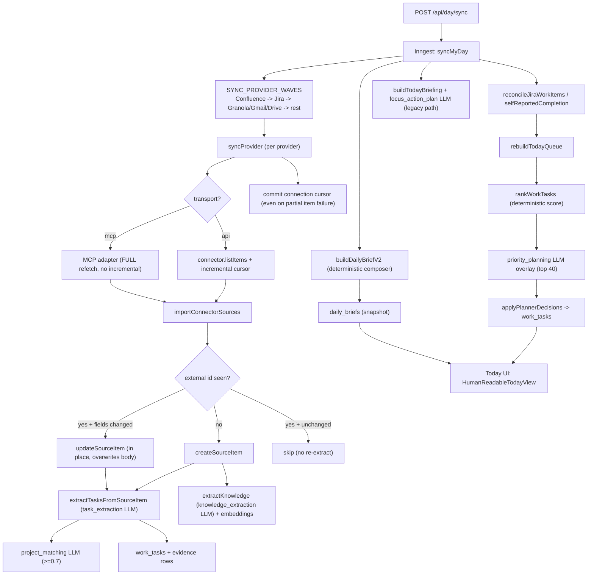
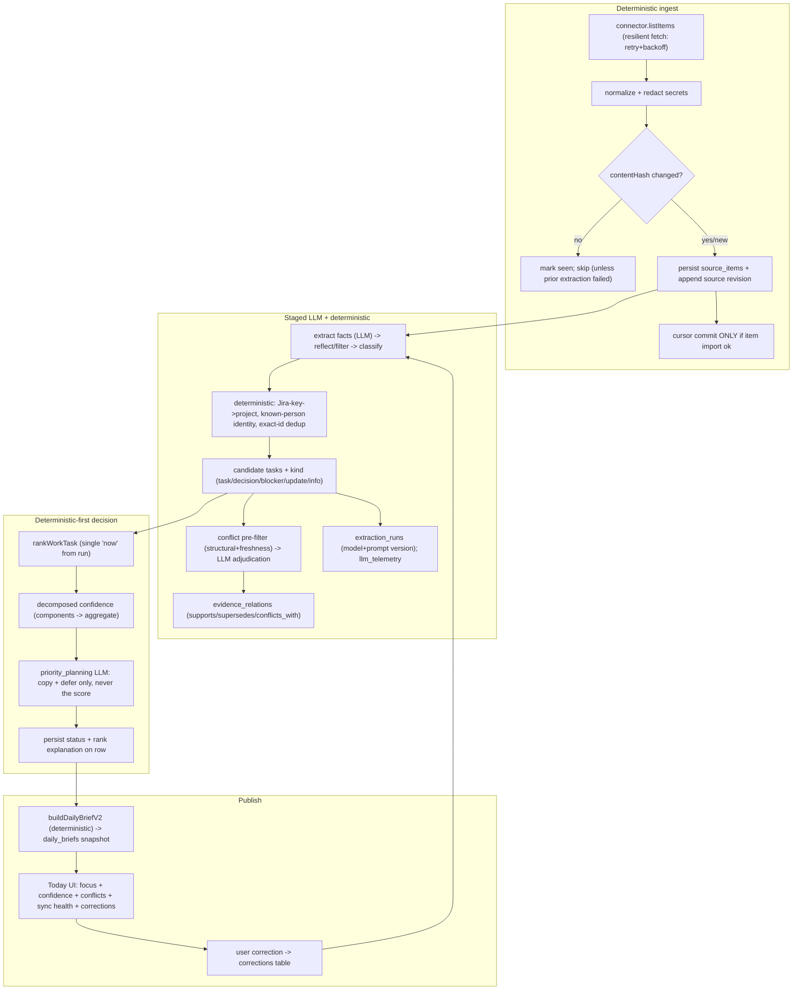

# Worklight Accuracy and Improvement Audit

> Scope note: This is a **read-only architecture audit**. No application code was
> modified. The only artifact produced is this file. All Worklight claims were
> verified against source at the paths/symbols cited. External repos were cloned
> to `tmp/external-audit/` purely for inspection; most external claims were
> checked against cloned source, but some (e.g. 10xProductivity's device-specific
> `verified_connections.md`, which is private and absent from the clone, and
> Dex's markdown/skill-driven correction lifecycle) rest on
> documentation/skill/workflow files rather than executed code. Treat external
> "better than Worklight" statements as author inference, not measured results.

**Certainty labels used throughout:** `VERIFIED IN WORKLIGHT`,
`VERIFIED IN EXTERNAL PROJECT`, `INFERRED`, `PROPOSED`, `UNVERIFIED`.

---

## 1. Executive Decision

**Worklight's architecture is fundamentally suitable for its purpose** (a
local-first, single-operator "what do I do first, why, what's next, how do I
know it's done" briefing) and should be **extended, not rewritten**. `VERIFIED IN WORKLIGHT`

The system is more mature than any of the five external projects on the
dimensions that matter most for it: a typed connector registry with
per-connection incremental cursors (`src/lib/imports/connectionCursorUtils.ts`),
a central LLM router with model fallback + JSON repair + Zod validation
(`src/lib/llm/router.ts`), a hybrid deterministic-plus-LLM ranking system
(`src/lib/tasks/priorityRank.ts` + `src/lib/tasks/prioritizer.ts`), an
already-immutable evidence snapshot path for reports (`source_documents`,
`hydra_evidence_items`, `evidence_relations` in `src/db/schema.ts`), and a
deterministic daily-brief composer (`src/lib/dailyBrief/composer.ts`). None of
the external projects match this combination.

The **largest accuracy risk is not the LLM** — it is a set of **data-integrity
and sync-state defects** that let the system silently believe it has fully and
correctly processed information it has not:

1. A provider sync is marked **`completed` and its cursor advanced even when
   individual items failed to import** (`src/lib/imports/syncProvider.ts:193`
   returns `{ ok: true }` regardless of `importResult.ok`; cursors are committed
   at lines 152–191 before that return). `VERIFIED IN WORKLIGHT`
2. The main task path stores sources in a **mutable `source_items` row with no
   revision history, no `updated_at`, and no DB-enforced uniqueness** on
   `(source_type, source_external_id)` (`src/db/schema.ts:59-71`). An edited
   source overwrites the prior body; races can duplicate rows. `VERIFIED IN WORKLIGHT`
3. **Confidence is invented by the model**, not derived from signals
   (`src/lib/llm/prompts/shared.ts:44`, universal rule 7), then only thresholded
   in code (`src/lib/tasks/plannerConfidence.ts`). `VERIFIED IN WORKLIGHT`

The single most leverage-per-effort improvements are: **(a)** make sync state
honest — and note this must cover **both** persist failures *and*
extraction/embedding failures, which today never touch `itemsFailed` or the
run-completion status; **(b)** add content-hash + revision awareness to the
task-path source store (building on the existing `_worklightProcessing`
fingerprint, not from scratch); and **(c)** decompose confidence into
deterministic components (replacing the current `resolvePlannerConfidence`
default of `1.0`). All three are low-to-medium effort and provable with fixtures,
but they are **not migration-free**: (a) needs a `sync_provider_runs` status
enum change, (b) adds columns + a revision store, and (c) adds component storage
and threshold recalibration. Only (a)'s behavior half is pure code. Their
*accuracy* payoff for (c) must be measured against a labeled baseline, not
assumed.

Only two external projects contribute patterns worth adopting in the near term:
**CORE** (`RedPlanetHQ/core`) for temporal fact invalidation, document-diff
re-ingestion, staged extraction, and per-source ingestion rules; and
**Workstream** (`happybhati/workstream`) for LLM telemetry, snapshot tombstone
cleanup, rate-limit backoff, and pre-LLM secret redaction. **Dex** and
**continuum.ai** contribute a few narrow ideas (correction-capture lifecycle,
person entities, deterministic action policy). **10xProductivity** contributes
essentially nothing adoptable into a backend app.

---

## 2. Audit Scope

| In scope | Out of scope |
|----------|--------------|
| Integration reliability, incremental sync, extraction accuracy, entity/project matching, decision/prioritization, LLM usage, evidence/confidence/conflict handling, presentation | Redesigning Worklight into a new product; adding features because a competitor has them; implementing any change |

The audit reconstructs the real pipeline from source, identifies verified
weaknesses, inspects five external repositories for genuinely-better patterns,
and produces prioritized deltas with acceptance criteria and evaluation
fixtures. Recommendations that only add visual novelty, autonomous execution, a
second task system, opaque agents, or weaker traceability are rejected by rule.

## 3. Repository Areas Inspected

**Worklight (`VERIFIED IN WORKLIGHT`)** — verified by reading source:

- Connectors: `src/lib/connectors/**` (registry, types, providers, oauth, auth,
  transport, `mcp/**`, and each provider adapter).
- Sync/imports: `src/lib/imports/**` (cursor utils, `sourceImportPipeline.ts`,
  `sourceProcessing.ts`, `syncProvider.ts`, `syncRunCompletion.ts`,
  `syncResourceScopes.ts`, `backfillExtractions.ts`, reconciliation modules).
- Jobs: `src/inngest/functions/syncMyDay.ts`, `src/inngest/functions.ts`.
- Schema/migrations: `src/db/schema.ts`, `drizzle/postgres/0000`–`0006`.
- Domain/services: `src/domain/**`, `src/services/**`.
- LLM: `src/lib/llm/router.ts`, `src/lib/llm/prompts/**`, provider adapters.
- Decision/tasks: `src/lib/tasks/**`, `src/lib/hydra/**`, `src/lib/dailyBrief/**`,
  `src/lib/filters/**`.
- UI: `src/app/page.tsx`, `src/app/tasks/**`, `src/components/**`.
- Tests: `*.test.mts` across `src/lib/**`.

**External (`VERIFIED IN EXTERNAL PROJECT`)** — cloned and read under
`tmp/external-audit/`:

- `RedPlanetHQ/core` — commit dated 2026-07-20, AGPL-3.0 + Commons Clause,
  ~226k LOC TS.
- `happybhati/workstream` — commit dated 2026-07-18, Apache-2.0, ~19k LOC Python.
- `avyuktsoni0731/continuum.ai` — commit dated 2025-12-30 (stale), MIT, ~9.4k LOC Python.
- `davekilleen/dex` — commit dated 2026-07-21, PolyForm Noncommercial 1.0.0 +
  separate commercial license, ~74k LOC code / ~85k LOC markdown.
- `ZhixiangLuo/10xProductivity` — commit dated 2026-07-12, MIT, ~23k LOC (≈half markdown).

---

## 4. Current Worklight Architecture

### 4.1 Current System Diagram



> Note: The Hydra report pipeline (`decisionEngine` → `hydra_report` LLM →
> `source_documents` + `hydra_evidence_items` + `evidence_relations`) is a
> **separate** scheduled/manual pipeline (`src/lib/hydra/orchestrator.ts`). It is
> **not** invoked by `syncMyDay` — `syncMyDay.ts` has no Hydra imports. Within a
> run, `hydra_evidence_items` are rebuilt via `replaceHydraEvidence`
> (`services/hydra.ts`); `source_documents` are append-on-hash via
> `saveSourceDocument`.

**Stage-by-stage reconstruction** (`VERIFIED IN WORKLIGHT` unless noted):

| Stage | Module / symbol | Det/LLM | Persisted | Idempotent? | Key risk |
|-------|-----------------|---------|-----------|-------------|----------|
| Provider connection | `src/lib/connectors/oauth.ts`, `auth.ts`; `connections` table | Det | `data/connection-secrets.json`, `connections` | Yes | Jira OAuth requests `write:jira-work` (`oauth.ts:13-18`) despite read-only policy |
| Source retrieval | `connector.listItems` in `src/lib/connectors/registry.ts`; per-provider adapters | Det | — | N/A | No retry/rate-limit/backoff anywhere in connectors |
| Sync checkpoint lookup | `resolveIncrementalSinceIso` (`connectionCursorUtils.ts:99-122`); `connection_cursors` | Det | `connection_cursors` | Yes | MCP transport bypasses incremental → full refetch (`syncProvider.ts:103-107`) |
| New/changed detection | `importConnectorSources` (`sourceImportPipeline.ts:68-109`) | Det | — | Partial | Unchanged skip blocks re-extraction; metadata-only change may be skipped |
| Raw source persistence | `createSourceItem`/`updateSourceItem` (`sourceItems.ts`) | Det | `source_items` (mutable) | No | No revision history, no content hash, no unique index (task path) |
| Normalization | in connector, before persist | Det | — | N/A | No separate normalized state tracked |
| Identity resolution | `classifyTaskOwnership` (`ownerFilter.ts:197-226`) | Det (LLM ownership is inside `task_extraction`, not this symbol) | task fields | No | No durable person entity; owner inferred per-run |
| Project matching | `matchProjectForText` (`projectMatcher.ts`), `MIN_PROJECT_MATCH_CONFIDENCE=0.7` | LLM | `source_items.metadata.projectMatch`, `work_tasks.projectId` | No | A deterministic `projects.jira_keys` registry exists (`schema.ts:35`, `jiraSync.ts`) but is **not wired into** source/task assignment — the matcher stays LLM-only |
| Fact/task extraction | `extractTasksFromSourceItem` (`extractor.ts:184`) → `task_extraction` | LLM | `work_tasks`, `evidence` | No | Kitchen-sink call (see §4.5) |
| Decision/blocker extraction (task path) | `task_extraction` status + `waitingOn`; `priorityRank.ts` scores blocker text via regex (`:217`). (`decisionEngine.ts` regex belongs to the Hydra report path, not this stage.) | Det+LLM | task fields | Partial | No first-class decision/blocker/update/info type |
| Deduplication | `resolveTranscriptMergeTarget` (`transcriptTaskMerge.ts`), `canonicalKey.ts`, `planDuplicateJiraTaskMerge` | Det+LLM | `work_tasks.canonical_key` | Partial | Non-Jira meeting tasks fuzzy-merged only at extraction |
| Conflict resolution | `sourceAuthority.ts`, `claimAwareRanking.ts`; surfaced in `composer.ts:397-424`, Hydra | Det | brief/report JSON | Yes (cached) | Most conflicts resolved silently on task path |
| Confidence calculation | model output + `plannerConfidence.ts` gating | LLM | `work_tasks.confidence` | No | Model-invented, single scalar |
| Priority calculation | `rankWorkTask` (`priorityRank.ts`) + `priority_planning` overlay | Det+LLM | task status/score | Cached by inputHash | `Date.now()` in weights → minor run drift |
| Daily output | `buildDailyBriefV2` (`composer.ts`), legacy `buildTodayBriefing` | Det (+LLM legacy) | `daily_briefs` | Yes (inputHash) | Two parallel briefing architectures coexist |
| Persistence | Drizzle/Postgres | Det | see §4.4 | — | FKs mostly `ON DELETE no action` |
| UI presentation | `src/app/page.tsx` → `HumanReadableTodayView` | Det | — | — | Drops confidence/conflict/correction surfacing (see §4.7) |
| User correction | `PATCH /api/work-tasks/[id]/status` → `statusManuallySet` | Det | `work_tasks.status_manually_set` | Yes | Not fed back into prompts/future syncs |
| Future sync behavior | cursor + `_worklightProcessing` fingerprint (`sourceProcessing.ts`) | Det | `source_items.metadata` | Partial | Fingerprint match can skip needed re-extraction |

### 4.2 Integration Architecture

`VERIFIED IN WORKLIGHT`. Connectors implement a shared `Connector` interface
(`src/lib/connectors/registry.ts:47-52`) with `configError` + read-only
`listItems`, normalizing to `ConnectorSourceCandidate`
(`src/lib/connectors/types.ts:3-13`: `sourceType`, `sourceExternalId`, `title`,
`body`, `sourceDate`, `metadata`). Transport is `api` or `mcp`
(`transport.ts`). OAuth config, CSRF state, and token exchange live in
`oauth.ts`; proactive refresh (60s skew) in `auth.ts:11-56`. Secrets are stored
server-side in `data/connection-secrets.json` (mode 0600) and never reach the
frontend — architecture rule satisfied.

Strengths: clean provider isolation; UI never imports connector SDKs; MCP and
API transports both supported. Weaknesses (all `VERIFIED IN WORKLIGHT`):

- **No HTTP retry / rate-limit / backoff** in any connector (`grep` in
  `src/lib/connectors/**` returns zero); single-shot `fetchWithTimeout`
  (`src/lib/http.ts:3-18`).
- **MCP transport bypasses incremental filters** → full refetch every sync.
  This happens both at the orchestration gate (`syncProvider.ts:103-107`) and in
  the MCP adapters themselves, which omit any `updatedSinceIso`/cursor window
  (`fetchJiraIssuesViaMcp`, `fetchConfluencePagesViaMcp` in `registry.ts:139-145,
  208-209`; `fetchGranolaMeetingsViaMcp` in `registry.ts:220-221`).
- **GitHub/Discord non-incremental fallback paths** refetch broadly.
- **Connect-time OAuth scopes exceed read-only** for three providers, not one:
  Jira `write:jira-work`, GitHub `repo` (full repo read/write), and Discord `bot`
  (`oauth.ts:13-18,26-27`) — all against the read-only-by-default policy.

### 4.3 Sync and Processing Pipeline

`VERIFIED IN WORKLIGHT`. `syncMyDay` (`src/inngest/functions/syncMyDay.ts`)
orchestrates provider waves, cancellation checkpoints, reconciliation, queue
rebuild, and brief building. Incremental cursors are stored in
`connection_cursors` (`schema.ts:454-483`, unique on
`(connectionId, provider, scopeType, scopeKey, cursorType)`) with a 24h overlap
window and 30-day initial lookback (`connectionCursorUtils.ts:3-4,99-122`).

Critical defects (`VERIFIED IN WORKLIGHT`):

- **False provider success:** `syncProvider.ts:193` returns `{ ok: true }`
  whenever no exception is thrown, **ignoring `importResult.ok`** (item failures
  set `ok:false` in `sourceImportPipeline.ts:255` but never change provider
  outcome). `syncMyDay.ts:164-172` then calls `completeSyncProviderRun`, marking
  the provider `completed` despite `itemsFailed > 0`.
- **Extraction/embedding failures don't count as failures at all** (the dominant
  silent path): when a source persists but its `task_extraction`, knowledge
  extraction, or embedding fails, `sourceImportPipeline.ts` pushes an error and
  records `_worklightProcessing.taskStatus:"failed"` but leaves `result.ok` true
  and **does not increment `itemsFailed`** — only the `catch` at
  `sourceImportPipeline.ts:255` (persist exceptions) increments it. So a provider
  can be `completed` with `itemsFailed === 0` while sources carry a failed
  extraction status.
- **Run-level masking:** `deriveSyncRunCompletionStatus`
  (`syncRunCompletion.ts:17-31`) takes only `failedProviderCount`, `rebuildOk`,
  `briefingOk` — never `itemsFailed`. `syncMyDay.ts:344,358-363` counts only
  `!entry.ok`. A run with persisted import/extraction failures but no thrown
  exceptions and a successful rebuild/brief finalizes as **`completed`**, not
  `partially_completed`.
- **Cancelled providers can be recorded `completed`:** when a cancellation
  carries partial metrics, `syncMyDay.ts:144-146` calls `completeSyncProviderRun`
  rather than keeping the run `cancelled`.
- **Cursor advances on partial failure:** provider-level cursors commit at
  `syncProvider.ts:152-191` before the success return, so failed items are not
  re-fetched next run. (Resource-scoped incremental in `syncResourceScopes.ts`
  is stricter — commits only when `itemsFailed === 0` per scope — but still
  reports provider success via `finalizeProviderSyncSuccess` with errors.)
- **No processing state machine:** states fetched → persisted → normalized →
  interpreted → recommendation → published are only partially tracked
  (`SyncProviderRun` counts + `metadata._worklightProcessing.{taskStatus,knowledgeStatus}`).
  There is no unified enum, and `backfillUnextractedSources` processes only
  8 sources/run (`backfillExtractions.ts:36,92`) without blocking completion.
- **`calendarSyncState.ts`** holds the pending Google syncToken in an
  in-memory singleton — not durable, not concurrency-safe.

### 4.4 Data Model

`VERIFIED IN WORKLIGHT`. Postgres via Drizzle; `src/db/schema.ts` canonical.
There are **two parallel evidence systems**:

- **Task path (mutable):** `source_items` (`schema.ts:59-71`) → `evidence`
  (`schema.ts:114-126`, FK to `work_tasks` + `source_items`, `quote`+`summary`)
  → `work_tasks` (pillars, `confidence`, `meeting_context`, `canonical_key`,
  `status_manually_set`, `review_status`).
- **Report path (append/replace-per-run, more disciplined than the task path):**
  `source_documents` (`content_hash`, `version`, append-on-hash via
  `saveSourceDocument` in `services/hydra.ts:240-247`) → `hydra_evidence_items`
  (per-run snapshot, `content_hash`, `score`; rebuilt each run via
  `replaceHydraEvidence`, so it is not immutable *within* a run) →
  `evidence_relations` (`relation="conflicts_with"`, `reason`) → `report_runs`
  (`model_provider`, `model_name`, token/cost columns, `idempotency_key`;
  **prompt version is not a `report_runs` column** — it lives on `report_tasks`
  and is copied into `report_runs.config_snapshot`) → `reports`
  (`structured_json`, `citation_coverage`).
- **Daily snapshot:** `daily_briefs` (unique on `today`, `input_hash`,
  `structured_json`, model/prompt columns).

**Evidence traceability matrix** (task path unless noted):

| Field | Stored? | Location |
|-------|---------|----------|
| provider | Partial | derive from `source_items.source_type`; explicit on `source_documents.provider` |
| source type | Yes | `source_items.source_type` |
| external id | Yes (not unique-indexed) | `source_items.source_external_id` |
| url | Yes | `source_items.url`, `evidence.url` |
| version/revision | Report path only | `source_documents.version`; task path has none |
| timestamp | Yes | `source_items.source_date`, `created_at` |
| author | Yes | `source_items.author` |
| speaker | No | embedded in `body` text only |
| exact quote | Partial | `evidence.quote`, `work_tasks.meeting_context[].evidenceQuotes` |
| supporting sources | Implicit | multiple `evidence` rows per task |
| contradicting sources | Report path only | `evidence_relations`, `daily_briefs.structured_json.sourceConflicts` |
| extraction result (raw) | No | derived rows only; no `extraction_runs` table |
| model version | Report path only | `report_runs`, `daily_briefs`; not per task/evidence |
| prompt version | Report path only | `report_tasks.prompt_version`, `daily_briefs.prompt_version` |
| user correction | Flags only | `status_manually_set`, `review_status`; no diff/history table |

Confidence columns exist on `work_tasks`, `knowledge_items`,
`verification_reports`, `sync_review_reports`, `daily_memories` — but **not** on
`evidence` or `source_items`. `daily_memories` has **no unique constraint on
`date`** (duplicate rows possible). Most FKs are `ON DELETE no action`.

### 4.5 LLM Usage

`VERIFIED IN WORKLIGHT`. All text LLM calls go through `runLlmJob`
(`src/lib/llm/router.ts:411-461`); embeddings through `runEmbeddingJob`. No
feature imports a provider SDK directly — the central-router rule is satisfied.
The router owns model selection (`MODEL_CONFIG`, `router.ts:82-179`), provider
fallback chain, JSON repair (≤2 attempts), transient retry (2 attempts, backoff),
and Zod validation (`schema.safeParse`). **Logging is `console.info` only —
there is no DB audit trail of prompt/response/tokens/cost** (`router.ts:274-298`).

Inventory of distinct call sites (14 job types):

| Call site | Job | Model (primary) | Output validated | Persisted | Unstable? | Det. better? |
|-----------|-----|-----------------|------------------|-----------|-----------|--------------|
| `extractor.ts:184` | `task_extraction` | Groq llama-3.3-70b | Zod + superRefine | `work_tasks`, `evidence` | **Yes** | Partial (keys/owner/status) |
| `projectMatcher.ts:131` | `project_matching` | Groq 70b | Zod + ≥0.7 gate | task `projectId` | Yes | Strong (Jira key/url) |
| `discoverer.ts:98` | `project_discovery` | Groq 70b | Zod + ≥0.7 | `projects` | Yes | Yes when Jira MCP present |
| `knowledge/extractor.ts:89` | `knowledge_extraction` | Groq 70b | Zod | `knowledge_items` + embeddings | Yes | No |
| `knowledge/qa.ts:169` | `knowledge_qa` | Groq 70b | Zod + citation gate | ephemeral | Medium | No |
| `prioritizer.ts:362` | `priority_planning` | Groq 70b | Zod | tasks + summary file | Medium | Ranking already det. |
| `todayBriefing.ts:359` | `today_briefing` | Groq 70b | Zod (no confidence) | `today-briefing.json` | Medium | Superseded by V2 composer |
| `focusActionPlanner.ts:80,156` | `focus_action_plan` | Groq 70b | Zod | task copy fields | **Yes** | Partly |
| `dailyMemory.ts:106` | `daily_memory` | Groq 70b | Zod | `daily_memories` | Yes | No |
| `taskQa.ts:297` | `task_qa` | OpenAI gpt-5.4 | Zod + ≥0.7 + cites | ephemeral | Medium | No |
| `deliveryVerifier.ts:111` | `delivery_verification` | Groq 70b | Zod | `verification_reports` | Yes | No |
| `deliverySyncReview.ts:172` | `delivery_sync_review` | OpenAI gpt-5.4 | Zod | `sync_review_reports` | Yes | No |
| `figmaTaskAudit.ts:141` | `figma_frame_discovery` | GPT-4.1 | Zod + node validation | task field | Yes | No |
| `hydra/orchestrator.ts:485` | `hydra_report` | GPT-4.1 | Zod + evidence validator | `hydra_reports` | Low | No |

**Answer to the "one big call" question:** There is **no single call** that runs
the entire pipeline, but `task_extraction` **is a kitchen-sink call**. Its prompt
(`src/lib/llm/prompts/taskExtractor.ts:42-83`) asks the model to simultaneously:
classify actionability, decide ownership (`If a task's owner is named and is not
clearly the user, lower "confidence"`, L49-51), apply a source-authority conflict
hierarchy (`newest dated source wins ... Matt or Lucas ... still wins`, L68-73),
merge against up to 30 existing tasks (`set "existingTaskId"`, L76-80), and emit
`confidence` + `evidence` + `nextAction` + `doneCriteria`. Project assignment is
correctly a **separate** call, and priority is deterministic-first. But the
extraction call carries the highest blast radius for hallucinated/duplicated
tasks and unstable confidence. `VERIFIED IN WORKLIGHT`

**Confidence is model-invented.** `shared.ts:44` (universal rule 7) forces the
model to emit a "genuine certainty" number for every judgment; code only
thresholds/decontaminates it (`plannerConfidence.ts`: `0.5` unclear routing;
`projectMatcher.ts:15`: `0.7`; contamination guard when `confidence ≈
priorityScore`). There is **no** deterministic confidence from evidence count,
source-type weight, or corroboration. `VERIFIED IN WORKLIGHT`

Notes: temperature is silently ignored for OpenAI Responses-API jobs
(`openaiResponses.ts` never sends it); `dailyBriefV2` is LLM-free while the
legacy `today_briefing` + `focus_action_plan` still run — two parallel briefing
stacks.

### 4.6 Decision and Priority Logic

`VERIFIED IN WORKLIGHT`. Prioritization is **hybrid**: `rankWorkTasks`
(`priorityRank.ts`) computes an additive weighted score first
(`prioritizer.ts:316-318`), then `priority_planning` LLM may override
reason/confidence and **defer** status to `waiting`/`tomorrow`/`unclear` for the
top 40 tasks (`prioritizer.ts:362-428`). The **priority score is always
deterministic** (the model's `priorityScore` output is ignored) and now/next
slots come from the deterministic ranking, but **status is a hybrid merge** —
the LLM's `semanticDeferredStatus` can move a task to waiting/tomorrow/unclear
unless it is force-included (`prioritizer.ts:403-413`). Score components include queue
status, manual pin (+1000), blocker text (+160), stakeholder request (+120),
Jira priority/status/due-date, evidence recency, source authority (transcript
+180, attended meeting +600 forceInclude, Matt/Lucas +160), corroboration (+25),
new Jira assignment (+520), and Jira-Done-vs-transcript (−900)
(`priorityRank.ts`, `sourceAuthority.ts:299-376`, `claimAwareRanking.ts:59-68`).

Stability: a SHA-256 `inputHash` cache skips re-runs on identical inputs
(`prioritizer.ts:344-360`); a single-`now` invariant is enforced
(`workTasks.ts:456-468`). Explainability: `rankWorkTask` emits an
`explanation: string[]`, condensed for display by `priorityExplanationForDisplay`
(`priorityExplanation.ts:27-64`). **Gap:** the persisted queue `reason` is the
work description, not the rank explanation (`priorityRank.ts:584-586`), so the
"why is this above that" trail is not always on the task row. `Date.now()` in
recency weights makes scores mildly non-deterministic between runs absent a
cache hit.

**No first-class item taxonomy** (task/decision/blocker/update/info). Confidence
is a **single scalar**, not decomposed. Conflicts are **partly surfaced**
(`daily_briefs.structured_json.sourceConflicts` in `composer.ts:397-424`; Hydra
`detectHydraConflicts`) and **partly auto-resolved silently** (Jira-Done
reconciliation, `sourceAuthority` staleness window, self-reported completion).
User corrections set `statusManuallySet`, which **is** respected by ranking (the
planner skips `statusManuallySet` tasks — `prioritizer.ts:268-273` — and
`rankWorkTask` adds a +1000 pin) but is **not** fed back into extraction prompts
or identity learning. Note the manual pin is **not** the last word: deterministic
Jira-Done reconciliation closes a task even when `statusManuallySet` is true
(`jiraDoneReconciliation.ts:138-146`), and self-reported completion has no
manual-set guard (`selfReportedCompletionReconciliation.ts:27-28`) — both mutate
`work_tasks.status` to `done` before the queue is shown.

### 4.7 Information Presentation

`VERIFIED IN WORKLIGHT`. The live entry point `src/app/page.tsx` renders
**`HumanReadableTodayView`** only. It enforces a single dominant focus plus one
quiet secondary item (`resolveAttention()` → `.slice(0,2)`), a "What changed"
alert (`dayChange`), a `WhyThisButton` drawer (AI conclusion + ranked evidence),
and meeting prep. The three pillars (evidence/next-action/done-criteria) are
present on the primary `FocusCard` but the **secondary card shows none**, and
evidence on Today is **first-source-only** (`EvidenceRow` uses
`entry.task?.evidence[0]`).

Regressions vs the richer stack (`TaskCard`, `MinimalTodayView`, `DailyFocusCard`
— used on `/projects` and `/tomorrow`), all `VERIFIED IN WORKLIGHT`:

- **Confidence is not shown** on Today focus/secondary cards; `ConfidenceBadge`
  is used only on `TaskCard`. Large humanized prose can read as certain.
- **Conflicts and coverage warnings are not rendered** on Today —
  `MinimalTodayView:515-553` surfaced `sourceConflicts`/`coverageWarnings` in a
  `<details>`; `HumanReadableTodayView` dropped them. **Blockers are only
  partially dropped:** `statusBadge` (`HumanReadableTodayView.tsx:124-132`) reads
  `brief.blockedWaiting` and shows a **"Blocked"** badge on a matching card, but
  there is no explicit blocked/waiting *list* as in `MinimalTodayView`.
- **Failed integrations are easy to miss** — provider failure state appears only
  in the sync overlay and `/sources`, not on Today chrome.
- **Correction controls are absent** on Today and task detail — `TaskActionButtons`,
  project reassignment (`/api/work-tasks/[id]/project` exists but has no UI
  caller), and the `not_mine` action (API-supported, no button) live only on
  `TaskCard`. Task detail is read-only **for actions** — it still shows confidence
  (`tasks/[id]/page.tsx:62-64`), evidence, and meeting context; only the
  mutating controls are missing.
- **Chat is hidden** on `/`, `/tasks/**`, `/how-ai-works` (`AskMemoryWidget`
  `isMinimalFlowPage`).

Good: Jira transitions require an explicit confirmation dialog
(`JiraStatusDropdown.tsx:183-208`), and the unclear bucket is visually distinct
on `/projects` (`border-unclear`).

---

## 5. Current Strengths to Preserve

All `VERIFIED IN WORKLIGHT`. **Do not rewrite these:**

1. **Central LLM router** (`src/lib/llm/router.ts`) with model fallback chain,
   JSON repair, transient retry, and Zod validation at the boundary. Better than
   every external project's LLM handling.
2. **Typed connector registry + per-connection incremental cursors**
   (`registry.ts`, `connection_cursors`, `connectionCursorUtils.ts`) with overlap
   window and initial lookback. More disciplined than any external sync.
3. **Prompt-injection discipline** — `wrapUntrustedContent` +
   `buildStrictSystemPrompt` universal rules (`shared.ts`). Evidence-grounding
   and "route to unclear" are already first-class prompt rules.
4. **Hybrid deterministic-first ranking** (`priorityRank.ts` +
   `sourceAuthority.ts` + `claimAwareRanking.ts`) with an `inputHash` cache and a
   single-`now` invariant. This is the right decision-system shape.
5. **Immutable evidence + conflict + provenance on the Hydra report path**
   (`source_documents`, `hydra_evidence_items`, `evidence_relations`,
   `report_runs` with model/prompt versions). The building blocks for full
   traceability already exist here — they should be borrowed onto the task path,
   not reinvented.
6. **Deterministic daily-brief composer** (`src/lib/dailyBrief/composer.ts`,
   `buildDailyBrief.ts`) — LLM-free, snapshotted to `daily_briefs`, cited by
   `sourceItemId`. Stable and explainable.
7. **Confidence-contamination guard** (`plannerConfidence.ts`) — a real,
   tested fix separating ownership confidence from priority score.
8. **Write confirmation for external mutations** (`JiraStatusDropdown` dialog) —
   satisfies the ai-safety rule.
9. **Canonical-key dedup + Jira reconciliation** (`canonicalKey.ts`,
   `jiraDoneReconciliation.ts`) — a working task-identity backbone for Jira items.

## 6. Accuracy and Reliability Risks

### 6.1 Integration Risks

- `VERIFIED IN WORKLIGHT` **No retry/rate-limit/backoff** in connectors — a
  transient 429/5xx fails the whole provider for the run.
- `VERIFIED IN WORKLIGHT` **MCP transport = full refetch** (`syncProvider.ts:103-107`)
  — repeated retrieval, wasted tokens, potential duplicate churn.
- `VERIFIED IN WORKLIGHT` **GitHub/Discord fallback paths** refetch broadly;
  Discord fallback has a 50-message window with no cursor.
- `VERIFIED IN WORKLIGHT` Jira OAuth requests `write:jira-work` at connect.

### 6.2 Sync Risks

- `VERIFIED IN WORKLIGHT` **Provider marked `completed` with failed items**
  (`syncProvider.ts:193`; `syncMyDay.ts:164-172`).
- `VERIFIED IN WORKLIGHT` **Extraction/embedding failures never fail the provider
  or the run** — they don't increment `itemsFailed` and don't reach
  `deriveSyncRunCompletionStatus`; the run can finalize `completed` while sources
  hold `_worklightProcessing.taskStatus:"failed"` (`sourceImportPipeline.ts:186-189,
  215-218`; `syncRunCompletion.ts:17-31`). This is the dominant silent-failure mode.
- `VERIFIED IN WORKLIGHT` **Cancelled provider runs can be recorded `completed`**
  when partial metrics are present (`syncMyDay.ts:144-146`).
- `VERIFIED IN WORKLIGHT` **Cursor advances despite item failures**
  (`syncProvider.ts:152-191`) → a candidate that failed to *persist* can be
  missed after the 24h overlap window. (A source that persisted but whose
  interpretation failed is retried locally via the backfill, not refetched.)
- `VERIFIED IN WORKLIGHT` **Unchanged-source skip blocks re-extraction**
  (`sourceImportPipeline.ts:80-84`) even when prior extraction failed;
  mitigated only by the 8-source/run backfill.
- `VERIFIED IN WORKLIGHT` **No deleted/tombstone handling** — removed external
  records live forever locally.
- `VERIFIED IN WORKLIGHT` **In-memory calendar syncToken** (`calendarSyncState.ts`).

### 6.3 Data and Evidence Risks

- `VERIFIED IN WORKLIGHT` **Mutable `source_items`, no revision history, no
  `updated_at`, no content hash on task path** — edited source overwrites prior
  body; prior evidence context lost.
- `VERIFIED IN WORKLIGHT` **No DB unique index on `(source_type,
  source_external_id)`** (`schema.ts:59-71`) → race duplicates.
- `VERIFIED IN WORKLIGHT` **No extraction-run record** — cannot answer "which
  model/prompt produced this task and when." Model/prompt versions exist only on
  Hydra/daily-brief rows.
- `VERIFIED IN WORKLIGHT` **`evidence` rows are destructively replaced**
  (`replaceEvidenceForTaskSource`) with no history and no `created_at`.
- `VERIFIED IN WORKLIGHT` **`daily_memories` not idempotent by date**.

### 6.4 Entity-Matching Risks

- `VERIFIED IN WORKLIGHT` **No durable person entity** — ownership/identity is
  inferred per run by `classifyTaskOwnership`; no learning of "X is a foreign
  actor."
- `VERIFIED IN WORKLIGHT` **Source/task project assignment is LLM-only** with a
  0.7 gate. A deterministic `projects.jira_keys` registry does exist (`schema.ts:35`,
  maintained by `jiraSync.ts`) and is used for Jira project *discovery/fetch*, but
  it is **not wired into** `matchProjectForText` (`projectMatcher.ts:117-147`), so
  a known Jira key can still be mis/unmatched at assignment.
- `INFERRED` Meeting-only task identity keyed on sorted source IDs
  (`canonicalKey.ts:44-53`) is fragile if the same content re-imports under new
  IDs.

### 6.5 Decision-System Risks

- `VERIFIED IN WORKLIGHT` **Confidence is a single model-invented scalar** —
  cannot explain *why* trust is high/low; not calibrated. Worse, when no semantic
  or existing confidence is available, `resolvePlannerConfidence`
  (`plannerConfidence.ts:46-64`) **defaults to `1.0`** ("neutral default:
  identity/ownership is trusted"), so an unscored task is treated as fully
  trusted — a deterministic inflation WL-05 must explicitly replace.
- `VERIFIED IN WORKLIGHT` **Most task-path conflicts are resolved silently**
  (authority/staleness/Jira-Done) — the user is not told two sources disagreed.
- `VERIFIED IN WORKLIGHT` **User corrections are respected by ranking but not
  generalized** — `statusManuallySet` is honored on the next rebuild
  (`prioritizer.ts:268-273`) yet is never fed into extraction prompts or identity
  learning, and can still be overridden by deterministic Jira-Done/self-reported
  reconciliation (§4.6).
- `VERIFIED IN WORKLIGHT` **Rank explanation decoupled from persisted `reason`**
  — the "why above the next item" trail is not reliably on the row.
- `INFERRED` `Date.now()` in scoring introduces minor run-to-run drift absent
  cache hits.

### 6.6 LLM Risks

- `VERIFIED IN WORKLIGHT` **`task_extraction` is a kitchen-sink call** — highest
  hallucination/instability surface.
- `VERIFIED IN WORKLIGHT` **No centralized per-call LLM audit log for general
  router jobs** — `runLlmJob` logs to `console.info` only (`router.ts:274-298`).
  (The Hydra report path is the exception: `report_runs` persists
  `model_provider`/`model_name`/token/cost columns and `writeAuditLog` records run
  events. The gap is a router-wide per-attempt trace, not a total absence of any
  DB audit.)
- `VERIFIED IN WORKLIGHT` **Raw source snippets sent to LLM with no secret
  redaction layer.**
- `VERIFIED IN WORKLIGHT` **Two parallel briefing stacks** (legacy LLM briefing
  vs deterministic V2) — redundant LLM cost and divergent output.
- `VERIFIED IN WORKLIGHT` **Temperature ignored** on OpenAI Responses jobs.

### 6.7 Presentation and Trust Risks

- `VERIFIED IN WORKLIGHT` Today view **hides confidence, conflicts, coverage
  warnings, and failed-integration state**; secondary card omits the three
  pillars. (Blockers are only *partly* hidden: a matched `blockedWaiting` item
  still drives a "Blocked" status badge via `statusBadge`
  (`HumanReadableTodayView.tsx:124-132`), but there is no explicit blocked/waiting
  list as in `MinimalTodayView`.)
- `VERIFIED IN WORKLIGHT` **Correction controls unreachable** from the primary
  Today→task path.
- `VERIFIED IN WORKLIGHT` **Evidence is first-source-only** on Today.
- `INFERRED` Heavy generated prose (`humanizeReason`, `dayChange`, meeting prep)
  can make uncertain conclusions look authoritative.

---

## 7. External Project Analysis

Evaluated only on: integration architecture, information processing, decision
system, LLM usage, output/UX.

### 7.1 CORE (`RedPlanetHQ/core`)

`VERIFIED IN EXTERNAL PROJECT`. ~226k LOC TS monorepo (Remix + Tauri +
Trigger.dev), **Neo4j (graph) + Postgres/pgvector**. License **AGPL-3.0 +
Commons Clause** (Copyright 2025 Poozle Inc.) — the Commons Clause forbids
"selling" the software. Active (2026-07-20). ~28 test files, but **no tests on
the graph-resolution / ingestion core**.

The temporal-memory reputation is **real in code**, not README marketing:

- **Temporal knowledge graph:** `StatementNode` carries `validAt` / `invalidAt`
  / `invalidatedBy` (`packages/types/src/graph/graph.entity.ts:261-276`); SPO
  triples with `HAS_PROVENANCE` edges to source episodes
  (`packages/providers/src/graph/neo4j/domains/triple.ts:38-45`).
- **Document-diff re-ingestion:** `episodeVersioning.server.ts:61-79` compares
  `contentHash` + per-chunk hashes; changed docs get a new `version`,
  differential chunk processing, and `invalidateStatementsFromPreviousVersion`.
- **Decomposed extraction:** `KnowledgeGraphService.comprehendAndClassify`
  runs normalize → parallel `extract-world`/`extract-voice` → `reflect-*` (cheap
  noise filter) → `classify-*` → async `graph-resolution` (entity dedup +
  contradiction adjudication via `resolveStatementPrompt`).
- **Conflict handling:** structural pre-filter (`findContradictoryStatementsBatch`)
  + embedding pre-filter (≥0.7) + LLM adjudication that distinguishes duplicate
  vs contradiction vs supersession, invalidating superseded statements
  (`graph-resolution.logic.ts:1037-1053`).
- **Per-source ingestion rules** injected into normalization prompts
  (`getIngestionRulesForSource` in `knowledgeGraph.server.ts`; `IngestionRule`
  Prisma model + UI).
- Sync cursors are **simpler** than Worklight's — per-integration
  `settings.lastSyncTime` JSON, not a unified cursor table.
- **Not implemented despite schema:** `User.memoryFilter` has zero read sites.

### 7.2 10xProductivity (`ZhixiangLuo/10xProductivity`)

`VERIFIED IN EXTERNAL PROJECT`. ~23k LOC (≈half markdown). MIT. Active
(2026-07-12). **Paradigm: a coding agent (Cursor/Claude Code) is the runtime;
markdown workflows are the "brain."** `runtime/README.md` states the flow
`trigger -> runtime host -> workflow -> tool connections -> output`, and the
README's own maturity table marks **learning/memory as "Roadmap" (not
implemented)**. Only 3 unit tests; no backend data model, no cursors, no central
LLM router.

Adoptable ideas are narrow and mostly documentation-shaped: a device-verified
capability manifest (`verified_connections.md`), a connector "recipe" format
with executed verify snippets, an enterprise-search fan-out (parallel per-source
retrieval then single synthesis, `workflows/enterprise-search/`), and git
pre-commit secret/prompt-injection scanning (`hooks/pre-commit`). Its
session-token scraping (Slack `xoxc`+cookie via Playwright) and
coding-agent-as-runtime are **rejected** for Worklight.

### 7.3 Workstream (`happybhati/workstream`)

`VERIFIED IN EXTERNAL PROJECT`. ~19k LOC Python, FastAPI + SQLite dashboard for
GitHub/GitLab/Jira/Calendar. Apache-2.0. Active (2026-07-18). 7 pytest files,
but **coverage config explicitly excludes `pollers.py`, `reviewer.py`,
`intelligence/*`, `mcp_server/*`** (`pyproject.toml`), `fail_under=30`.

Genuinely useful, verified patterns:

- **Persisted LLM telemetry + cost** — `ai_telemetry` table +
  `agents/telemetry.record_event` + `model_registry.estimate_cost`
  (provider/model/tokens/latency/status/cost per call). Worklight has none.
- **Snapshot tombstone sync** — every upsert stamps `polled_at`; end-of-cycle
  `cleanup_stale_prs` / `cleanup_stale_jira_issues` (`database.py:612-636`)
  reconcile items that disappeared from the provider.
- **GitHub rate-limit backoff** — `intelligence/collector.py:57-70`
  (`_check_rate_limit` sleeps before exhaustion). The only proactive rate-limit
  code in either codebase.
- **Pre-LLM secret redaction** — `reviewer.sanitize_diff` + `_SECRET_PATTERNS`.
- **Deterministic review-pattern mining** — `intelligence/analyzer.py`
  (`classify_comment` regex categories, reviewer profiles from SQL aggregates,
  evidence-backed, no model-invented confidence).

Overstated/unimplemented: "model registry" is **pricing only**, not routing;
`response_validator.py` is **not wired into the production review path**; A2A
built-in agents are **missing** (`agents/a2a_servers` import guarded).

### 7.4 Continuum.ai (`avyuktsoni0731/continuum.ai`)

`VERIFIED IN EXTERNAL PROJECT`. ~9.4k LOC Python, FastAPI + Agno Slack agent for
Jira/GitHub/Calendar. MIT. **Stale (last commit 2025-12-30).** **No test
suite.** Thinner than its docs: `app/db/` referenced by the Streamlit dashboard
**does not exist**; the policy engine is **dead code on the main chat path**;
delegation uses a hardcoded teammates config.

Honest count of genuinely-better patterns: **≈3, all "ideas" not drop-ins.**
The one worth noting is a **deterministic action-policy layer** (`app/policy/`:
`calculate_criticality_score`, `calculate_automation_feasibility_score`,
`decide_action`, guardrails, `DecisionTrace`) that separates "how urgent" from
"what to do when unavailable" with an auditable trace — but it only fires on the
webhook/scheduler path, not on the live agent. Also modest: a composite
`get_pr_context()` bundle (CI+review+merge-readiness in one call) and calendar
`get_availability()` free-slot computation. Slack-as-primary-UI, unconfirmed
autonomous writes, and LLM-managed persistent memory are **rejected**.

### 7.5 Dex (`davekilleen/dex`)

`VERIFIED IN EXTERNAL PROJECT`. ~74k LOC code + ~85k LOC markdown. **Paradigm: a
Claude/Cursor agent OS over a Markdown PARA vault**; state is markdown/JSON +
one small runtime SQLite (Ritual Intelligence). License **PolyForm
Noncommercial 1.0.0 + separate commercial license** — cannot ship a derivative
commercial product without a paid license. Active (2026-07-21). Substantial real
engineering exists (MCP servers, a tested Todoist task-sync bridge, transaction
engine) but **there is no queryable task DB** and planning/"learning" are prompt
workflows. Hooks explicitly **do not work in Cursor**.

Adoptable *ideas* (not architecture): a **structured correction/preference
lifecycle** (`System/Session_Learnings/` → promote to `Mistake_Patterns.md` →
inject at session start), **person entities** (`05-Areas/People/` +
`build_people_index` + inject-on-read), **role-group config**
(`role_group` in `user-profile.yaml`; `ROLES` in `onboarding_server.py`), and
**week-progress signals** (`get_week_progress_data`, stall detection). The
markdown-OS, agent-as-UI, and hook-dependent infra are **rejected**.

---

## 8. Patterns Better Than Worklight

Each row is a genuine improvement over a **verified** Worklight weakness.

| # | Pattern | Project | External evidence | Worklight equivalent | Better? | Worklight problem solved | Accuracy | Reliability | UX | Complexity | Adoption |
|---|---------|---------|-------------------|----------------------|---------|--------------------------|----------|-------------|----|-----------| ---------|
| 1 | Statement temporal invalidation (`validAt`/`invalidAt`/`invalidatedBy`) | CORE | `graph.entity.ts:261-276`; `graph-resolution.logic.ts:1037-1053` | Silent authority/staleness resolution on task path | Yes | Facts evolve without silent loss; supersession is recorded, not hidden | High | Med | Med | High | Adapt (onto `evidence_relations`, no Neo4j) |
| 2 | Document-diff re-ingestion (contentHash + chunkHashes) | CORE | `episodeVersioning.server.ts:61-79` | Mutable `source_items`, unchanged-skip | Yes | Detects real changes, re-processes only changed parts, invalidates stale facts | High | High | Low | Med | Adapt (extend Hydra `source_documents` to task path) |
| 3 | Decomposed extraction (extract→reflect→classify) | CORE | `knowledgeGraph.server.ts` `comprehendAndClassify` | Kitchen-sink `task_extraction` | Yes | Reduces hallucination/instability; per-stage validation + cost | High | Med | Low | Med | Adapt (split router calls) |
| 4 | Per-source ingestion rules in prompt | CORE | `getIngestionRulesForSource`; `IngestionRule` model | Corrections not fed back | Yes | User can steer extraction ("ignore CI noise", "attribute to project X") | Med | Med | High | Low | Adopt |
| 5 | Persisted LLM telemetry + cost | Workstream | `ai_telemetry`; `telemetry.record_event`; `estimate_cost` | `console.info` only | Yes | Debuggable drift; token/cost accounting; eval baselines | Med | High | Low | Low | Adopt |
| 6 | Snapshot tombstone cleanup (`polled_at` + stale sweep) | Workstream | `database.py:612-636` | No deleted/tombstone handling | Partially | Removes items that vanished from provider | Med | Med | Low | Low–Med | Adapt (soft-archive, not delete) |
| 7 | Proactive rate-limit backoff | Workstream | `intelligence/collector.py:57-70` | No retry/rate-limit anywhere | Yes | Transient 429/5xx no longer fails a provider run | Med | High | Low | Med | Adapt (shared fetch wrapper) |
| 8 | Pre-LLM secret redaction | Workstream | `reviewer.sanitize_diff` + `_SECRET_PATTERNS` | Raw snippets sent to LLM | Yes | Prevents leaking PATs/keys into prompts | Low | Med | Low | Low | Adopt |
| 9 | Structured correction/preference lifecycle | Dex | `Session_Learnings/` → `Mistake_Patterns.md` → session inject | `statusManuallySet` flag only | Partially | Corrections persist and re-enter future runs | Med | Low | Med | Med | Adapt (DB table + prompt inject) |
| 10 | Durable person entities + inject-on-read | Dex (also CORE entity resolution) | `05-Areas/People/`, `build_people_index`; CORE `resolveExtractedNodesWithMerges` | Per-run `classifyTaskOwnership`, no entity | Yes | Stable who-is-who; better ownership/meeting prep | High | Med | Med | Med–High | Adapt |
| 11 | Deterministic action-policy layer + `DecisionTrace` | continuum.ai | `app/policy/*` | Rank explanation not on row | Partially | Auditable "what to do" separate from urgency | Med | Low | Med | Med | Investigate |
| 12 | Role-group config | Dex | `user-profile.yaml` `role_group`; `ROLES` | `user_profiles` = name/email only | Partially | Role-aware extraction/priority emphasis | Low | Low | Med | Med | Investigate |

## 9. Patterns Worklight Already Handles Better

All `VERIFIED IN WORKLIGHT` vs `VERIFIED IN EXTERNAL PROJECT`:

| Area | Worklight | External comparison |
|------|-----------|---------------------|
| LLM routing/validation | Central router + fallback chain + JSON repair + Zod (`router.ts`) | Workstream "model registry" = pricing only; continuum keyword routing; 10x/Dex delegate to an agent CLI |
| Incremental sync cursors | `connection_cursors` table, overlap window, initial lookback | CORE per-integration JSON `lastSyncTime`; Workstream full snapshot every 300s; continuum/10x none |
| Deterministic ranking | Weighted score + authority + claim-aware + single-`now` invariant + cache | continuum policy is dead on chat path; Dex/10x rely on LLM prose; Workstream is dashboard sorting |
| Prompt-injection mitigation | `wrapUntrustedContent` + universal rules | Not systematically present in any external repo |
| Immutable evidence + provenance (report path) | `source_documents`/`hydra_evidence_items`/`evidence_relations`/`report_runs` | Only CORE matches (via Neo4j); others have none |
| Write confirmation | Jira transition dialog | continuum writes on single Slack click; 10x/dex agents act with bypass permissions |
| Deterministic daily brief | `dailyBrief/composer.ts` snapshot | Dex daily plan is an LLM chat workflow; others none |

## 10. Patterns to Reject

`VERIFIED IN EXTERNAL PROJECT` capabilities that are **out of scope or harmful**
for Worklight (per the no-feature-copying rule):

- **Neo4j as primary memory store** (CORE) — operational burden + AGPL/Commons
  Clause obligations; Worklight is local-first Postgres.
- **Full "Personal AI OS" + credits/subscription + multi-user workspaces**
  (CORE) — team/product scope beyond a single-operator daily brief.
- **Coding-agent-as-runtime, autonomous execution, terminal/snippet
  integration** (10xProductivity, Dex) — violates read-only-by-default and
  auditable-server-side rules.
- **Session-token scraping (Slack `xoxc`+cookie via Playwright)**
  (10xProductivity) — ToS/fragility risk; incompatible with OAuth/MCP.
- **Slack chat as primary interface + unconfirmed autonomous writes + LLM-managed
  persistent memory + team delegation** (continuum.ai) — violates UI/ai-safety
  rules; not single-operator.
- **Markdown vault as database + agent-as-UI + Claude-Code hooks as core infra**
  (Dex) — no query integrity; Worklight already has a DB and a rendered UI.
- **Full-snapshot polling every N seconds** (Workstream) — regresses Worklight's
  incremental sync; and its aggressive stale-Jira `DELETE` would wipe evidence on
  a transient failure.
- **Coverage config that excludes core modules** (Workstream) — an anti-pattern.

---

## 11. Integration Improvement Plan

`PROPOSED`. Smallest useful deltas, preserving the connector registry and cursor
model:

1. **Shared resilient fetch wrapper** around `src/lib/http.ts` adding
   `Retry-After` / rate-limit-header awareness and bounded exponential backoff
   for 429/5xx, adapted from Workstream `intelligence/collector.py:57-70`. Wire
   all connectors through it. Preserve per-provider `shouldCancel` checks.
2. **Incremental for MCP transport** — give MCP adapters the same
   `updatedSinceIso` filter the API adapters use (`syncProvider.ts:103-107`),
   ending full refetch.
3. **Pre-LLM secret redaction** — port Workstream's `_SECRET_PATTERNS` into a
   shared sanitizer applied to `body`/diff text before it reaches `runLlmJob`.
4. **Drop `write:jira-work`** from the connect-time Jira scope (`oauth.ts:13-18`)
   until a specific, approved write feature needs it.

## 12. Sync and Processing Improvement Plan

`PROPOSED`. This is the **highest-priority accuracy work.**

1. **Honest provider status** — make `syncProvider.ts:193` return
   `ok: importResult.ok` (or a distinct `partial` outcome), and only call
   `completeSyncProviderRun` when `itemsFailed === 0`; otherwise
   `failSyncProviderRun`/partial. Feed this into
   `deriveSyncRunCompletionStatus`.
2. **Gate cursor advance on item success** — move the provider-cursor commits
   (`syncProvider.ts:152-191`) behind `importResult.ok`, matching the stricter
   `syncResourceScopes.ts` behavior. Failed items must be retried next run.
3. **Content hash + `updated_at` on `source_items`**, plus a **task-path source
   revision** (extend the existing Hydra `source_documents` append-on-hash to the
   task path). Use the hash to detect *real* changes and to safely re-extract
   when a prior extraction failed. Borrowed from CORE
   `episodeVersioning.server.ts`.
4. **DB unique index** on `(source_type, source_external_id)` (partial index
   where `source_external_id IS NOT NULL`) to kill race duplicates.
5. **Soft-archive tombstones** — stamp `last_seen_at` on upsert and mark
   (never hard-delete) sources absent from a *successful* full provider pull,
   adapted from Workstream but non-destructive.
6. **Idempotent extraction step** — key `extractTasksFromSourceItem` on
   `(sourceItemId, contentHash, promptVersion)` so Inngest re-runs don't
   duplicate LLM work.
7. **Durable calendar syncToken** — persist it on the connection cursor instead
   of the in-memory `calendarSyncState.ts` singleton.

## 13. LLM Improvement Plan

`PROPOSED`. Per the required stage decomposition. The guiding rule: **run
deterministic code first; use the LLM only where semantic interpretation is
genuinely required; never let the LLM produce the final priority number
directly.**

| Stage | LLM required? | Smaller model ok? | Deterministic-first | Output schema | Persist |
|-------|---------------|-------------------|---------------------|---------------|---------|
| Source parsing/normalization | No | — | Yes (in connector) | `ConnectorSourceCandidate` | `source_items` + hash |
| Fact extraction | Yes | Yes (Groq 70b) | Redact secrets, strip boilerplate | claims[] w/ verbatim quote | extraction-run row |
| Assignment/ownership | Partial | Yes | Jira assignee, known-person map, first-person heuristics first | `{owner, basis, ownershipConfidence}` | task field + component |
| Project matching | Partial | Yes | **Jira-key→project map first**; LLM only when no deterministic hit | `{projectId, confidence}` ≥0.7 | source metadata |
| Task-candidate generation | Yes | Yes | Canonical-key + merge-target resolution first | candidates w/ `existingTaskId` | `work_tasks` |
| Conflict analysis | Partial | Yes | Structural + freshness pre-filter (like CORE) before LLM adjudication | `{relation, reason, evidenceIds}` | `evidence_relations` (task path) |
| Priority explanation | No (compose) | — | Rank explanation is deterministic | `string[]` from `rankWorkTask` | on task row |
| User-facing copy | Yes | Yes | — | brief/focus copy | `daily_briefs` |

Concrete deltas:

- **Decompose `task_extraction`** into extract → (cheap) reflect/noise-filter →
  classify, mirroring CORE `comprehendAndClassify`. Keep the existing Zod schemas
  as per-stage validators. This directly reduces the kitchen-sink instability.
- **Move deterministic work out of the LLM:** Jira-key→project mapping, status
  mapping, exact-ID dedup, source-freshness comparison, and known-person identity
  should be computed in code and *passed into* the prompt as facts, not asked of
  the model.
- **Add an `llm_telemetry` table** (Workstream pattern): job type, provider,
  model, prompt version, input hash, tokens, latency, status, cost — written by
  `router.ts` after each call. This also becomes the backbone for evaluation.
- **Stamp `model_version` + `prompt_version`** on extraction outputs (a
  first-class `extraction_runs` row), matching what the Hydra path already does.
- **Retire the legacy `today_briefing` + `focus_action_plan` LLM path** once
  `dailyBriefV2` covers focus copy — removing a redundant, unstable LLM stack.

## 14. Decision and Prioritization Improvement Plan

`PROPOSED`. Preserve the hybrid model and `rankWorkTask`; strengthen inputs,
explanation, and feedback.

1. **First-class item type** — add a `kind` (`task | decision | blocker |
   update | info`) so decisions/blockers/updates aren't forced into the task
   shape. Extraction already detects these signals; persist them.
2. **Deterministic Jira-key→project map** feeding project assignment before the
   LLM matcher.
3. **Attach the rank explanation to the row** — persist
   `priorityExplanationForDisplay(ranked.explanation)` alongside `reason` so the
   "why above the next item" trail is always available (closes the
   `priorityRank.ts:584-586` gap).
4. **Correction feedback loop** — persist corrections (see §15) and inject
   per-source ingestion rules + confirmed identities into extraction/ranking
   context (CORE `IngestionRule` + Dex `Session_Learnings`).
5. **Remove `Date.now()` nondeterminism** from scoring by passing a single
   `now` from the sync run into the ranker.

The system must be able to answer, deterministically and with citations: *why is
this actionable, why mine, why this project, why above the next item, which
evidence, which uncertainty remains, what changed since last sync.* Most inputs
already exist; the missing pieces are the decomposed confidence (§15), the
persisted explanation, and a first-class "what changed" derived from source
revisions (§12).

---

## 15. Evidence, Confidence and Conflict Model

`PROPOSED`. **Confidence should be computed from measurable components, not
emitted by the model.** Replace the single `work_tasks.confidence` scalar
(fed by `shared.ts:44` rule 7) with a stored decomposition and a deterministic
aggregate:

```text
finalConfidence = f(
  assignmentConfidence,     // deterministic: Jira assignee match / explicit @mention / first-person
  identityConfidence,       // deterministic: known-person entity resolved vs guessed
  projectMatchConfidence,   // deterministic Jira-key hit = 1.0; else LLM matcher score
  extractionConfidence,     // LLM: only the semantic "is this really an assignment" judgment
  sourceAuthorityConfidence,// deterministic: sourceAuthority tier + stakeholder
  freshnessConfidence,      // deterministic: recency within the 5-day window
  corroborationConfidence,  // deterministic: count of independent fresh sources
  conflictSeverity          // deterministic: presence/strength of contradicting evidence
)
```

The LLM contributes only `extractionConfidence` (a genuine semantic judgment);
everything else is derived from signals Worklight **already computes** in
`sourceAuthority.ts`, `claimAwareRanking.ts`, `ownerFilter.ts`, and
`projectMatcher.ts`. Keep the existing `plannerConfidence.ts` contamination
guard. This makes confidence explainable ("low because owner is a named foreign
actor and only one stale source supports it") and testable.

**Evidence/provenance:** bring the task path up to the Hydra path's traceability
by adding an `extraction_runs` row (model + prompt version + input hash) and by
making `evidence` rows non-destructive (append + `created_at`, supersede rather
than replace). Store `speaker` and, where available, meeting offsets.

**Conflict handling:** Worklight must **not silently resolve meaningful
conflicts.** Adopt CORE's structural+freshness pre-filter before any LLM
adjudication, and record the outcome as an `evidence_relations` row on the task
path (the table exists for Hydra — extend it), with `relation ∈ {supports,
supersedes, conflicts_with}` and `reason`. Surface unresolved conflicts to the
UI (Jira Done vs newer meeting; PRD vs newer instruction; two stakeholders;
multi-project ambiguity) instead of auto-picking.

## 16. Information Presentation Improvement Plan

`PROPOSED`. Restore trust signals that the `HumanReadableTodayView` redesign
dropped, without violating the "calm, single-focus" UI rule:

1. **Show confidence on the focus card** (reuse `ConfidenceBadge`), styled so
   uncertain never looks certain.
2. **Surface conflicts, blockers, and coverage warnings** on Today (the
   `dailyBrief` schema already carries `blockedWaiting` / `sourceConflicts` /
   `coverageWarnings`; `MinimalTodayView:515-553` shows the pattern to re-add).
3. **Show sync health / partial provider failure** on Today chrome, not only in
   the sync overlay — driven by the now-honest provider status (§12).
4. **Give the secondary card its three pillars** (or a clear link), satisfying
   the UI rule that every task element shows evidence/next-action/done-criteria.
5. **Reachable corrections** from Today→task detail: reassign project, mark not
   mine, correct status — with the existing write-confirmation pattern; persist
   as correction feedback (§15).
6. **"What changed since last sync"** derived from source revisions (§12), not
   only the current `dayChange` prose.

Only presentation changes that improve accuracy perception, error detection,
comprehension speed, correction, trust, and actionability are proposed — no new
decorative widgets.

## 17. Recommended Target Architecture

### 17.1 Architecture Diagram



### 17.2 Deterministic Responsibilities

External IDs, content hashing, time/freshness comparisons, status mappings,
Jira-key→project mapping, known-person identity, exact-ID dedup, source-authority
tiers, corroboration counts, priority score and its explanation, and every
confidence component except the semantic extraction judgment.

### 17.3 LLM Responsibilities

Only genuine semantic interpretation: is a statement really an assignment; does a
discussion imply a blocker; do two differently-worded requests describe the same
work; does a decision supersede older context; is information important but
non-actionable; and final user-facing copy. Each stage has a Zod schema,
validation, retry, and evidence grounding.

### 17.4 Persistence Boundaries

Immutable/append-only: `source_items` revisions (new), `evidence` (append +
supersede), `extraction_runs` (new), `evidence_relations` (extended to task
path), `llm_telemetry` (new). Mutable/current-state:
`work_tasks` status, `connection_cursors`, `user_profiles`, and **`daily_briefs`
as it exists today** — it is upsert-by-day (unique on `today`,
`upsertDailyBrief` in `buildDailyBrief.ts` overwrites the row and the
`data/daily-brief-v2.json` shadow file), not append-only. If a durable per-day
history is wanted, that is a new table, not the current `daily_briefs`. This
mirrors the discipline the Hydra report path already demonstrates.

### 17.5 Failure and Retry Boundaries

Provider status and cursor advance gated on item-level success; extraction
idempotent by `(sourceItemId, contentHash, promptVersion)`; resilient fetch with
backoff at the connector boundary; router-level fallback + JSON repair unchanged;
partial-run status propagated to `deriveSyncRunCompletionStatus` and shown in UI.

---

## 18. Prioritized Recommendations

Each recommendation is a table per the required format. IDs are stable.

### P0 — Accuracy and Data Integrity

#### WL-01 — Honest provider sync status

| Field | Content |
|-------|---------|
| ID | WL-01 |
| Priority | P0 |
| Worklight problem | Provider marked `completed` even when items failed to import **or failed extraction/embedding**, and the run then finalizes `completed`. Two distinct failure classes: (a) persist exceptions increment `itemsFailed`; (b) extraction/knowledge/embedding failures do **not** touch `itemsFailed` at all (`sourceImportPipeline.ts:186-189,215-218`), so they are invisible to any `itemsFailed`-based gate. |
| Worklight evidence | `src/lib/imports/syncProvider.ts:193` returns `{ok:true}` ignoring `importResult.ok`; `src/inngest/functions/syncMyDay.ts:164-172`; only the `catch` at `sourceImportPipeline.ts:255` increments `itemsFailed`; `deriveSyncRunCompletionStatus` (`syncRunCompletion.ts:17-31`) never receives item failures; cancelled-with-partial-metrics still calls `completeSyncProviderRun` (`syncMyDay.ts:144-146`) |
| External pattern | Per-provider failure isolation + explicit partial status |
| External evidence | Workstream `poll_all` try/except per provider (`app.py:1267-1301`) — same class of bug, so this is an internal correctness fix, not a copy |
| Why external approach is better | N/A (internal fix); no external project does this correctly |
| Proposed Worklight change | (1) Add a distinct partial outcome — **note `SYNC_PROVIDER_RUN_STATUSES` today = `running\|completed\|failed\|cancelled` with no `partial`, so this requires a schema/enum change** or mapping partial→`failed`. (2) Return `ok: importResult.ok` and gate `completeSyncProviderRun` on `itemsFailed===0` **and** zero extraction/knowledge/embedding failures (track a separate `itemsExtractionFailed` count). (3) Feed aggregated item/extraction failures into `deriveSyncRunCompletionStatus` so the run reflects partial. (4) Keep cancelled runs `cancelled`, not `completed`. |
| Preserve | Wave orchestration, cancellation, per-provider metrics |
| Affected files | `src/lib/imports/syncProvider.ts`, `src/inngest/functions/syncMyDay.ts`, `src/lib/imports/syncRunCompletion.ts`, `src/lib/imports/sourceImportPipeline.ts`, `src/services/syncRuns.ts`, `src/db/schema.ts` (enum) |
| New files | none |
| Accuracy impact | High |
| Reliability impact | High |
| User-value impact | Medium |
| Complexity | Low–Medium (enum + extraction-failure counter) |
| Risk | More runs surface as `partially_completed` (correctly) |
| Dependencies | none |
| Acceptance criteria | (a) A provider whose import throws (`itemsFailed>0`) never records `completed`. (b) **A provider whose extraction/embedding fails but persist succeeds also does not record `completed`** and the run is `partially_completed`. (c) A cancelled provider stays `cancelled`. |
| Evaluation fixture | Two unit tests, both first asserting **today's** buggy behavior then the fixed behavior: (1) persist throw → `itemsFailed=1`; (2) forced extraction failure → `itemsFailed=0` but `_worklightProcessing.taskStatus==="failed"` (this is the case the original `itemsFailed=1` fixture would have missed). Requires a new `syncProvider.test.mts` — it does not exist yet (only `syncRunCompletion.test.mts`). |
| Confidence | Verified |

#### WL-02 — Gate cursor advance on item success

| Field | Content |
|-------|---------|
| ID | WL-02 |
| Priority | P0 |
| Worklight problem | Provider cursors advance even when items failed → items never re-fetched |
| Worklight evidence | `src/lib/imports/syncProvider.ts:152-191` (commits before the `ok:true` return) |
| External pattern | Resource-scoped commit only when `itemsFailed===0` (already used elsewhere in Worklight) |
| External evidence | Worklight's own `src/lib/imports/syncResourceScopes.ts:116-118`; conceptually aligned with CORE per-run state |
| Why external approach is better | Consistency: apply the stricter internal pattern uniformly |
| Proposed Worklight change | Move provider-cursor commits behind `importResult.ok` |
| Preserve | Overlap window, 30-day lookback, cursor schema |
| Affected files | `src/lib/imports/syncProvider.ts`, provider cursor modules under `src/lib/imports/*ConnectionCursor.ts` |
| New files | none |
| Accuracy impact | High |
| Reliability impact | High |
| User-value impact | Medium |
| Complexity | Low–Medium |
| Risk | Slightly more overlap re-fetch on failure runs (acceptable) |
| Dependencies | WL-01 |
| Acceptance criteria | On item failure, cursor `lastSuccessfulSyncAt` does not advance; next run re-fetches failed window |
| Evaluation fixture | Test: simulate item failure → assert cursor unchanged; success → cursor advances |
| Confidence | Verified |

#### WL-03 — Content hash + revision on task-path sources

| Field | Content |
|-------|---------|
| ID | WL-03 |
| Priority | P0 |
| Worklight problem | Mutable `source_items` overwrites prior body; unchanged-skip blocks needed re-extraction; no change provenance |
| Worklight evidence | `src/db/schema.ts:59-71` (no hash/`updated_at`); `sourceImportPipeline.ts:80-98` |
| External pattern | contentHash + per-chunk hash diff re-ingestion with revision/version |
| External evidence | CORE `apps/webapp/app/services/episodeVersioning.server.ts:61-79` verifies contentHash comparison + whole-document diff ingestion; it does **not** demonstrate that `changedChunkIndices` drive processing or that previous-version invalidation is wired in (`invalidateStatementsFromPreviousVersion` in `graphModels/episode.ts` has no ingestion call site). Worklight's own `source_documents.content_hash` (`schema.ts`, `services/hydra.ts:240-247`). |
| Why external approach is better | Persisted revision identity + retry-after-failure. Note: a raw content hash does **not** distinguish real vs cosmetic change on its own — CORE hashes raw content too (`generateContentHash`), and Worklight already does exact field-equality change detection (`sourceImportPipeline.ts:72-84`). The real gain is durable revision history and DB identity, not semantic change detection. |
| Proposed Worklight change | This is **not greenfield hashing** — `sourceProcessingFingerprint` (`sourceProcessing.ts:19-31`) already SHA-256 hashes title/body/author/date/project into `metadata`, and backfill retries `taskStatus==="failed"` (`backfillExtractions.ts:168-170`). Add a first-class `content_hash` + `updated_at` column and a persisted task-path revision (extend the Hydra `source_documents` shape — which requires `sourceItemId`/`provider`/`externalId`), reconciling with (not duplicating) the existing fingerprint, and wire the hash into the import-path skip so a failed prior extraction re-runs on the next sync rather than only via the 8/run backfill. |
| Preserve | Existing `_worklightProcessing` fingerprint (merge, don't fork), connector normalization |
| Affected files | `src/db/schema.ts`, `src/lib/imports/sourceImportPipeline.ts`, `src/lib/imports/sourceProcessing.ts`, `src/services/sourceItems.ts` |
| New files | `drizzle/postgres/PROPOSED_source_items_hash.sql`, `PROPOSED PATH: src/lib/imports/sourceRevision.ts` |
| Accuracy impact | High |
| Reliability impact | High |
| User-value impact | Medium |
| Complexity | Medium |
| Risk | Migration adds columns (nullable backfill) |
| Dependencies | none |
| Acceptance criteria | Editing a source creates a revision, retains prior body, and re-extracts; identical re-sync creates no revision |
| Evaluation fixture | Test: import → edit body → assert new revision + re-extraction; re-import identical → no revision |
| Confidence | Verified (problem); Proposed (change) |

#### WL-04 — Unique index on external ID

| Field | Content |
|-------|---------|
| ID | WL-04 |
| Priority | P0 |
| Worklight problem | Concurrent syncs can create duplicate `source_items` rows |
| Worklight evidence | `src/db/schema.ts:59-71` — `source_external_id` nullable, no unique index |
| External pattern | Natural-key upsert with DB-enforced identity |
| External evidence | Workstream PK `"github:org/repo:42"` on `pull_requests` (`database.py`) |
| Why external approach is better | DB-level guarantee beats app-level lookup under races |
| Proposed Worklight change | Partial unique index on `(source_type, source_external_id) WHERE source_external_id IS NOT NULL`; make upsert conflict-aware |
| Preserve | Manual-transcript hash dedup path |
| Affected files | `src/db/schema.ts`, `src/services/sourceItems.ts` |
| New files | `drizzle/postgres/PROPOSED_source_items_unique.sql` |
| Accuracy impact | Medium |
| Reliability impact | High |
| User-value impact | Low |
| Complexity | Low |
| Risk | Must de-dup existing rows before adding the index |
| Dependencies | none |
| Acceptance criteria | Duplicate insert with same `(type, external_id)` is prevented/updated, not duplicated |
| Evaluation fixture | Test: two concurrent imports of same external id → one row |
| Confidence | Verified |

#### WL-05 — Decomposed, deterministic confidence

| Field | Content |
|-------|---------|
| ID | WL-05 |
| Priority | P0 |
| Worklight problem | Confidence is model-invented and unexplained |
| Worklight evidence | `src/lib/llm/prompts/shared.ts:44` (rule 7); `src/lib/tasks/plannerConfidence.ts` |
| External pattern | Confidence/criticality computed from measurable signals with an auditable trace |
| External evidence | continuum.ai `app/policy/scoring.py` (deterministic CS/AFS + `DecisionTrace`); CORE decomposed extract/classify |
| Why external approach is better | Explainable, calibratable, stable across runs; not a model guess |
| Proposed Worklight change | Compute components (assignment/identity/project/authority/freshness/corroboration/conflict) from existing signals; LLM supplies only `extractionConfidence`; aggregate deterministically; keep contamination guard |
| Preserve | `plannerConfidence.ts` contamination logic; `sourceAuthority.ts`/`claimAwareRanking.ts` signals |
| Must also replace | The current **`resolvePlannerConfidence` default of `1.0`** (`plannerConfidence.ts:46-64`): when no semantic/existing confidence exists, an unscored task is treated as fully trusted. This deterministic inflation, not only model-invented scores, is part of the problem. |
| Affected files | `src/lib/tasks/plannerConfidence.ts`, `src/lib/tasks/sourceAuthority.ts`, `src/lib/tasks/extractor.ts`, `src/lib/llm/prompts/taskExtractor.ts` |
| New files | `PROPOSED PATH: src/lib/tasks/confidenceModel.ts` |
| Accuracy impact | High (contingent on calibration — see acceptance) |
| Reliability impact | Medium |
| User-value impact | High |
| Complexity | Medium |
| Risk | Recalibration needed vs current thresholds (0.5/0.7). Aggregating heuristic ranking weights (`sourceAuthority.ts`) into a number *labeled* confidence is not itself calibrated probability. |
| Dependencies | WL-10 (person identity) improves `identityConfidence` |
| Acceptance criteria | (a) Determinism: same inputs → identical confidence with a stored component breakdown. (b) **Accuracy gain must be measured, not assumed:** on a fixed labeled corpus the decomposed score must beat the current model scalar on a calibration/ownership metric (e.g. Brier score or threshold precision/recall). Determinism alone is not an accuracy improvement. |
| Evaluation fixture | Golden test for the component vector **plus** a labeled ownership/calibration set comparing decomposed vs current confidence. |
| Confidence | Verified (problem); Proposed (change; accuracy benefit UNVERIFIED until measured) |

#### WL-06 — Surface conflicts, stop silent resolution

| Field | Content |
|-------|---------|
| ID | WL-06 |
| Priority | P0 |
| Worklight problem | Meaningful conflicts auto-resolved silently on task path |
| Worklight evidence | `src/lib/tasks/sourceAuthority.ts:13-18,385-449`; `claimAwareRanking.ts:59-64`; reconciliation modules |
| External pattern | Structural+semantic pre-filter → LLM adjudication → recorded relation |
| External evidence | CORE `graph-resolution.logic.ts:1037-1053`; `evidence_relations` already exists in Worklight (Hydra) |
| Why external approach is better | Records supersession/contradiction instead of hiding it; user can see disagreement |
| Prior art in Worklight | Conflict **detection already exists server-side**: `composeDailyBriefV2` builds `sourceConflicts`/`blockedWaiting`/`coverageWarnings` (`composer.ts:397-437`). The gap is (a) task-path relation persistence and (b) **UI rendering** — `HumanReadableTodayView` drops the conflict/coverage lists that `MinimalTodayView:515-553` showed. |
| Proposed Worklight change | Persist task-path relations and render unresolved conflicts on Today. **Caveat:** `evidence_relations` is not drop-in reusable — its FKs require `run_id` + `hydra_evidence_items` IDs (`schema.ts:378-392`), so extending it to the task path is a **schema redesign**, not table reuse. Also key transcript evidence to the same canonical/Jira key before attaching it to a conflict (today `composer.ts` collects `transcriptIds` across all transcript tasks, not just the ticket in question). |
| Preserve | Existing authority ranking as the *default*, not a silent override |
| Affected files | `src/db/schema.ts`, `src/lib/tasks/sourceAuthority.ts`, `src/lib/dailyBrief/composer.ts`, `src/components/HumanReadableTodayView.tsx`, `src/services/*` |
| New files | `PROPOSED PATH: src/lib/tasks/conflictDetection.ts` |
| Accuracy impact | High |
| Reliability impact | Medium |
| User-value impact | High |
| Complexity | Medium–High (task-path relation schema is a redesign, not reuse) |
| Risk | Over-surfacing trivial conflicts — tune severity threshold; false positives from source-wide (not task-keyed) evidence collection |
| Dependencies | WL-03 (revisions), WL-05 (conflictSeverity) |
| Acceptance criteria | Detection already exists, so acceptance is **rendering + precision**: a Jira-Done-vs-newer-meeting conflict is **shown in `HumanReadableTodayView`** (not merely produced), with labeled conflict precision/recall and an explicit case where unrelated meeting evidence is **not** attached. |
| Evaluation fixture | A dedicated conflict/rendering fixture (not `completionEvidence.test.mts`, which tests self-reported completion, not Jira-Done-vs-meeting surfacing), including a two-ticket negative case. |
| Confidence | Verified (problem); Proposed (change) |

### P1 — Daily Usefulness and Clarity

#### WL-07 — Decompose the kitchen-sink extraction call

| Field | Content |
|-------|---------|
| ID | WL-07 |
| Priority | P1 |
| Worklight problem | One LLM call does understanding + ownership + tasks + conflict + confidence + merge → unstable |
| Worklight evidence | `src/lib/tasks/extractor.ts:184`; `src/lib/llm/prompts/taskExtractor.ts:42-83` |
| External pattern | extract → reflect/filter → classify staged pipeline |
| External evidence | CORE `KnowledgeGraphService.comprehendAndClassify` (`knowledgeGraph.server.ts`); prompts `reflect-{world,voice}.ts` |
| Why external approach is better | Isolates failures, cheaper noise filter, per-stage validation and telemetry |
| Proposed Worklight change | Split into 2–3 `runLlmJob` stages reusing existing Zod schemas; pass deterministic facts in rather than asking the model |
| Preserve | Central router, Zod validation, prompt-injection wrapper |
| Affected files | `src/lib/tasks/extractor.ts`, `src/lib/llm/prompts/taskExtractor.ts`, `src/lib/llm/router.ts` (job types) |
| New files | `PROPOSED PATH: src/lib/llm/prompts/factReflect.ts` |
| Accuracy impact | High |
| Reliability impact | Medium |
| User-value impact | Medium |
| Complexity | Medium |
| Risk | More LLM calls per source (offset by reflect using a smaller model) |
| Dependencies | WL-09 (telemetry to measure), WL-11 (redaction) |
| Acceptance criteria | Extraction stability improves on a fixed transcript set (fewer spurious tasks / merge flips across N runs) |
| Evaluation fixture | New fixture under `test/fixtures/` running extraction ×5, asserting stable task set |
| Confidence | Verified (problem); Proposed (change) |

#### WL-08 — Per-source ingestion rules (correction feedback, part 1)

| Field | Content |
|-------|---------|
| ID | WL-08 |
| Priority | P1 |
| Worklight problem | User corrections don't influence future extraction |
| Worklight evidence | `PATCH /api/work-tasks/[id]/status` sets `statusManuallySet` only; no prompt injection |
| External pattern | Per-source free-text ingestion rules injected into normalization prompt |
| External evidence | CORE `getIngestionRulesForSource` + `IngestionRule` model + UI |
| Why external approach is better | User steers extraction ("ignore CI noise", "attribute repo X to project Y") without code |
| Proposed Worklight change | Add `ingestion_rules` table (per connector/project); inject into `task_extraction`/normalization system prompt |
| Preserve | Read-only connector posture; universal prompt rules |
| Affected files | `src/db/schema.ts`, `src/lib/tasks/extractor.ts`, `src/lib/llm/prompts/taskExtractor.ts`, new settings UI |
| New files | `PROPOSED PATH: src/services/ingestionRules.ts`, `drizzle/postgres/PROPOSED_ingestion_rules.sql` |
| Accuracy impact | Medium |
| Reliability impact | Medium |
| User-value impact | High |
| Complexity | Low–Medium |
| Risk | Rule text is itself untrusted-adjacent — wrap and constrain |
| Dependencies | none |
| Acceptance criteria | A rule measurably changes extraction output for its scope |
| Evaluation fixture | Test: rule "ignore GitHub CI" → CI source yields no task |
| Confidence | Verified (problem); Proposed (change) |

#### WL-09 — LLM telemetry + cost audit log

| Field | Content |
|-------|---------|
| ID | WL-09 |
| Priority | P1 |
| Worklight problem | No DB record of LLM calls; drift/cost invisible |
| Worklight evidence | `src/lib/llm/router.ts:274-298` (console.info only) |
| External pattern | Persisted telemetry with cost estimation |
| External evidence | Workstream `ai_telemetry` + `agents/telemetry.record_event` + `model_registry.estimate_cost` |
| Why external approach is better | Debuggable production drift; token/cost accounting; eval baselines |
| Proposed Worklight change | Add `llm_telemetry` table; write from `runLlmJob` (job type, provider, model, prompt version, input hash, tokens, latency, status, cost) |
| Preserve | Router behavior, fallback chain |
| Affected files | `src/lib/llm/router.ts`, `src/db/schema.ts` |
| New files | `PROPOSED PATH: src/services/llmTelemetry.ts`, `drizzle/postgres/PROPOSED_llm_telemetry.sql` |
| Accuracy impact | Medium (enables eval) |
| Reliability impact | High |
| User-value impact | Low |
| Complexity | Low |
| Risk | Storage growth — retention policy |
| Dependencies | none |
| Acceptance criteria | Every `runLlmJob` writes exactly one telemetry row |
| Evaluation fixture | Test: mock provider → assert telemetry row with tokens/status |
| Confidence | Verified |

#### WL-10 — Durable person entities

| Field | Content |
|-------|---------|
| ID | WL-10 |
| Priority | P1 |
| Worklight problem | Ownership/identity inferred per-run; no learning of who is who |
| Worklight evidence | `src/lib/filters/ownerFilter.ts:197-226`; `user_profiles` = name/email only (`schema.ts:204-209`) |
| External pattern | Person entities + inject-on-read; graph entity resolution |
| External evidence | Dex `05-Areas/People/` + `build_people_index`; CORE `resolveExtractedNodesWithMerges` |
| Why external approach is better | Stable identity improves ownership accuracy and meeting prep; feeds `identityConfidence` |
| Proposed Worklight change | Add `people` + `person_aliases` tables; resolve/store identities; use in `classifyTaskOwnership` and confidence |
| Preserve | Existing owner heuristics as fallback |
| Affected files | `src/db/schema.ts`, `src/lib/filters/ownerFilter.ts`, `src/lib/tasks/extractor.ts` |
| New files | `PROPOSED PATH: src/services/people.ts`, `drizzle/postgres/PROPOSED_people.sql` |
| Accuracy impact | High |
| Reliability impact | Medium |
| User-value impact | Medium |
| Complexity | Medium–High |
| Risk | Identity merge errors — require confirmation for merges |
| Dependencies | WL-05 (identityConfidence consumer) |
| Acceptance criteria | Repeated mentions of the same person resolve to one entity across syncs |
| Evaluation fixture | Test: two sources naming "Matt" → single person entity, stable ownership |
| Confidence | Verified (problem); Proposed (change) |

#### WL-11 — Pre-LLM secret redaction

| Field | Content |
|-------|---------|
| ID | WL-11 |
| Priority | P1 |
| Worklight problem | Raw source/diff text sent to LLM with no redaction |
| Worklight evidence | `src/lib/tasks/extractor.ts` sends `sourceItem.body`; no sanitizer in `router.ts` |
| External pattern | Regex secret redaction before prompt build |
| External evidence | Workstream `reviewer.sanitize_diff` + `_SECRET_PATTERNS` |
| Why external approach is better | Prevents leaking PATs/keys/connection strings into model providers |
| Proposed Worklight change | Shared sanitizer applied to untrusted content before `runLlmJob` |
| Preserve | `wrapUntrustedContent` wrapper |
| Affected files | `src/lib/llm/prompts/shared.ts`, `src/lib/tasks/extractor.ts` |
| New files | `PROPOSED PATH: src/lib/llm/redact.ts` |
| Accuracy impact | Low |
| Reliability impact | Medium |
| User-value impact | Low |
| Complexity | Low |
| Risk | Over-redaction of legitimate content — conservative patterns |
| Dependencies | none |
| Acceptance criteria | Known secret patterns are `[REDACTED]` in prompt input |
| Evaluation fixture | Test: body with fake AWS key → redacted before router |
| Confidence | Verified |

#### WL-12 — Restore Today-view trust signals

| Field | Content |
|-------|---------|
| ID | WL-12 |
| Priority | P1 |
| Worklight problem | Today hides confidence, conflicts, blockers, sync health, and corrections |
| Worklight evidence | `src/components/HumanReadableTodayView.tsx` vs `MinimalTodayView.tsx:515-553`; correction controls only on `TaskCard` |
| External pattern | Attention hierarchy + source evidence + sync state + inline correction |
| External evidence | (Internal regression fix; general UX best practice) |
| Why external approach is better | N/A — restores capability the app already had |
| Proposed Worklight change | Show confidence on focus card; render conflicts/blockers/coverage; show partial-provider failure; give secondary card its pillars/link; reachable corrections |
| Preserve | Single-focus calm layout; write-confirmation dialogs |
| Affected files | `src/components/HumanReadableTodayView.tsx`, `src/app/page.tsx`, `src/app/tasks/[id]/page.tsx` |
| New files | none |
| Accuracy impact | Medium (perception) |
| Reliability impact | Low |
| User-value impact | High |
| Complexity | Medium |
| Risk | Re-cluttering the calm view — keep progressive disclosure |
| Dependencies | WL-01 (sync health), WL-05, WL-06 |
| Acceptance criteria | Focus card shows confidence; conflicts/blockers/failed providers visible; correction reachable from Today |
| Evaluation fixture | Component test / snapshot asserting these elements render when data present |
| Confidence | Verified |

### P2 — Advanced Improvements

- **WL-13 — Temporal fact invalidation & memory retrieval.** `PROPOSED`.
  Problem: no durable fact evolution. External: CORE `validAt`/`invalidAt`
  statements + search-v2 router. Adapt onto `evidence_relations` without Neo4j.
  Accuracy High / Complexity High. Dependency: WL-03, WL-06. Only after P0
  data-integrity work lands.
- **WL-14 — Week-priority hierarchy + stall detection.** `PROPOSED`. Problem:
  weak week↔task linkage. External: Dex `get_week_progress_data`. Complexity
  Medium. User-value Medium.
- **WL-15 — Role-aware config.** `PROPOSED`. Problem: `user_profiles` is
  name/email only. External: Dex `role_group`/`ROLES`. Select prompt emphasis in
  router. Complexity Medium. User-value Medium.
- **WL-16 — Deterministic action-policy layer.** `PROPOSED`, Investigate.
  External: continuum `app/policy/*`. Only if a "what to do when unavailable"
  need emerges; risk of a second decision system.

### Rejected or Premature

- **Neo4j/graph store**, **full Personal-AI-OS scope**, **credits/multi-user**
  (CORE) — out of scope / license risk.
- **Coding-agent-as-runtime, autonomous execution, session-token scraping**
  (10xProductivity, Dex) — violates read-only / auditable rules.
- **Slack-as-primary-UI, unconfirmed autonomous writes, LLM-managed persistent
  memory, team delegation** (continuum.ai) — violates UI/ai-safety/single-user
  rules.
- **Markdown-vault DB, agent-as-UI, hook infra** (Dex) — Worklight already has a
  DB and UI.
- **Full-snapshot polling, stale-Jira hard DELETE** (Workstream) — regresses
  incremental sync and risks evidence loss.
- **Autonomous execution of any kind before accuracy is measured** — premature.

---

## 19. Suggested Implementation Order

1. **WL-09** (LLM telemetry) — cheap, and it is the measurement backbone every
   later accuracy claim depends on.
2. **WL-01 → WL-02** (honest sync status → gated cursors) — stop silently
   missing/duplicating data. No migration.
3. **WL-04** (unique index) — trivial, prevents duplicate rows.
4. **WL-03** (content hash + revision) — enables correct change detection and
   safe re-extraction.
5. **WL-11** (secret redaction) — small, safety-relevant, unblocks WL-07.
6. **WL-05** (decomposed confidence) — depends on existing signals; enables WL-06.
7. **WL-06** (surface conflicts) — depends on WL-03/WL-05.
8. **WL-07** (decompose extraction) — measured against WL-09 baseline.
9. **WL-08** (ingestion rules) and **WL-10** (person entities) — correction loop
   and identity accuracy.
10. **WL-12** (UI trust signals) — after the data behind it is honest.
11. **P2 (WL-13..WL-16)** — only after accuracy is objectively measured.

## 20. Test and Evaluation Plan

Worklight already has a `tsx --test` suite (`npm test`) covering cursors, sync
completion, source authority, transcript merge, planner confidence, task
visibility, canonical lifecycle, completion evidence, and the Jul-20 brief
scenario. Extend it:

- **WL-01/02:** new `syncProvider.test.mts` (it does not exist today) asserting
  provider/run status and cursor advance as a function of **both** persist
  failures (`itemsFailed`) **and** extraction/embedding failures (which do not
  touch `itemsFailed`); each test should first pin today's buggy `completed`
  outcome, then the fixed partial outcome.
- **WL-03:** import→edit→re-import fixture asserting revision creation and
  re-extraction, reconciling with the existing `_worklightProcessing` fingerprint
  (extend `sourceProcessing`).
- **WL-04:** concurrent-insert dedup test.
- **WL-05:** golden component-vector test **plus** a labeled ownership/calibration
  set showing the decomposed score beats the current model scalar (extend
  `plannerConfidence.test.mts`); include the `resolvePlannerConfidence` default-1.0
  case.
- **WL-06:** a dedicated conflict/rendering fixture (Jira Done vs newer meeting)
  asserting the conflict is **surfaced in `HumanReadableTodayView`**, plus a
  two-ticket negative case proving unrelated meeting evidence is not attached.
  (Not `completionEvidence.test.mts`, which covers self-reported completion.)
- **WL-07:** stability harness running extraction ×N on a fixed transcript set,
  asserting a stable task set / merge target (new fixture in `test/fixtures/`).
- **WL-08/10/11:** targeted behavior tests (rule changes output; identity merges;
  secret redaction).
- **Cross-cutting eval dataset:** using WL-09 telemetry + a small labeled corpus
  (existing `test/fixtures/jul20DailyBriefScenario.mts` is a template) to measure
  extraction precision, ownership accuracy, project-match accuracy, and
  confidence calibration over time. Every P0 recommendation ships with a fixture;
  no accuracy claim is accepted without one.

## 21. Migration Risks

- **No migration required:** WL-02, WL-07, WL-11, WL-12 (behavior/UI only).
- **Enum/additive migration:** WL-01 — a clean partial outcome needs a new
  `sync_provider_runs.status` value (`SYNC_PROVIDER_RUN_STATUSES` today is
  `running|completed|failed|cancelled`, no `partial`) and/or a new
  `itemsExtractionFailed` counter; small but not migration-free.
- **Additive columns/tables (low risk):** WL-03 (`content_hash`, `updated_at`,
  source revisions), WL-08 (`ingestion_rules`), WL-09 (`llm_telemetry`), WL-10
  (`people`), WL-05 (component storage). All nullable/backfillable.
- **Requires pre-migration cleanup:** WL-04 — existing duplicate
  `(source_type, source_external_id)` rows must be de-duplicated before the
  unique index is added.
- **Recalibration:** WL-05 changes what confidence numbers *mean*; the 0.5/0.7
  thresholds and any UI copy must be re-tuned and re-tested.
- **Extending `evidence_relations` to the task path** (WL-06) reuses an existing
  table shape — verify no Hydra-only assumptions leak.

## 22. Open Questions

1. Should confidence components (WL-05) be stored per-task, per-evidence, or both?
   (Recommendation: per-task aggregate + per-component JSON; per-evidence later.)
2. For WL-06, what conflict severity threshold avoids over-surfacing trivial
   disagreements while never hiding a real Jira-Done-vs-meeting conflict?
3. Retention policy for `llm_telemetry` and source revisions (local-first disk
   growth)?
4. Should the legacy `today_briefing` + `focus_action_plan` LLM path be retired
   immediately, or kept behind a flag until `dailyBriefV2` demonstrably covers
   focus copy?
5. Person-entity merges (WL-10): auto-merge on high similarity, or always require
   user confirmation (safer, aligns with ai-safety)?
6. Is there appetite for a temporal fact store (WL-13) given it is the largest
   single effort, or should the app rely on source revisions + conflict relations
   as a lighter substitute?

## 23. Final Recommendation

**Keep Worklight's architecture and extend it.** It is already the most
disciplined system among those reviewed on connectors, LLM routing, deterministic
ranking, and (on the report path) evidence provenance. Do not adopt any external
project's architecture wholesale; none is a better foundation for a single-operator
daily work briefing.

Spend the first effort on **data-integrity and sync-honesty (WL-01–WL-04)** and
**confidence decomposition (WL-05)** — these remove the largest sources of
*silent* inaccuracy for little effort and no risky migration. Borrow, as adapted
patterns, CORE's **document-diff re-ingestion**, **staged extraction**, **fact
invalidation**, and **ingestion rules**; and Workstream's **telemetry**,
**tombstones**, **rate-limit backoff**, and **secret redaction**. Treat Dex and
continuum.ai as **idea sources** (correction lifecycle, person entities,
deterministic action policy) and 10xProductivity as **non-adoptable** for a
backend app. Reject everything that adds autonomy, a second task system, opaque
agents, or weaker traceability.

---

## Appendix A — Required Final Answers

1. **Is the current architecture suitable?** Yes — suitable and above-peer for
   its purpose; extend, don't rewrite. `VERIFIED IN WORKLIGHT`
2. **Which parts should remain unchanged?** The central LLM router, connector
   registry + `connection_cursors`, prompt-injection discipline, hybrid
   deterministic ranking, Hydra immutable evidence/provenance, deterministic
   `dailyBriefV2` composer, confidence-contamination guard, Jira write
   confirmation (see §5).
3. **Largest source of inaccurate information?** Silent data-integrity/sync
   defects: provider marked complete + cursor advanced despite item failures
   (`syncProvider.ts:193`, `:152-191`), compounded by mutable sources with no
   revision/uniqueness (`schema.ts:59-71`).
4. **Largest synchronization risk?** Cursor advancing on partial failure → items
   never re-fetched (WL-02).
5. **Largest LLM-related risk?** The kitchen-sink `task_extraction` call
   (`taskExtractor.ts:42-83`) plus no telemetry to detect its drift.
6. **Largest decision-system risk?** Model-invented single-scalar confidence and
   silent conflict resolution — the system can't explain or defend its trust.
7. **Best connector pattern for Worklight?** None beats Worklight's cursor model;
   the best *addition* is Workstream's rate-limit backoff
   (`intelligence/collector.py:57-70`).
8. **Best processing/memory pattern?** CORE — document-diff re-ingestion and
   temporal statement invalidation (`episodeVersioning.server.ts`,
   `graph-resolution.logic.ts`).
9. **Best LLM orchestration pattern?** CORE's staged extract→reflect→classify
   (`comprehendAndClassify`).
10. **Best task/priority pattern?** Worklight's own hybrid ranker is best; the
    most useful external *idea* is continuum.ai's deterministic action policy +
    `DecisionTrace` (`app/policy/*`).
11. **Best output-presentation pattern?** None externally beats Worklight's
    single-focus brief; the fix is internal (WL-12, restoring dropped signals).
12. **Adopt immediately?** The low-risk, no-behavior-change adoptions are WL-09
    (telemetry) and WL-11 (redaction). Per the §19 order, the **first correctness
    work** is the sync-honesty/data-integrity set (WL-01, WL-02, WL-04), which
    precedes feature-shaped items like WL-08 (ingestion rules). (Earlier drafts
    listed WL-08 here; that conflicts with §19 and is corrected.)
13. **Adapt rather than copy?** CORE re-ingestion/invalidation/staging,
    Workstream tombstones/backoff, Dex correction lifecycle + person entities.
14. **Reject?** Neo4j/agent-OS, coding-agent runtime, Slack-primary UI,
    autonomous writes, markdown-vault DB, session scraping, full-snapshot polling
    (see §10).
15. **No data migration needed?** WL-01, WL-02, WL-07, WL-11, WL-12.
16. **Largest accuracy gain per effort?** WL-01+WL-02 (honest sync) and WL-05
    (decomposed confidence).
17. **Implement first?** WL-09 telemetry, then WL-01→WL-02 (§19).
18. **Not until accuracy is measured?** All P2 (WL-13–WL-16) and any autonomy.
19. **Can every recommendation be traced to exact evidence?** Worklight
    recommendations cite exact paths/symbols verified against source. External
    citations point to specific files, but some rest on documentation/skill/
    workflow files rather than executed code (see scope note), and comparative
    "better than Worklight" claims are author inference, not measured results —
    treat those as `INFERRED`, not `VERIFIED IN EXTERNAL PROJECT`.
20. **Can Worklight reliably explain why one item ranks above another?** Partially
    today (`rankWorkTask.explanation` exists but isn't reliably persisted on the
    row); WL-05 + §14 close the gap so the target explanation ("first because
    directly assigned by the decision-maker in the newest meeting, blocks
    tomorrow's review, and Jira shows it unresolved") is fully backed by stored,
    deterministic signals.

## Appendix B — External Repository Facts

| Project | Stack | LOC | Last commit (clone) | License | Tests | Maturity note |
|---------|-------|-----|---------------------|---------|-------|---------------|
| RedPlanetHQ/core | TS monorepo, Neo4j + Postgres/pgvector, Trigger.dev | ~226k | 2026-07-20 | AGPL-3.0 + Commons Clause | ~28 files; none on graph core | Real temporal graph; product-scale |
| happybhati/workstream | Python, FastAPI + SQLite | ~19k | 2026-07-18 | Apache-2.0 | 7 files; core modules excluded from coverage | Dev dashboard; some overstated claims |
| avyuktsoni0731/continuum.ai | Python, FastAPI + Agno + Slack | ~9.4k | 2025-12-30 (stale) | MIT | none | Thin/oversold; missing `app/db/` |
| davekilleen/dex | Markdown vault + Python/Node MCP | ~74k code / ~85k md | 2026-07-21 | PolyForm Noncommercial + commercial | 77 pytest + hook/script tests | Agent OS, not a backend app |
| ZhixiangLuo/10xProductivity | Python + markdown workflows | ~23k | 2026-07-12 | MIT | 3 files | Coding-agent-as-runtime; memory is roadmap |

