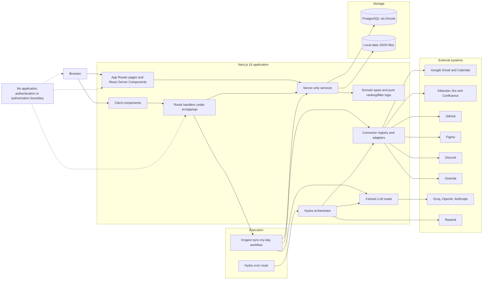

# Company identity, hierarchy, and authorization: current-state audit

Audit date: 2026-07-19

Scope: current executable repository state, including the working tree. This is a current-state audit only; it is not an implementation plan. README and planning-document claims were not used as evidence unless confirmed by runtime code.

Classification key:

- **Implemented** — executable code provides the behavior.
- **Partially implemented** — some required mechanics exist, but the behavior is incomplete.
- **Mocked** — test/demo-only or non-durable behavior stands in for production behavior.
- **Hardcoded** — behavior or identity is fixed in source/configuration rather than modeled.
- **Not found** — no executable implementation was found.
- **Unknown** — cannot be confirmed from the repository.

## A. Executive summary

The application is currently a single-person work operator, not a multi-employee company application. It has no login, authenticated session, employee directory, organization membership, hierarchy, or server-side ownership authorization.

The strongest evidence is structural:

- **Not found** — `package.json` and the repository contain no authentication/session dependency such as Auth.js/NextAuth, Better Auth, Clerk, Lucia, or an equivalent. There is no `middleware.ts`, proxy, route guard, session helper, or authenticated principal.
- **Hardcoded** — `src/services/userProfile.ts`, `getUserProfile()` and `saveUserProfile()` always select the first `user_profiles` row. The browser can overwrite that singleton through unauthenticated `GET`/`POST` handlers in `src/app/api/profile/route.ts`.
- **Not found** — `src/db/schema.ts` has no employee, organization-member, department, manager relationship, direct-report relationship, session, account, or identity-provider table.
- **Partially implemented** — `src/db/schema.ts`, `workTasks.owner` stores a free-form person name, and `src/lib/filters/ownerFilter.ts` performs fuzzy name matching. This is a personalization heuristic, not identity or authorization.
- **Not found** — `src/db/schema.ts`, `sourceItems`, `workTasks`, `knowledgeItems`, `dailyMemories`, `connections`, `reports`, and related tables do not carry an employee owner ID. `syncRuns.userId` is the sole operational user foreign key and is not propagated to imported data or generated output.
- **Not found** — all normal pages and API routes are callable without a session. Service functions generally query global tables by primary key or return all rows.
- **Implemented** — Google OAuth exists in `src/lib/connectors/oauth.ts`, but only for Gmail and Calendar read access. It stores connector tokens and does not authenticate a person into the application, validate a Workspace domain, or establish a session.

The application has two output paths:

1. **Today briefing** — `src/lib/tasks/todayBriefing.ts` persists one global daily artifact in `data/today-briefing.json`. It is input-hash cached, but it is not employee-owned, database-backed, or versioned as a canonical per-employee generation. The client may rewrite its summary and remove fields through `filterBriefingByOwners()`.
2. **Hydra report** — `src/lib/hydra/orchestrator.ts` and `src/services/hydra.ts` persist a report, run snapshot, evidence snapshot, prompt/schema/config versions, and run metadata in PostgreSQL. This is closer to a canonical generated artifact, but it is global, personalized to hardcoded Miloš/Hydra assumptions, and has no employee ownership or manager authorization.

The existing connector isolation, evidence relationships, extraction pipeline, deterministic ranking, LLM router, verification records, sync-run lifecycle, and Hydra report snapshot mechanics are valuable. Most can be preserved at the algorithm level. Their storage and service boundaries are currently global, so they cannot safely be reused unchanged at authorization boundaries.

Bottom line: none of the planned employee-login, active-employment, direct-report, or same-canonical-briefing authorization behavior is implemented today.

## B. Current architecture diagram

Important runtime boundaries:

- **Implemented** — `package.json` runs Next.js 16.2.10 and React 19.2.4 with App Router pages under `src/app`.
- **Implemented** — `src/db/connection.postgres.ts`, `getPostgresDb()` creates a lazily cached Drizzle/Postgres.js connection.
- **Implemented** — `src/lib/connectors/registry.ts`, `CONNECTOR_REGISTRY` isolates provider reads behind `configError()` and `listItems()`.
- **Implemented** — `src/lib/llm/router.ts`, `runLlmJob()` centralizes model selection, fallback, structured-output validation, retries, and operational console logging.
- **Implemented** — `src/inngest/functions/syncMyDay.ts`, `syncMyDay` performs the long-running synchronization workflow.
- **Partially implemented** — PostgreSQL is the main durable data store, while briefing, secrets, OAuth state, LLM settings, and MCP tokens remain process-local filesystem state under `data/`.

## C. Current authentication and session model

### Application login

- **Not found** — `package.json` has no application-authentication library.
- **Not found** — repository root and `src/` have no `middleware.ts`, `proxy.ts`, auth route, sign-in page, session cookie reader, authenticated-principal helper, or page-level redirect to login.
- **Not found** — `src/app/layout.tsx`, `RootLayout` always renders `WelcomeModal`, `NavBar`, and page content. It does not resolve or require a session.
- **Not found** — `src/components/NavBar.tsx`, `NavBar` exposes Today, Reports, Sources, Schedule, Projects, Knowledge, Audit, and Settings without identity-aware navigation.
- **Implemented** — all server-rendered pages call global services directly. For example, `src/app/page.tsx`, `TodayPage()` calls `getTodayQueue()`, `getSourceItems()`, `getConnections()`, `getUserProfile()`, and report services without a principal.

### Session state

- **Not found** — no session table exists in `src/db/schema.ts`.
- **Not found** — no signed/encrypted application session cookie is read or written.
- **Not found** — no access-token, refresh-token, OIDC ID-token, or claims object represents the signed-in application user.
- **Not found** — no logout or session revocation behavior exists.

### Google support

- **Implemented** — `src/lib/connectors/oauth.ts`, `getOAuthConfig()` supports Google authorization endpoints for `gmail` and `calendar`.
- **Implemented** — `GMAIL_SCOPES` and `CALENDAR_SCOPES` request `gmail.readonly` and `calendar.readonly`.
- **Not found** — the Google flow does not request `openid`, `email`, or `profile`; it does not validate an ID token, hosted-domain (`hd`) claim, Workspace group, or employee status.
- **Not found** — `src/app/api/connections/[provider]/callback/route.ts`, `GET()` exchanges a code into a shared connector secret and marks a global connection connected. It does not create an application user or session.

Conclusion: Google infrastructure is reusable as evidence that the stack can perform OAuth redirects and token exchange, but current Google OAuth is not a login implementation.

## D. Current user/profile model

- **Partially implemented** — `src/db/schema.ts`, table `userProfiles` contains only:
  - `id`
  - `email`
  - `name`
  - `createdAt`
  - `updatedAt`
- **Not found** — `userProfiles` has no external identity subject, provider, immutable company identifier, email verification state, active/inactive employee state, title, department, manager ID, employment dates, role, or authorization status.
- **Hardcoded** — `src/services/userProfile.ts`, `getUserProfile()` runs `select().from(userProfiles).limit(1)`. It does not accept a user ID.
- **Hardcoded** — `src/services/userProfile.ts`, `saveUserProfile()` updates the first row if any row exists, otherwise inserts one.
- **Partially implemented** — `saveUserProfile()` lowercases the email and checks only that it contains `@`. It does not verify ownership, company domain, active employment, or uniqueness.
- **Not found** — `src/db/schema.ts`, `userProfiles.email` has no unique constraint.
- **Not found** — `src/app/api/profile/route.ts`, `POST()` has no authentication or authorization and allows any caller to replace the singleton profile.
- **Partially implemented** — `src/components/ProfileForm.tsx`, `ProfileForm` renders email but registers `name` only as a hidden input. A fresh user cannot establish the name required by Today/Knowledge owner filtering through this form.
- **Partially implemented** — `src/db/schema.ts`, `syncRuns.userId` references `userProfiles.id`.
- **Partially implemented** — `src/app/api/day/sync/route.ts`, `POST()` copies the singleton profile ID into a new sync run.
- **Not found** — `syncRuns.userId` is not used by `src/inngest/functions/syncMyDay.ts` to scope connections, sources, tasks, queue rebuilding, briefing generation, or status reads.

The current profile is personalization configuration, not a trusted identity record.

## E. Current organization/team/hierarchy model

- **Not found** — no employee directory table or organization membership table exists in `src/db/schema.ts`.
- **Not found** — no manager foreign key, organizational edge, direct-report relation, department, job title, employee status, or hierarchy snapshot exists.
- **Partially implemented** — `src/db/schema.ts`, table `workspaces` has `id`, `name`, and `timezone`, but no members, roles, owners, or organization association.
- **Hardcoded** — `src/services/hydra.ts`, `ensureHydraSetup()` creates a single workspace named `"Miloš · Hydra"`.
- **Partially implemented** — `src/db/schema.ts`, `projects.people` is a JSON array of strings used as project context. It is not an employee directory and carries no reporting relationships.
- **Not found** — no API or UI can select a direct report or view a manager relationship.
- **Not found** — no full-tree or direct-report access algorithm exists.

The repository has project grouping and a personal workspace label, but no company hierarchy model.

## F. Current task ownership model

- **Partially implemented** — `src/db/schema.ts`, `workTasks.owner` is nullable free-form text.
- **Not found** — `workTasks` has no `userId`, employee ID, organization ID, workspace owner ID, or ownership foreign key.
- **Partially implemented** — `src/lib/filters/ownerFilter.ts`, `ownerParts()`, `personMatchesFilter()`, and `taskMatchesOwner()` compare lowercase names, including first-name/full-name prefix matches and compound owner strings.
- **Hardcoded** — `src/lib/filters/ownerFilter.ts`, `myOwnerFilter()` derives “me” from the editable singleton profile name.
- **Partially implemented** — `src/lib/tasks/todayBriefing.ts`, `buildTodayBriefing()` applies `taskMatchesOwner()` when choosing focus candidates.
- **Partially implemented** — `src/components/TodayFilteredView.tsx`, `TodayFilteredView()` receives the entire global queue and performs another owner filter in a client component.
- **Not found** — client filtering is not an authorization boundary. The server already loaded and serialized the global queue, source lookup, progress, and briefing into the page.
- **Implemented** — `src/services/workTasks.ts`, `createWorkTaskWithEvidence()` transactionally writes a task and evidence, and demotes evidence-free tasks to `unclear`.
- **Implemented** — `src/services/workTasks.ts`, `getTodayQueue()` loads every approved non-done task globally and orders by `priorityScore DESC`.
- **Partially implemented** — persisted task IDs, task text, priority score, confidence, evidence links, verification reports, and sync-review reports provide stable task records.
- **Not found** — ordering ties have no deterministic secondary sort in `getTodayQueue()`, so exact order is not guaranteed when scores are equal.
- **Not found** — task read/update/delete/status/progress/review/verify/project/context/Jira routes do not check an authenticated owner.

The free-form `owner` is useful extraction metadata. It cannot safely decide access.

## G. Current source ownership model

- **Not found** — `src/db/schema.ts`, `sourceItems` has no employee, connection-owner, organization, or workspace ownership field.
- **Partially implemented** — `sourceItems.projectId` associates a source with a project, not a person.
- **Not found** — `src/domain/sourceItem.ts`, `SourceItem` has no user identity.
- **Implemented** — `src/services/sourceItems.ts`, `getSourceItems()` returns all source rows.
- **Implemented** — `src/services/sourceItems.ts`, `getSourceItemByExternalId()` looks up only by `sourceType` plus `sourceExternalId`.
- **Partially implemented** — `src/lib/imports/sourceImportPipeline.ts`, `importConnectorSources()` uses that global lookup to deduplicate and update imported sources.
- **Security-relevant runtime behavior** — if multiple employees imported the same external ID, the current lookup would treat it as one shared source and could update the existing row. There is no owner dimension in the deduplication key.
- **Not found** — `knowledgeItems`, `knowledgeEmbeddings`, `evidence`, `dailyMemories`, `verificationReports`, and `syncReviewReports` have no user owner; they inherit the global scope of their linked source/task.
- **Partially implemented** — `src/lib/filters/knowledgeFilter.ts`, `filterKnowledgeForMe()` uses source type, author text, editable name/email, and text mentions to personalize knowledge. It is relevance filtering, not access control.
- **Hardcoded** — `PERSONAL_SOURCE_TYPES` treats all manual transcripts, Gmail, and Calendar data in the global store as personal to the singleton user.

## H. Current briefing generation and persistence model

### Queue and task facts

- **Implemented** — `src/services/workTasks.ts`, `workTasks` rows persist task ID, status, priority, confidence, reason, next action, done criteria, owner text, and timestamps.
- **Implemented** — `evidence`, `verificationReports`, and `syncReviewReports` persist supporting and corrective/verification context linked by task ID.
- **Partially implemented** — `syncReviewReports.notOk` and `syncReviewReports.conflicts` resemble correction signals, but there is no canonical “correction list” field on a daily briefing.

### Today briefing

- **Implemented** — `src/lib/tasks/todayBriefing.ts`, `buildTodayBriefing()` loads projects, all sources, knowledge, the global queue, connections, Jira state, daily memory, and the singleton profile.
- **Implemented** — deterministic ranking in `src/lib/tasks/priorityRank.ts` chooses focus order before the LLM summary.
- **Implemented** — `src/lib/tasks/focusActionPlanner.ts`, `enrichFocusItemsWithActionPlans()` may use the LLM to replace a focus item’s reason, next action, steps, done criteria, evidence quotes, and links.
- **Implemented** — `src/lib/tasks/todayBriefing.ts` calculates `inputHash`; if today and the input hash match, it reuses the prior file instead of regenerating.
- **Partially implemented** — the input hash includes hardcoded `BRIEFING_PROMPT_VERSION = 3`, but that prompt version is not stored as an explicit field on `StoredTodayBriefing`.
- **Implemented** — `getTodayBriefing()` reads one `data/today-briefing.json` and rejects it if its date is not today.
- **Hardcoded** — `BRIEFING_PATH` is one global file; it has no user key.
- **Partially implemented** — `StoredTodayBriefing` in `src/lib/llm/prompts/todayBriefing.ts` persists `generatedAt`, `today`, optional `inputHash`, focus items, summary, knowledge, risks, waiting items, source list, and provider list.
- **Not found** — `StoredTodayBriefing` has no employee ID, immutable generation ID, monotonic generated version, correction list, or focus confidence field.
- **Partially implemented** — a linked `workTask` can supply confidence at render time, but confidence is not embedded in the persisted focus-item snapshot.
- **Partially implemented** — `src/lib/tasks/taskPlanVersion.ts`, `hashTaskPlanVersion()` creates a hash for progress tracking over steps and done criteria. This is not a daily briefing generated version.
- **Partially implemented** — `src/components/TodayFilteredView.tsx` merges persisted focus text with current task records and current source records at render time. Therefore the displayed view is not exclusively a read of one immutable canonical snapshot.
- **Partially implemented** — `src/lib/filters/ownerFilter.ts`, `filterBriefingByOwners()` filters focus/Jira items, clears `waitingOn` and `risks`, and synthesizes a new summary string. A filtered viewer does not receive the exact stored briefing object.
- **Hardcoded** — `src/lib/tasks/todayBriefing.ts`, both persisted success and fallback objects set `jiraPending: []`, even when Jira input was used for ranking. The richer `StoredTodayBriefingJiraItem` path and parts of Jira owner filtering therefore do not represent persisted runtime output.
- **Not found** — no manager path reads another employee’s stored artifact without generation.

### Queue rebuilding

- **Implemented** — `src/lib/tasks/prioritizer.ts`, `rebuildTodayQueue()` performs deterministic ranking, optionally applies semantic LLM decisions, and persists task status/score/reason/confidence updates.
- **Implemented** — `src/services/workTasks.ts`, `applyPlannerDecisions()` preserves manually set and unclear statuses and ensures at most one non-manual `now` task.
- **Hardcoded** — the queue is global. Rebuilding it mutates the shared task rows for the singleton application, not an employee-specific queue generation.
- **Partially implemented** — `data/today-queue-summary.json` stores a global input hash and summary, but no user or canonical generation identity.

### Hydra report

- **Implemented** — `src/db/schema.ts`, `reportRuns` records idempotency key, status, config snapshot, model metadata, timings, warnings, and timestamps.
- **Implemented** — `src/db/schema.ts`, `hydraEvidenceItems` stores a run-specific evidence snapshot.
- **Implemented** — `src/db/schema.ts`, `reports` stores one structured JSON report per run through a unique `runId`.
- **Implemented** — `src/lib/hydra/orchestrator.ts`, `validateReportAgainstEvidence()` enforces evidence IDs, source URLs, and deterministic first-priority preservation.
- **Implemented** — `src/services/hydra.ts`, `getHydraReportByRunId()` reads the persisted report rather than regenerating it.
- **Partially implemented** — a terminal `executeHydraRun()` returns the existing persisted report. Before terminal state, retry execution can replace evidence and update the report for the same run.
- **Hardcoded** — `src/domain/hydraReport.ts`, `DEFAULT_HYDRA_CONFIG` fixes project `"Hydra/ASC"`, Jira project `"UATL"`, assignee `"Milos Dostanic"`, stakeholders `["Matt", "Lucas"]`, and Belgrade timezone.
- **Not found** — Hydra run/report/evidence rows have no employee owner, manager visibility rule, or organization scope.

## I. Current API authorization model

### General model

- **Not found** — normal route handlers do not resolve a session or principal.
- **Not found** — service methods do not receive an authorization context.
- **Not found** — object reads and mutations do not constrain IDs by owner.
- **Not found** — there is no centralized policy such as “self or direct manager.”

### Route census

All route groups below are executable and lack application-user authentication and ownership checks unless explicitly noted.

#### Global data and AI reads

- **Not found** — `src/app/api/profile/route.ts`, `GET()` returns the singleton profile.
- **Not found** — `src/app/api/task-chat/tasks/route.ts`, `GET()` returns global task options.
- **Not found** — `src/app/api/day/sync/[id]/route.ts`, `GET()` returns any sync run, provider results, and `whatsNew` by numeric ID.
- **Not found** — `src/app/api/reports/run/[id]/route.ts`, `GET()` returns any run, persisted report, full evidence content, relations, deliveries, and feedback by numeric ID.
- **Not found** — `src/app/api/connections/github/repos/route.ts` and `branches/route.ts`, `GET()` use the shared GitHub credential.
- **Not found** — `src/app/api/jira/[issueKey]/transitions/route.ts` and `src/app/api/work-tasks/[id]/jira-transitions/route.ts`, `GET()` expose Jira status/transitions through shared credentials.
- **Not found** — `src/app/api/local-path/browse/route.ts`, `GET()` lists non-hidden directories under the process user’s home directory or application directory.
- **Not found** — `src/app/api/inngest/test/route.ts`, `GET()` exposes process-local test state.

#### Global local-data mutations

- **Not found** — `src/app/api/profile/route.ts`, `POST()` overwrites the singleton profile.
- **Not found** — `src/app/api/settings/route.ts`, `POST`, `DELETE`, and `PATCH` save/delete/enable global LLM credentials.
- **Not found** — `src/app/api/source-items/route.ts`, `POST()` imports a transcript and can trigger extraction.
- **Not found** — the following task routes mutate a task selected only by URL ID:
  - `src/app/api/work-tasks/[id]/route.ts`
  - `src/app/api/work-tasks/[id]/status/route.ts`
  - `src/app/api/work-tasks/[id]/review/route.ts`
  - `src/app/api/work-tasks/[id]/progress/route.ts`
  - `src/app/api/work-tasks/[id]/project/route.ts`
  - `src/app/api/work-tasks/[id]/context/route.ts`
  - `src/app/api/work-tasks/[id]/verify/route.ts`
  - `src/app/api/work-tasks/[id]/sync-review/route.ts`
- **Not found** — `src/app/api/knowledge-items/[id]/route.ts`, `PATCH()` and `DELETE()` mutate global knowledge by ID.
- **Not found** — project mutation routes select only by project ID:
  - `src/app/api/projects/[id]/status/route.ts`
  - `src/app/api/projects/[id]/repo-paths/route.ts`
  - `src/app/api/projects/[id]/integration-settings/route.ts`
- **Not found** — connection mutation routes operate on one global provider record/secret:
  - `src/app/api/connections/[provider]/route.ts`
  - `src/app/api/connections/[provider]/secret/route.ts`
  - `src/app/api/connections/[provider]/sync/route.ts`
  - `src/app/api/connections/github/settings/route.ts`
- **Not found** — `src/app/api/day/sync/route.ts`, `POST()` starts a global sync.
- **Not found** — `src/app/api/day/sync/[id]/cancel/route.ts`, `POST()` can cancel any run by ID.
- **Not found** — `src/app/api/day/end/route.ts`, `POST()` generates and persists global daily memory.
- **Not found** — `src/app/api/today/rebuild-queue/route.ts`, `POST()` reprioritizes the global queue.
- **Not found** — `src/app/api/task-chat/ask/route.ts` and `src/app/api/knowledge/ask/route.ts`, `POST()` query global task/knowledge/source context through configured LLM providers.
- **Not found** — Hydra/report mutations are global:
  - `src/app/api/reports/run/route.ts`
  - `src/app/api/reports/run/[id]/execute/route.ts`
  - `src/app/api/reports/run/[id]/route.ts`, `DELETE()`
  - `src/app/api/reports/[id]/feedback/route.ts`
  - `src/app/api/hydra/config/route.ts`
  - `src/app/api/hydra/schedules/[id]/route.ts`
- **Mocked** — `src/app/api/inngest/test/route.ts`, `POST()` publishes arbitrary test notes; `src/inngest/testState.ts` stores the result only in process memory.
- **Partially implemented** — `src/app/api/reports/[id]/feedback/route.ts`, `POST()` calls `createReportFeedback()` without `await`, then returns the Promise as `feedback`. The insert is not sequenced before the response and failures are not handled by this route.
- **Partially implemented** — `src/app/api/work-tasks/[id]/context/route.ts`, `PATCH()` accepts any existing server directory as `localRepoPath`; unlike `src/app/api/local-path/browse/route.ts`, it does not constrain the path to the process home/application tree.

#### External-system writes

- **Implemented** — `src/app/api/jira/[issueKey]/transition/route.ts`, `POST()` performs a Jira transition.
- **Implemented** — `src/app/api/work-tasks/[id]/jira-transition/route.ts`, `POST()` extracts a Jira key from a task and performs a Jira transition.
- **Not found** — neither route authenticates the caller or authorizes the issue/task.
- **Partially implemented** — `src/components/JiraStatusDropdown.tsx`, `JiraStatusDropdown` shows an explicit confirmation dialog before the UI calls the route.
- **Security-relevant runtime behavior** — the confirmation exists only in the browser component. A direct HTTP caller can invoke either write route without that confirmation.
- **Implemented** — `src/lib/connectors/oauth.ts`, `JIRA_SCOPES` requests `write:jira-work`; the app is therefore not globally read-only despite the footer text in `src/app/layout.tsx`.
- **Implemented** — `src/app/api/reports/run/[id]/execute/route.ts` can indirectly send report email through Resend when Hydra email delivery is enabled (`src/lib/hydra/orchestrator.ts`, `deliverReport()`).
- **Not found** — the report execution route does not authenticate the caller, authorize the run, or require an in-the-moment confirmation for that external email write.
- **Implemented** — `src/lib/connectors/oauth.ts`, `GITHUB_SCOPES` includes `repo`, a broad repository scope rather than a read-only-only scope.

#### OAuth and infrastructure endpoints

- **Partially implemented** — connection OAuth routes validate provider and OAuth state but not an application session:
  - `src/app/api/connections/[provider]/connect/route.ts`
  - `src/app/api/connections/[provider]/callback/route.ts`
  - `src/app/api/mcp/[provider]/connect/route.ts`
  - `src/app/api/mcp/[provider]/callback/route.ts`
- **Partially implemented** — `src/app/api/cron/hydra/route.ts`, `authorized()` checks `CRON_SECRET` only when it is configured.
- **Security-relevant runtime behavior** — `authorized()` returns true when `CRON_SECRET` is missing, so the cron endpoint fails open.
- **Partially implemented** — `src/app/api/inngest/route.ts` delegates `GET`, `POST`, and `PUT` to Inngest’s `serve()` handler. Verification behavior depends on Inngest configuration and runtime environment and is not an application-user authorization boundary.

## J. Current integration credential ownership model

- **Hardcoded** — `src/services/connectionSecrets.ts`, `secretsPath` points to one `data/connection-secrets.json`.
- **Hardcoded** — secrets are keyed only by provider string. There is no employee/connection-owner dimension.
- **Partially implemented** — `writeSecretsFile()` uses filesystem mode `0600` and `.gitignore` excludes `data/*`.
- **Not found** — connector secrets are not encrypted at rest by application code.
- **Hardcoded** — `src/services/settings.ts`, `data/secrets.json` stores one API key per LLM provider; `data/llm-settings.json` stores global enabled/disabled state.
- **Implemented** — environment variables take precedence for LLM keys in `getRawApiKey()`.
- **Hardcoded** — `src/lib/connectors/oauth.ts`, `data/oauth-states.json` stores OAuth state globally.
- **Resolved after audit** — `src/lib/connectors/mcp/oauthProvider.ts` stores MCP registration, tokens, PKCE verifier, and discovery state in the encrypted, user-scoped `connection_secrets` table.
- **Partially implemented** — `src/db/schema.ts`, `connections` stores provider/status/scopes/metadata but no secret material.
- **Not found** — `connections` has no user ID, organization ID, or unique ownership boundary.
- **Not found** — `connections.provider` has no database unique constraint. `src/services/connections.ts`, `upsertConnection()` performs read-then-write and can create duplicate provider rows under concurrent requests.
- **Implemented** — `src/lib/connectors/auth.ts`, `getAccessToken()` refreshes and overwrites the shared provider token.
- **Security-relevant runtime behavior** — every caller and background job uses the same provider identity and token set.

## K. Current database and storage model

### PostgreSQL

- **Implemented** — `src/lib/env/database.ts`, `resolveDatabaseConfig()` requires `DATABASE_URL` with a PostgreSQL URL and rejects SQLite/file URLs.
- **Implemented** — `src/db/dialect.ts`, `getDatabaseDialect()` always returns `"postgres"`.
- **Implemented** — `src/db/connection.postgres.ts` uses Postgres.js and Drizzle; hosted Vercel deployments use a one-connection pool and optional SSL detection.
- **Implemented** — `drizzle.config.ts` points at `src/db/schema.ts` and `drizzle/postgres`.
- **Implemented** — `docker-compose.yml` defines a local PostgreSQL 16/pgvector container on port 5433.
- **Unknown** — the repository cannot confirm which database, migration level, backups, row-level security, encryption, or retention policy production actually uses.

### Main persisted domains

`src/db/schema.ts` defines:

- projects and project integration settings;
- source items and source-document snapshots;
- work tasks, evidence, task progress, verification, and sync review;
- knowledge items and JSON embeddings;
- singleton-style user profiles;
- global connections and connection cursors;
- daily memories;
- sync runs and provider runs;
- Hydra workspaces, report tasks, schedules, runs, evidence, relations, reports, deliveries, feedback, cursors, and audit logs.

### Filesystem state

- **Implemented** — `.gitignore` excludes `data/*` except `.gitkeep`.
- **Partially implemented** — file permissions are set to `0600` for connection secrets, LLM secrets/settings, OAuth state, and MCP OAuth files.
- **Partially implemented** — `src/lib/tasks/todayBriefing.ts` and `src/lib/tasks/prioritizer.ts` persist generated output/summary without explicit restrictive mode.
- **Not found** — file writes use no cross-process lock, compare-and-swap, user namespace, or transactional coordination.
- **Security/reliability behavior** — filesystem state is process-instance local and unsuitable as shared durable production state on horizontally scaled or ephemeral deployments.

## L. Current background jobs and sync execution model

### Inngest Sync My Day

- **Implemented** — `src/inngest/client.ts` creates an Inngest client with ID `"worklight"`.
- **Implemented** — `src/inngest/functions.ts`, `inngestFunctions` registers `testPing` and `syncMyDay`.
- **Implemented** — `src/app/api/day/sync/route.ts`, `POST()` creates a `syncRuns` row and sends `worklight/sync.requested`.
- **Implemented** — `src/inngest/functions/syncMyDay.ts`, `syncMyDay`:
  1. checks cancellation;
  2. approves pending extraction;
  3. resolves all globally connected providers;
  4. discovers projects;
  5. syncs providers concurrently;
  6. records provider metrics;
  7. backfills extraction;
  8. fetches Jira pending work;
  9. rebuilds the global queue;
  10. builds the global briefing;
  11. creates a `whatsNew` payload;
  12. finalizes the sync run.
- **Implemented** — cancellation is cooperative and preserves already imported data.
- **Partially implemented** — provider runs and completion state are durable.
- **Not found** — the workflow does not load `syncRuns.userId` to scope credentials, projects, sources, extraction, queue, or briefing.
- **Not found** — no per-employee concurrency key or “one active sync per employee” rule exists.
- **Not found** — Sync My Day has no idempotency key or server lock; repeated `POST /api/day/sync` calls can create overlapping global runs.
- **Partially implemented** — source and cursor deduplication reduce repeated imports, but keys are global.

### Provider sync

- **Implemented** — `src/lib/imports/syncProvider.ts`, `syncProvider()` uses `CONNECTOR_REGISTRY`, imports candidates, updates global connection metadata, and commits incremental cursors.
- **Implemented** — `src/lib/imports/sourceImportPipeline.ts`, `importConnectorSources()` performs dedupe, project matching, embedding, task extraction, knowledge extraction, and processing-state recording.
- **Partially implemented** — tasks and evidence are persisted transactionally, and processing fingerprints avoid unnecessary repeated extraction.
- **Not found** — no employee scope is passed through connector context or import functions.
- **Partially implemented** — `src/lib/imports/calendarSyncState.ts`, `setPendingCalendarSync()` and `consumePendingCalendarSync()` use one module-global `pending` value. Overlapping calendar syncs in the same process can overwrite or consume each other’s pending token state.

### Hydra scheduling

- **Implemented** — `src/lib/hydra/scheduler.ts`, `runDueHydraSchedules()` evaluates enabled weekday schedules in each configured timezone and creates an idempotent daily run.
- **Implemented** — `src/lib/hydra/orchestrator.ts`, `executeHydraRun()` performs fetch, normalization, ranking, generation, validation, persistence, and delivery phases.
- **Partially implemented** — schedule idempotency is keyed to the single Hydra report task and date.
- **Hardcoded** — schedules and report task are global to `ensureHydraSetup()`.
- **Partially implemented** — `src/app/api/cron/hydra/route.ts` provides a cron entry point, but authorization is optional/fail-open.
- **Implemented** — `vercel.json` invokes `/api/cron/hydra` every 15 minutes on weekdays.
- **Not found** — Hydra execution is not queued through Inngest and can execute synchronously in the route’s request lifecycle.

## M. Current audit logging

- **Implemented** — `src/db/schema.ts`, `auditLogs` stores workspace ID, actor, action, entity type/ID, metadata, and creation time.
- **Hardcoded** — `auditLogs.actor` defaults to `"local-user"`.
- **Not found** — `src/services/hydra.ts`, `writeAuditLog()` does not accept or resolve an authenticated employee identity.
- **Partially implemented** — audit events cover:
  - Hydra report-task creation/update;
  - schedule updates;
  - manual/scheduled report starts;
  - report completion/partial/failure/cancellation;
  - report feedback.
- **Not found** — audit events do not generally cover login, logout, denied access, profile changes, manager views, task reads/changes, source reads, connection changes, credential changes, sync starts/cancellation, LLM questions, or Jira transitions.
- **Implemented** — `src/app/audit/page.tsx`, `AuditPage()` renders up to 200 global events.
- **Not found** — the audit page itself is not authorized.
- **Partially implemented** — `src/lib/llm/router.ts`, `logJobEvent()` logs provider/model, status, duration, usage, and truncated errors to console.
- **Not found** — LLM logs are not tied to employee, source set, authorization decision, or persisted audit record.

## N. Security and privacy risks

### Critical

1. **Not found — no authentication or server authorization**
   - Files/symbols: `src/app/layout.tsx`, `RootLayout`; every normal route under `src/app/api`; global service methods under `src/services`.
   - Runtime effect: any network-reachable caller can read or mutate global work, evidence, reports, settings, connections, and profile data.

2. **Not found — no ownership boundary / direct object authorization**
   - Files/symbols: `src/services/workTasks.ts`, `getWorkTaskById()` and mutation methods; `src/services/syncRuns.ts`, `getSyncRunById()`; `src/services/hydra.ts`, run/report getters.
   - Runtime effect: numeric IDs are sufficient to retrieve or mutate objects. In a multi-user deployment this becomes direct cross-user access.

### High

3. **Hardcoded — one shared credential set for all callers**
   - Files/symbols: `src/services/connectionSecrets.ts`; `src/services/settings.ts`; `src/lib/connectors/mcp/oauthProvider.ts`; `src/db/schema.ts`, `connections`.
   - Runtime effect: all users/jobs would act as the same external account and share imported private content.

4. **Implemented but unauthenticated — external Jira writes**
   - Files/symbols: `src/app/api/jira/[issueKey]/transition/route.ts`, `POST`; `src/app/api/work-tasks/[id]/jira-transition/route.ts`, `POST`.
   - Runtime effect: direct HTTP requests can perform a Jira mutation with the shared token. UI confirmation does not protect the route.

5. **Not found — source/task/report privacy partitioning**
   - Files/symbols: `src/db/schema.ts`, `sourceItems`, `workTasks`, `knowledgeItems`, `reports`, `dailyMemories`; global getters in `src/services`.
   - Runtime effect: personal Gmail, calendar, meeting, task, evidence, and report content is commingled.

6. **Not found — trusted active-employee state**
   - Files/symbols: `src/db/schema.ts`, `userProfiles`; `src/services/userProfile.ts`.
   - Runtime effect: the application cannot revoke access for a departed employee or distinguish a verified company identity from typed text.

### Medium

7. **Partially implemented — secrets protected by file mode but not application encryption**
   - Files/symbols: `src/services/connectionSecrets.ts`, `writeSecretsFile()`; `src/services/settings.ts`, `writeSecretsFile()`; `src/lib/connectors/mcp/oauthProvider.ts`, `writeFile()`.
   - Runtime effect: filesystem/process compromise exposes provider and LLM tokens. Files are also not portable/shared across production instances.

8. **Partially implemented — OAuth state is global and origin is request-derived**
   - Files/symbols: `src/lib/connectors/oauth.ts`, `createOAuthState()`, `buildRedirectUri()`; connection and MCP connect/callback routes.
   - Runtime effect: state is not bound to an application session/user, and redirect origins depend on the request URL/host configuration.

9. **Partially implemented — cron authorization fails open**
   - File/symbol: `src/app/api/cron/hydra/route.ts`, `authorized()`.
   - Runtime effect: if `CRON_SECRET` is absent, anyone reaching the route can trigger due schedules.

10. **Not found — complete audit attribution**
    - Files/symbols: `src/db/schema.ts`, `auditLogs`; `src/services/hydra.ts`, `writeAuditLog()`.
    - Runtime effect: sensitive reads/writes and external actions cannot be attributed to a verified employee.

11. **Partially implemented — local filesystem browser exposes machine paths**
    - File/symbol: `src/app/api/local-path/browse/route.ts`, `GET()`.
    - Runtime effect: an unauthenticated caller can enumerate non-hidden directories and Git-repository locations under the server process user’s home directory.

12. **Partially implemented — external LLM privacy boundary is global**
    - Files/symbols: `src/lib/llm/router.ts`, `runLlmJob()`; prompts fed by sources/tasks in extraction, briefing, QA, and Hydra paths.
    - Runtime effect: connector content is sent to configured external providers without a per-employee authorization context or tenant audit record. Provider-side retention and contractual controls are not visible in the repository.

13. **Not found — sync concurrency isolation**
    - Files/symbols: `src/app/api/day/sync/route.ts`, `POST()`; `src/lib/imports/calendarSyncState.ts`, module-global `pending`.
    - Runtime effect: duplicate global syncs can overlap, and calendar cursor state can be associated with the wrong run.

14. **Implemented but unauthenticated — report email delivery**
    - Files/symbols: `src/app/api/reports/run/[id]/execute/route.ts`, `POST()`; `src/lib/hydra/orchestrator.ts`, `deliverReport()`.
    - Runtime effect: when email delivery is enabled, a direct HTTP caller can execute a run that sends email through the configured Resend account.

15. **Not found — production security headers and application rate limits**
    - Files/symbols: `next.config.ts`; LLM and mutation routes under `src/app/api`.
    - Runtime effect: the repository defines no CSP/HSTS/header policy or application-level throttling for expensive LLM/sync/report endpoints.

### Correct controls that already exist

- **Implemented** — server-only markers keep credential helpers out of client bundles.
- **Implemented** — OAuth state has randomness, expiry, and one-time consumption in the standard connector flow.
- **Implemented** — connector secrets and LLM keys are not returned raw by settings APIs.
- **Implemented** — task/evidence transaction and schema validation reduce orphaned or fabricated records.
- **Implemented** — LLM outputs are validated with Zod and some prompts wrap untrusted source content.
- **Implemented** — Jira UI requires a specific confirmation naming the issue and target status.

These controls are useful but do not compensate for the missing application identity and authorization boundary.

## O. Exact gaps between current implementation and planned behavior

1. **Only active SpaceInch employees may log in**
   - **Not found** — no login or employee status exists.
   - Relevant code: `package.json`; `src/db/schema.ts`, `userProfiles`; `src/app/layout.tsx`.

2. **Company identity provider, preferably Google Workspace**
   - **Partially implemented** — Google OAuth plumbing exists only for Gmail/Calendar connector access.
   - Missing: OIDC login scopes/claims, Workspace-domain validation, identity-to-employee mapping, session creation, and logout.
   - Relevant code: `src/lib/connectors/oauth.ts`, `getOAuthConfig()`; `src/app/api/connections/[provider]/callback/route.ts`.

3. **Identity, email, active status, title, department, manager, direct reports**
   - **Partially implemented** — editable email/name only.
   - **Not found** — all other fields and relationships.
   - Relevant code: `src/db/schema.ts`, `userProfiles`; `src/services/userProfile.ts`.

4. **Employee sees only own work**
   - **Not found** — no trusted owner ID or server filter.
   - Current behavior: global server load plus optional fuzzy/client name filtering.
   - Relevant code: `src/services/workTasks.ts`, `getTodayQueue()`; `src/components/TodayFilteredView.tsx`; `src/lib/filters/ownerFilter.ts`.

5. **Manager sees self plus direct reports**
   - **Not found** — no hierarchy or manager policy.
   - Relevant code: no matching schema/service/policy found.

6. **Direct reports only; no assumed full-tree access**
   - **Not found** — no hierarchy traversal exists, direct or recursive.

7. **Manager sees exact same canonical daily output**
   - **Not found** — no per-employee canonical briefing entity.
   - **Partially implemented** — task rows and Hydra reports persist stable facts/snapshots.
   - Current Today view can merge current records and rewrite/filter the stored briefing.
   - Relevant code: `src/lib/tasks/todayBriefing.ts`; `src/lib/llm/prompts/todayBriefing.ts`, `StoredTodayBriefing`; `src/components/TodayFilteredView.tsx`; `src/lib/filters/ownerFilter.ts`.

8. **Manager view must not regenerate or reinterpret**
   - **Not found** — no manager view.
   - Risk in current mechanics: calling `buildTodayBriefing()` can generate/replace the one global file; `filterBriefingByOwners()` reinterprets its summary and removes sections.

9. **Authorization enforced on server**
   - **Not found** — no principal, policy service, protected service query, or route guard.
   - Relevant code: all pages/routes/services described in section I.

10. **Preserve sync, extraction, evidence, prioritization, briefing, verification, memory, reporting**
    - **Partially implemented foundation** — these behaviors are executable and mostly separated into services/libraries.
    - Gap: every data-access and orchestration path assumes global singleton state, so preservation requires scoping without changing core semantics.

11. **Same task IDs**
    - **Partially implemented** — work task IDs persist in PostgreSQL.
    - Gap: no employee ownership and focus items may be Jira-only with `linkedTaskId: null`.

12. **Same order and priority**
    - **Partially implemented** — deterministic rank logic and persisted priority scores exist.
    - Gap: queue tie ordering lacks a stable secondary key; no stored per-employee ordered generation exists.

13. **Same text and confidence**
    - **Partially implemented** — task text/confidence persist.
    - Gap: focus action-plan text can differ from underlying task text; focus confidence is resolved live from the task, not stored in the briefing snapshot.

14. **Same evidence**
    - **Partially implemented** — evidence rows and Hydra run evidence snapshots exist.
    - Gap: Today rendering merges briefing quotes, task evidence, and current contextual source matches at view time.

15. **Same correction list**
    - **Not found** — no canonical correction-list field.
    - Related but non-equivalent fields: `syncReviewReports.notOk`, `syncReviewReports.conflicts`, verification `missing`, and Hydra `conflicts`.

16. **Same generated version**
    - **Not found** for Today — only `generatedAt` and optional `inputHash`.
    - **Partially implemented** for Hydra — run ID plus prompt/schema/config versions and config snapshot exist.

## P. Components that can be reused unchanged

“Unchanged” here means the component does not itself make an authorization decision and can remain behaviorally identical when called with already authorized/scoped inputs.

- **Implemented / reusable unchanged** — `src/domain/evidence.ts`, `src/domain/verificationReport.ts`, `src/domain/syncReviewReport.ts`, and validation-oriented domain types.
- **Implemented / reusable unchanged** — pure hashing/ID helpers in `src/lib/tasks/taskPlanVersion.ts`.
- **Implemented / reusable unchanged** — deterministic ranking helpers in `src/lib/tasks/priorityRank.ts` when passed one employee’s authorized task/source set.
- **Implemented / reusable unchanged** — source text parsers and display helpers such as `src/lib/connectors/jiraText.ts`, `jiraStatusVisual.ts`, and `figmaUrl.ts`.
- **Implemented / reusable unchanged** — provider API response normalization inside individual connector modules, provided credentials and resource scopes are supplied by an authorized caller.
- **Implemented / reusable unchanged** — structured LLM provider clients and Zod-output validation in `src/lib/llm/router.ts` and `src/lib/llm/prompts`.
- **Implemented / reusable unchanged** — evidence validation principles in `src/lib/hydra/orchestrator.ts`, especially `validateReportAgainstEvidence()`.
- **Implemented / reusable unchanged** — confirmation UI in `src/components/JiraStatusDropdown.tsx`; server authorization is still required behind it.
- **Implemented / reusable unchanged** — low-level PostgreSQL connection/query helpers in `src/db/connection.postgres.ts` and `src/db/query.ts`.

## Q. Components that require refactoring

- **Partially implemented / refactor** — every service in `src/services` that reads or mutates user data must operate on an explicit authorized employee/subject scope rather than global tables or bare IDs.
- **Partially implemented / refactor** — `src/services/workTasks.ts` needs ownership-aware queries while preserving task/evidence transactions and queue behavior.
- **Partially implemented / refactor** — `src/services/sourceItems.ts`, `knowledgeItems.ts`, `dailyMemories.ts`, `verificationReports.ts`, `syncReviewReports.ts`, `taskProgress.ts`, and `projects.ts` need owner/organization scoping.
- **Partially implemented / refactor** — `src/services/connections.ts`, `connectionSecrets.ts`, and all cursor services need credential-owner scope.
- **Partially implemented / refactor** — `src/lib/connectors/registry.ts` and connector token helpers need an authorized connection context rather than global provider lookup.
- **Partially implemented / refactor** — `src/lib/imports/syncProvider.ts`, `sourceImportPipeline.ts`, and `src/inngest/functions/syncMyDay.ts` need employee identity propagated through every stage.
- **Partially implemented / refactor** — Sync My Day needs an employee-scoped idempotency/concurrency boundary, and `src/lib/imports/calendarSyncState.ts` must not use process-global pending state.
- **Partially implemented / refactor** — source dedupe keys must include owner/connection scope; current `sourceType + sourceExternalId` lookup is global.
- **Partially implemented / refactor** — `src/lib/tasks/prioritizer.ts` and `todayBriefing.ts` need employee-scoped inputs and durable canonical generation persistence.
- **Partially implemented / refactor** — `src/app/page.tsx` and other server pages need server authorization before data loading.
- **Partially implemented / refactor** — every normal route in `src/app/api` needs authenticated-principal resolution and object-level authorization.
- **Partially implemented / refactor** — `src/services/hydra.ts` and Hydra orchestration need an employee/report-owner boundary if Hydra remains part of the canonical daily-output model.
- **Partially implemented / refactor** — `auditLogs` and `writeAuditLog()` need verified actor identity, view events, authorization decisions, and broader coverage.
- **Partially implemented / refactor** — `src/app/api/reports/[id]/feedback/route.ts` must sequence feedback persistence before response; this is an existing runtime correctness defect independent of identity work.

## R. Components that should be replaced

- **Hardcoded / replace** — singleton first-row identity in `src/services/userProfile.ts`, `getUserProfile()` and `saveUserProfile()`.
- **Hardcoded / replace** — free-form `workTasks.owner` and fuzzy name matching as an access mechanism in `src/lib/filters/ownerFilter.ts`. The field can remain as source metadata, but not as authorization identity.
- **Hardcoded / replace** — `data/today-briefing.json` as the canonical daily output store in `src/lib/tasks/todayBriefing.ts`.
- **Hardcoded / replace for production** — global provider-keyed credential files in `src/services/connectionSecrets.ts` and `src/lib/connectors/mcp/oauthProvider.ts`.
- **Hardcoded / replace** — global OAuth state not bound to a login session/user in `src/lib/connectors/oauth.ts`.
- **Hardcoded / replace** — Miloš/Hydra-specific defaults in `src/domain/hydraReport.ts` and workspace bootstrap in `src/services/hydra.ts` for company-wide behavior.
- **Partially implemented / replace** — fail-open cron authorization in `src/app/api/cron/hydra/route.ts`, `authorized()`.
- **Partially implemented / replace as security boundary** — client-side filtering in `src/components/TodayFilteredView.tsx`; it may remain presentation filtering only after server scoping.

## S. Unknowns that cannot be confirmed from the repository

- **Unknown** — SpaceInch’s authoritative employee directory: Google Workspace Directory, HRIS, SCIM, manual administration, or another system.
- **Unknown** — whether Google Workspace is configured to expose title, department, manager, and active status to this application.
- **Unknown** — exact approved company email domain(s), aliases, contractors, service accounts, and suspended-user semantics.
- **Unknown** — source of truth and update cadence for direct-manager relationships.
- **Unknown** — whether manager access should be computed from a current relationship or preserved against a historical hierarchy snapshot.
- **Unknown** — whether inactive employees’ historical briefings remain visible to former managers or only administrators.
- **Unknown** — whether “correction list” means sync-review conflicts, verification missing items, user edits, or a new canonical field.
- **Unknown** — whether the canonical employee daily output should be the Today briefing, Hydra report, a unified replacement, or both.
- **Unknown** — required canonical-version semantics: immutable generation, mutable draft with revisions, publication state, or day-level uniqueness.
- **Unknown** — production deployment topology, network exposure, reverse-proxy host validation, TLS termination, and number of application instances.
- **Unknown** — actual production database schema/migration state, backups, encryption, retention, and database row-level security.
- **Unknown** — whether `CRON_SECRET`, Inngest signing/event keys, and provider secrets are configured in production.
- **Unknown** — whether filesystem `data/` state exists in production, is persisted by a mounted volume, or is lost across deployments.
- **Unknown** — external LLM/provider retention, data-processing agreements, regional controls, and whether employee data may be sent to every configured fallback provider.
- **Unknown** — how existing singleton rows and global imported data map to a real employee during a future identity migration.
- **Unknown** — required administrative roles outside employee/manager, including who can connect shared sources, manage credentials, correct hierarchy, or inspect audit records.

## Audit conclusion

The repository contains a functioning evidence-to-task and report pipeline built around one local user and shared integrations. It does not currently contain the trusted identity, company-membership, hierarchy, ownership, canonical per-employee generation, or server authorization primitives required by the planned product behavior.

The largest preservation opportunity is above the connector/LLM/parsing/ranking algorithms and below the current global service APIs: retain those algorithms, but do not treat any current name filter, singleton profile, workspace label, global connection, URL ID, or client-side view filter as an authorization control.
