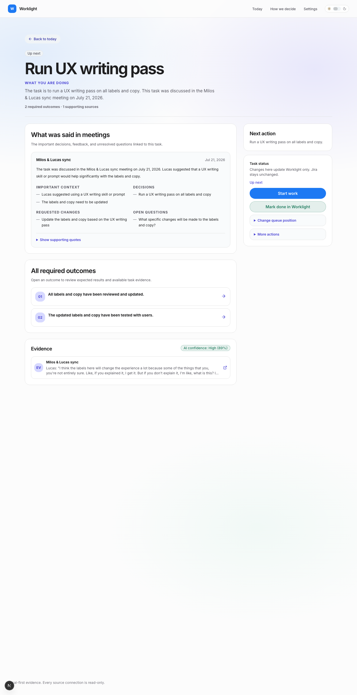
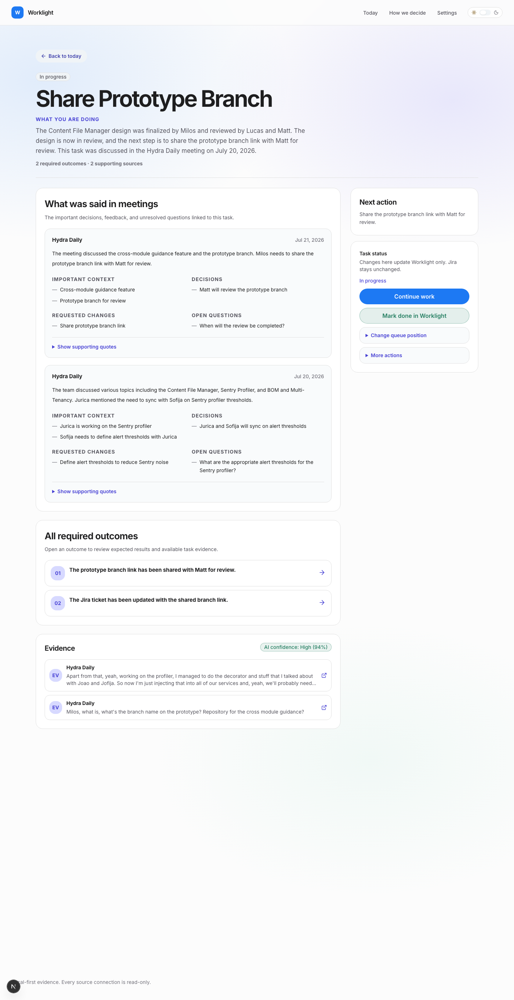
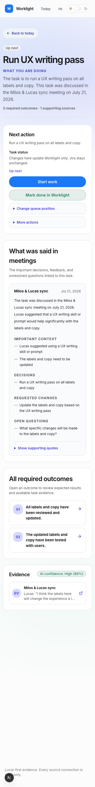

# Task Detail Page — UI/UX Audit & Redesign Proposal

**Scope:** `/tasks/[id]` (task detail view) — `src/app/tasks/[id]/page.tsx`, `src/components/TaskActionButtons.tsx` (detail layout), `src/components/ConfidenceBadge.tsx`, `src/components/OwnershipDecisionButtons.tsx`, type tokens in `src/app/globals.css`.

**Method:** Heuristic evaluation (Nielsen 10 + Krug), Vercel Web Interface Guidelines (`web-design-guidelines` skill), and the project's own `worklight-ux-review` skill. Findings are grounded in live screenshots of tasks 408 and 464 captured at 1440 px and 390 px.

**Current state (desktop, 1440 px):**



**Current state (task with two meetings):**



**Current state (mobile, 390 px):**



---

## Verdict

**Usability score: 5/10.** The page is calm and evidence-driven, which is right for the product. But its information hierarchy is inverted (meeting context dominates; next action and done criteria are visually secondary), the primary CTA is broken in one code path, the type scale jumps from a 64 px display title straight to a flat 14 px sea, and "how do I know it's done" is not answerable on this page — outcomes carry no state. Fixing the findings below gets the page to 9–10.

The user's questions, checked against the current page:

| Question the page must answer | Answered today? |
|---|---|
| What am I doing? | Yes — title + reason, clear |
| Why does it matter? | Partially — reason often restates the title |
| What is the next concrete action? | Weakly — 14 px muted text in a narrow sidebar |
| How do I know it's truly done? | **No** — outcomes are links with no completion state |
| How confident is the system, and based on what? | Yes — confidence badge sits next to Evidence (correct) |
| How do I correct the system? | Partially — ownership buttons only when `unclear` |

---

## Findings (highest risk first)

### F1 — "Start work" / "Continue work" button does nothing on this page

- **Severity:** 4 (catastrophic — primary action silently fails)
- **Problem:** When a task has no Figma/GitHub/Jira link, the sidebar's primary CTA scrolls to `#redosled`. That element exists only on the Today page (`DailyFocusCard.tsx:649`). On `/tasks/[id]` the click is a no-op. Task 464's screenshot shows exactly this button ("Start work") rendered as the page's most prominent control.
- **Evidence:** `src/lib/tasks/focusPrimaryCta.ts:47-52` returns `scrollTargetId: "redosled"`; `src/app/tasks/[id]/page.tsx` contains no such id. `TaskActionButtons.tsx:267-280` performs the scroll.
- **Recommended change:** On the detail page, make the fallback CTA run the `start` status action (`Start work` → sets status to `now`), or scroll to the Next action section (`#next-action`). Never render a button whose handler cannot succeed.
- **Replacement copy:** `Start work` (performing the start action) or, when already `now`, remove the button entirely — "Continue work" that does nothing is noise.
- **Acceptance criteria:** Every rendered CTA on `/tasks/[id]` produces a visible result (navigation, status change + toast, or scroll to an existing element).
- **Regression risk:** Low — the Today page keeps its own scroll target.

### F2 — Information hierarchy is inverted: context outranks the three pillars

- **Severity:** 3 (major — defeats the page's purpose)
- **Problem:** The main column leads with "What was said in meetings" (a 26 px title on the largest card), while **Next action** — the single thing the app exists to surface — is a 14 px muted paragraph in a 0.65fr sidebar. **All required outcomes** and **Evidence** sit below the fold. The screenshots show meeting context occupying ~60 % of the first viewport. On task 408 (two meetings) the outcomes don't appear until ~1500 px down.
- **Evidence:** `page.tsx:100-289` — main column order is Figma audit → meetings → outcomes → evidence; Next action lives at `page.tsx:292-301` in the aside. Product rule: every task must visibly surface evidence, next action, done criteria.
- **Recommended change:** Reorder the main column to: **1) Next action** (with the primary CTA inline), **2) All required outcomes**, **3) Evidence**, **4) What was said in meetings**, **5) Figma requirement audit**. Keep the sticky aside for status/queue/Jira controls only. When a task has more than one meeting, render the first expanded and collapse the rest behind their titles (`<details>`), preserving progressive disclosure.
- **Acceptance criteria:** At 1440×900, Next action, at least the first outcome, and the Evidence section header are all visible without scrolling.
- **Regression risk:** Medium — section anchors (`#task-evidence`) and any e2e selectors that assume order must be re-checked.

### F3 — Done criteria carry no completion state

- **Severity:** 3 (major — "is it done?" is unanswerable)
- **Problem:** Outcome rows are styled like a checklist (numbered tiles) but are pure navigation links. There is no per-outcome state (met / not met / unverified), even when a verification report exists (`latestVerificationReport` holds `matches`/`missing`). The section subtitle "Open an outcome to review expected results and available task evidence" is vague and forces a click to learn anything.
- **Evidence:** `page.tsx:217-239`; verification data available in `TaskActionButtons.tsx:50-55, 705-740` but rendered only inside the actions panel after running a check.
- **Recommended change:** When a verification report exists, badge each outcome row: `Met` (good tone), `Missing` (warning tone), `Not checked` (neutral). Keep the row as a link to the corrections page for detail. Change the subtitle to state what the section is.
- **Replacement copy:** Section subtitle → `The task is done when every outcome below is true.` Row badge labels → `Met` / `Missing` / `Not checked`.
- **Acceptance criteria:** After running "Check delivery against criteria", each outcome row shows its verdict without opening the corrections page.
- **Regression risk:** Low — additive; mapping report items to criteria strings needs care (fall back to `Not checked` when unmatched).

### F4 — Two competing primary buttons in the sidebar

- **Severity:** 3 (major — action hierarchy)
- **Problem:** The sidebar stacks a filled blue CTA ("Start work" / "Open in Figma") directly above an equally sized, equally full-width green "Mark done in Worklight". Two loud, same-weight buttons for opposite moments of the task lifecycle (starting vs. finishing) sit 10 px apart. Screenshots show both drawing the eye equally.
- **Evidence:** `TaskActionButtons.tsx:255-295` — both are `h-11 w-full`, one `bg-accent`, one `bg-good/[0.12]` with border.
- **Recommended change:** One primary per view. Keep the contextual CTA (Open in Figma / Start work) as the only filled button. Demote "Mark done in Worklight" to an outline/soft button visually grouped with the other status controls, or move it below the queue-position disclosure. When status is `now`, the emphasis can flip (done becomes primary).
- **Acceptance criteria:** Exactly one filled, full-width button is visible in the actions panel at any time.
- **Regression risk:** Low.

### F5 — Display-scale title on a working screen

- **Severity:** 2 (minor–major; readability and tone)
- **Problem:** The task title renders at `clamp(40px, 5vw, 64px)`, weight 650, line-height 1.02, letter-spacing −0.055em. Task titles are working strings (often Jira-key sentences like "WL-231 Share prototype branch with Matt"), not marketing headlines. At 64 px a two-line title consumes ~140 px; line-height 1.02 makes wrapped lines collide; −0.055em tracking hurts scanability. The jump from 64 px h1 to 26 px h2 also breaks the scale rhythm (no intermediate step).
- **Evidence:** `.ft-screen-title`, `globals.css:342-347`; used at `page.tsx:88`.
- **Recommended change:** See the full typography spec below — title drops to 30 px / 1.2 / −0.02em with `text-wrap: balance`.
- **Acceptance criteria:** A 120-character title wraps to ≤3 lines at 768 px with no touching ascenders/descenders.
- **Regression risk:** Low if changed via a new `ft-task-title` class; medium if `.ft-screen-title` is edited in place (also used by correction detail and "How AI works" — verify those pages).

### F6 — The most important sentence is the most muted

- **Severity:** 2
- **Problem:** The Next action body — the one sentence the user came for — is set in `text-sm text-muted` (14 px, secondary color), the same treatment as helper captions. Meanwhile decorative section titles get 26 px/650. Importance and visual weight are inverted.
- **Evidence:** `page.tsx:104, 295` — `<p className="mt-2 text-sm leading-relaxed text-muted">{task.nextAction}</p>`.
- **Recommended change:** Set the next action in body-large: 17 px / 1.6 / `text-foreground`, and keep its section header small. The content should outweigh its label.
- **Acceptance criteria:** Next action text is ≥16 px and uses the primary foreground color.
- **Regression risk:** None.

### F7 — Flat 14 px floor erases hierarchy; 7 font weights compensate

- **Severity:** 2
- **Problem:** `--text-xs` and `--text-sm` are both forced to 14 px, so body text, captions, badges, meta lines, and uppercase micro-labels are all the same size. Hierarchy is then faked with weight: the page uses 400, 500, 600, 650, 700, 750, 850, and 900. Uppercase labels at 14 px / weight 900 / +0.07em ("WHAT YOU ARE DOING", "IMPORTANT CONTEXT") shout instead of whispering. The visual result (visible in all screenshots) is a uniform gray texture where nothing recedes.
- **Evidence:** `globals.css:776-780` (14 px floor), `.ft-section-label` (`globals.css:366-371`: 14 px/900), `.ft-badge` (850), `.ft-header-meta`/`.ft-source-meta` (750).
- **Recommended change:** Adopt the type scale below: reintroduce a true caption size (12–13 px) for labels/meta/badges, raise default body to 15 px, and cap weights at four (400 / 500 / 600 / 650).
- **Acceptance criteria:** The page uses ≤4 font weights and ≥3 distinct sizes below the h2 level.
- **Regression risk:** Medium — the 14 px floor is global; scope the caption size to new utility classes rather than reverting `--text-xs` app-wide in one step.

### F8 — Evidence quotes are clamped with no way to expand

- **Severity:** 2 (also a rules violation)
- **Problem:** Evidence quotes are `line-clamp-2`. The UI rule says evidence may be collapsible/expandable if long but **never hidden entirely** — here the tail of every long quote is unrecoverable on this page (the row's only affordance opens the external source). Task 408's screenshot shows both quotes cut mid-sentence ("…we'll probably need…").
- **Evidence:** `page.tsx:258-260`.
- **Recommended change:** Make each evidence row expandable in place (e.g. the row toggles clamp on click, with the external-link icon as a separate, explicitly labelled control), or wrap quotes in `<details>` with the source title as summary.
- **Replacement copy:** Expand affordance → `Show full quote`; external control keeps `Open source` + icon.
- **Acceptance criteria:** Full quote text is reachable without leaving the page; external link remains one click.
- **Regression risk:** Low; the row is currently a single `<a>` — splitting click targets needs keyboard testing.

### F9 — "1 supporting sources": broken pluralization in the header meta

- **Severity:** 2 (small but erodes trust in an accuracy-first product)
- **Problem:** The meta line hardcodes plurals: task 464 renders "2 required outcomes · 1 supporting sources" (visible in the screenshot). An app whose pitch is precision cannot show grammatically wrong counts. The counts are also inert text — they name sections that exist on the page but don't link to them.
- **Evidence:** `page.tsx:95-97`.
- **Recommended change:** Pluralize properly and link each count to its section anchor (`#task-outcomes`, `#task-evidence`); add `scroll-mt-24` to both sections.
- **Replacement copy:** `2 required outcomes · 1 supporting source` (singular/plural via a tiny helper or `Intl.PluralRules`).
- **Acceptance criteria:** Counts are grammatical for 0/1/n and clicking each scrolls to its section.
- **Regression risk:** None.

### F10 — "Review evidence" link can point at itself

- **Severity:** 2
- **Problem:** The confidence badge inside the Evidence section header gets `reviewHref="#task-evidence"` — the section it already lives in. Clicking produces no perceptible change (no-op for a user already looking at it). Additionally the confidence explanation is delivered via `title` attribute only — hover-only information invisible on touch and keyboard.
- **Evidence:** `page.tsx:244`; `ConfidenceBadge.tsx:38` (`title={CONFIDENCE_EXPLANATION}`).
- **Recommended change:** On the detail page omit `reviewHref` (the evidence is right below). Surface the explanation as visible helper text under the section header or as a click-triggered popover — not `title`.
- **Acceptance criteria:** No link on the page targets its own container; confidence explanation reachable by tap and keyboard.
- **Regression risk:** None.

### F11 — "EV" tiles and unlabeled icons

- **Severity:** 1–2 (accessibility + jargon)
- **Problem:** Evidence rows lead with a tile reading "EV" — an invented abbreviation no user will decode (mystery meat). Several icons are undescribed for assistive tech: `ExternalLink` at `page.tsx:129` and `page.tsx:262`, `ArrowRight` at `page.tsx:235` lack `aria-hidden="true"` (decorative) while conveying "opens externally" / "navigates" visually only.
- **Evidence:** `page.tsx:251-253, 129, 235, 262`.
- **Recommended change:** Replace "EV" with a source-type glyph + visible source-type caption (`Meeting`, `Jira`, `Email`) — recognition over recall, and it answers "what kind of evidence is this" at a glance. Add `aria-hidden="true"` to decorative icons and `sr-only` text ("opens in new tab") on external links.
- **Acceptance criteria:** No invented abbreviations in the UI; axe/lighthouse reports no icon-labelling violations on this page.
- **Regression risk:** None.

### F12 — Meeting card sub-grids fragment scanning

- **Severity:** 1
- **Problem:** Inside each meeting card, four lists (Important context / Decisions / Requested changes / Open questions) flow into a 2-column grid at `sm:`. Columns of unequal length create ragged whitespace (clearly visible on task 408), and reading order zig-zags. The em-dash pseudo-bullets (`—`) add a second competing marker style next to the numbered outcome tiles.
- **Evidence:** `page.tsx:175-194`, `MeetingContextList` at `page.tsx:309-323`.
- **Recommended change:** Single column, lists stacked in a fixed order (Decisions → Requested changes → Open questions → Important context, i.e., most actionable first). Use standard `list-disc`-style markers or none; drop the `—` grid.
- **Acceptance criteria:** One reading direction (top-to-bottom) inside meeting cards at all breakpoints.
- **Regression risk:** Cards get taller — mitigated by F2's collapse-secondary-meetings change.

### F13 — Radius and spacing tokens drift

- **Severity:** 1 (cosmetic, consistency)
- **Problem:** Five corner radii coexist on one screen: `rounded-[20px]` (panels), `rounded-2xl` (16 px, meeting cards), `rounded-[14px]` (evidence rows), `rounded-xl` (12 px, tiles/disclosures), `rounded-lg` (8 px, CTA link). Section gaps mix `gap-7` (28 px), `gap-6`, `gap-5`, `gap-4`, `gap-2.5` without a clear rule for which level gets which.
- **Evidence:** `page.tsx:102, 165, 227, 229, 266`; `TaskActionButtons.tsx:261, 297`.
- **Recommended change:** Three-step radius scale: **16 px** cards/panels, **12 px** nested rows/tiles, **8 px** buttons/inputs. Spacing rule on an 8-pt grid: 24 px between sections, 24 px card padding, 16 px between blocks inside a card, 8–10 px between sibling rows.
- **Acceptance criteria:** No arbitrary-value radii (`rounded-[…]`) on the page; all gaps ∈ {8, 12, 16, 24, 28}.
- **Regression risk:** None.

### F14 — Ownership decisions (Unclear) write immediately with no confirm and no undo

- **Severity:** 2 (product-rule adjacent)
- **Problem:** "Mark as not mine" removes the task from Today with a single click — no confirmation, no undo window. These are local writes (allowed without confirmation by the AI-safety rules, which govern *external* systems), but heuristic 3 (user control) wants a recovery path for anything that makes content disappear.
- **Evidence:** `OwnershipDecisionButtons.tsx:18-34` — immediate PATCH, success toast only.
- **Recommended change:** Keep single-click, add an undo action inside the success toast (`Removed from Today — Undo`), which re-issues the previous status.
- **Acceptance criteria:** After "Mark as not mine", the task can be restored within one click for ~8 s.
- **Regression risk:** Low — requires storing the prior status in the toast callback.

---

## Typography specification (proposed)

One family (Inter) is fine — hierarchy comes from a disciplined scale, not new fonts. Scale is a ~1.25 ratio anchored at 15 px body, max four weights: **400, 500, 600, 650**.

| Role | Where on this page | Size / weight / line-height / tracking | Replaces |
|---|---|---|---|
| **Task title** (h1) | Header | **30 px / 650 / 1.2 / −0.02em**, `text-wrap: balance`; 26 px below 640 px | 40–64 px / 1.02 / −0.055em |
| **Lead** | Reason paragraph, **Next action text** | **17 px / 400 / 1.6**, color `foreground` for next action, `muted` for reason | 17 px kept; next action promoted from 14 px muted |
| **Section title** (h2) | Next action, Outcomes, Evidence, Meetings, Figma audit | **20 px / 650 / 1.3 / −0.015em** | 26 px and 20 px collapse into one level |
| **Card title** (h3) | Meeting name, evidence source title | **15 px / 600 / 1.45** | 15 px bold ad hoc |
| **Body** | Meeting overviews, outcome text, quotes, helper sentences | **15 px / 400 / 1.6** | 14 px floor |
| **Caption / meta** | Dates, header meta counts, sidebar helper text | **13 px / 500 / 1.45**, `muted` | 14 px / 750 |
| **Micro-label** (uppercase) | "What you are doing", "Decisions", "Open questions" | **12 px / 600 / 1.2 / +0.08em**, uppercase, `muted` | 14 px / 900 |
| **Badge / tag** | Status, Jira, confidence | **13 px / 600 / 1** | 14 px / 850 |
| **Button** | All CTAs | **15 px / 600** primary, 14 px / 600 secondary | 14–15 px mixed |

Rules that go with the scale:

- Exactly **one element per level** of the ladder between adjacent content: h1 → lead → h2 → body. Never let a label outweigh the content it labels (fixes F6, F7).
- Uppercase is reserved for micro-labels ≤12 px with wide tracking. Nothing uppercase above 12 px.
- Numbers users compare (counts, percentages, dates) get `font-variant-numeric: tabular-nums`.
- Headings get `text-wrap: balance`; body paragraphs `text-pretty`; truncation only with an in-place expand affordance (F8).

## Spacing & layout specification (proposed)

- **Grid:** keep the two-column split but rebalance to `minmax(0, 1fr) / 20rem` — the fixed-width aside stops the action panel stretching awkwardly at wide viewports.
- **Vertical rhythm (8-pt grid):**
  - Page top padding to back-link: 32 px; back-link to header: 24 px.
  - Header internals: badges → title 12 px, title → label 20 px, label → lead 8 px, lead → meta 12 px, header → content 28 px.
  - Between sections (main column): 24 px.
  - Card padding: 24 px all around; nested card padding: 16–20 px.
  - Inside a section: header → body 8 px, body → list 16 px, list rows 8–10 px apart.
- **Radii:** 16 / 12 / 8 (see F13).
- **Anchored sections:** `#next-action`, `#task-outcomes`, `#task-evidence`, each with `scroll-mt-24`.
- **Sticky aside:** keep `top-24`; cap its height (`max-h-[calc(100vh-7rem)] overflow-y-auto`) so long Jira transition lists never trap the page scroll.

## Proposed page order (target wireframe)

```
← Back to today
[Up next] [Jira]
Task title (30px, balanced)
WHAT YOU ARE DOING (12px label)
Reason lead (17px)
2 required outcomes · 1 supporting source   ← links to sections

┌─ main ────────────────────────────────┐  ┌─ aside (sticky) ──────┐
│ 1. Next action (17px, foreground)     │  │ Task status            │
│    [primary CTA — the only filled]    │  │ · queue position       │
│ 2. All required outcomes              │  │ · mark done (soft)     │
│    01 …criterion…       [Met]         │  │ · more actions         │
│    02 …criterion…       [Not checked] │  │ Jira status · WL-231   │
│ 3. Evidence        [AI confidence]    │  │ (writes need confirm)  │
│    Meeting · title · quote (expand)   │  └────────────────────────┘
│ 4. What was said in meetings          │
│    first meeting expanded,            │
│    older ones collapsed               │
│ 5. Figma requirement audit            │
└───────────────────────────────────────┘
```

Mobile: same order, aside content (status/actions) rendered after section 1 — actions stay near the next action, content still leads.

## What to preserve (working well today)

- Calm, single-purpose layout with no dashboard chrome — matches the UI rules.
- Confidence rendered **next to** evidence, with band + percentage (`High (89%)`), not conflated with priority.
- Local vs. Jira writes clearly separated in the sidebar, with honest copy ("Changes here update Worklight only. Jira stays unchanged.") and a confirmation dialog on every external write.
- "Mark done in Worklight?" dialog names the exact effect and the non-effect ("It does not change Jira.").
- Empty-evidence state refuses to pretend: "No source attached. Clarify before acting."
- Ownership decisions offered explicitly for Unclear tasks instead of guessing.
- Server component + client islands architecture; `Intl.DateTimeFormat` for dates; `min-w-0` + `overflow-wrap` on text containers.

## Suggested implementation order

1. **F1** dead CTA (one-line fix, catastrophic) and **F9** pluralization — quick trust wins.
2. **F2** section reorder + **F4** single primary CTA — the structural change everything else hangs on.
3. Typography pass (**F5, F6, F7**) — introduce the new `ft-task-*` classes, leave Today view untouched.
4. **F3** outcome state badges, **F8** expandable evidence.
5. **F10–F14** polish batch (self-link, icons/EV tiles, meeting lists, radii, undo toast).
